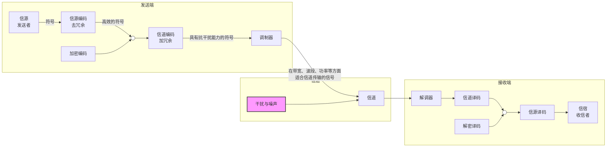

# 信息论与编码原理 

# 第一讲 信息论简介与概率论复习

## 1.1 信息的定义

### 1.1.1 通信系统中的信息、信号和消息

- **消息**：能被人的感觉器官所感知，是信息的载体，是具体、非物理的。
- **信号**：适合信道传输的物理量；信号携带消息，是消息的运载工具，可测量、可显示、可描述。

### 1.1.2 香农信息的概念

**香农信息的定义**：信息是事物运动状态或存在方式的不确定性的描述。

- 信息被接收前，具有未知性、不确定性。
- 信息通过通信系统之后，不确定性被完全或部分消除，信宿因此获得了信息。

通信过程是一种消除或部分消除不确定性，从而获得信息的过程。

**不确定性（信息量）的定性描述**：

- 概率极低的事件——难以预测——一旦发生，信息量很大。
- 概率极高的事件——容易预测——信息量较小。
- 必然事件——无需预测——信息量为0。

**定量描述**：随机事件发生所提供的信息量可以表示为该事件概率的函数

$$
I(x_i) = \log \frac{1}{p(x_i)} = -\log p(x_i)
$$

- 不可能事件概率为0，信息量为无穷大。
- 必然事件概率为1，信息量为0。
- 随机事件概率与自信息成负相关。

## 1.2 信息论的研究对象与目的

### 1.2.1 通信系统模型

通信的实质：形式上传输消息，实质上传输信息。

通信系统的基本组成：

- **信源**：产生消息和消息序列的源。
- **编码器**：将消息变成适合信道传输的物理量。
- **信道**：传输、存储信号的媒介。
- **译码器**：对干扰+信号进行反变换。
- **信宿**：消息传递的对象。

**编码器的作用**：

- **信源编码器**：通过去冗余提高通信系统的有效性（信息传输应尽可能快，高传输码率）。
- **信道编码器**：通过加冗余提高通信系统的可靠性（降低误码率）。
- **调制器**：变成适合信号传输要求的信号。

### 1.2.2 信息论的研究目的

- 找到信息传输的共同规律。
- 研究通信系统的整个过程，而非单个环节。
- 实现在有干扰的情况下，最佳的传送和准确（或近似）再现信息。
- 提高信息传输的有效性、可靠性、安全性。
- 关心系统的理论极限和潜能，实现信息传输系统的最优化。

## 1.3 概率论知识回顾

### 1.3.1 用矩阵表示概率分布

**一维概率分布**：

$$
P_X = [p(x_1) \quad p(x_2) \quad \cdots \quad p(x_n)]
$$

**联合概率分布矩阵**：

$$
P_{XY} = \begin{bmatrix}
p(x_1y_1) & p(x_2y_1) & \cdots & p(x_ny_1) \\
p(x_1y_2) & p(x_2y_2) & \cdots & p(x_ny_2) \\
\vdots & \vdots & \ddots & \vdots \\
p(x_1y_m) & p(x_2y_m) & \cdots & p(x_ny_m)
\end{bmatrix}
$$

依据联合分布矩阵可以写出边缘分布矩阵 $P_X, P_Y$。

**条件概率分布矩阵**：

$$
P_{X|Y} = \begin{bmatrix}
p(x_1|y_1) & p(x_2|y_1) & \cdots & p(x_n|y_1) \\
p(x_1|y_2) & p(x_2|y_2) & \cdots & p(x_n|y_2) \\
\vdots & \vdots & \ddots & \vdots \\
p(x_1|y_m) & p(x_2|y_m) & \cdots & p(x_n|y_m)
\end{bmatrix}
$$
条件Y写在左侧的行上，结果$P_{X|Y}$写在上方的列标上。
矩阵每行的条件概率之和恒为1：$\sum_{i=1}^{n} p(x_i|y_j) = 1$。

**关系式**：

$$
P_Y = P_X P_{Y|X}, \quad P_X = P_Y P_{X|Y}
$$

### 1.3.2 常用概率公式

**条件概率公式**：

$$
p(x_i|y_j) = \frac{p(x_i y_j)}{p(y_j)}
$$

**全概率公式**：

$$
p(x_i) = \sum_{j=1}^{n} p(y_j) p(x_i|y_j), \quad p(y_j) = \sum_{i=1}^{n} p(x_i) p(y_j|x_i)
$$

**贝叶斯公式**：

$$
p(x_i|y_j) = \frac{p(x_i y_j)}{p(y_j)} = \frac{p(y_j|x_i) p(x_i)}{\sum_{i=1}^{n} p(x_i) p(y_j|x_i)}
$$

## 例题1-1

**【题目描述】**：已知随机变量 $X$ 和 $Y$ 的联合概率分布如下表所示，试用概率空间表示 $P_{XY}$，并求 $P_X, P_Y, P_{X|Y}, P_{Y|X}$。（行代表$x_i$，列代表$y_j$）。

$$
P_{XY} = \begin{bmatrix}
\frac{1}{4} & \frac{1}{18} & 0 \\
\frac{1}{18} & \frac{1}{3} & \frac{1}{18} \\
0 & \frac{1}{18} & \frac{7}{36}
\end{bmatrix}
$$

**【详细解答】**：

**步骤1：求边缘概率 $P_X$**

$$
P_X = \left[ \frac{11}{36} \quad \frac{16}{36} \quad \frac{9}{36} \right]
$$

**步骤2：求边缘概率 $P_Y$**

$$
P_Y = \left[ \frac{11}{36} \quad \frac{16}{36} \quad \frac{9}{36} \right]
$$

**步骤3：求条件概率 $P_{Y|X}$**

$$
P_{Y|X} = \begin{bmatrix}
\frac{p(x_1y_1)}{p(x_1)} & \frac{p(x_1y_2)}{p(x_1)} & \frac{p(x_1y_3)}{p(x_1)} \\
\frac{p(x_2y_1)}{p(x_2)} & \frac{p(x_2y_2)}{p(x_2)} & \frac{p(x_2y_3)}{p(x_2)} \\
\frac{p(x_3y_1)}{p(x_3)} & \frac{p(x_3y_2)}{p(x_3)} & \frac{p(x_3y_3)}{p(x_3)}
\end{bmatrix}
= \begin{bmatrix}
\frac{9}{11} & \frac{2}{11} & 0 \\
\frac{2}{16} & \frac{12}{16} & \frac{2}{16} \\
0 & \frac{2}{9} & \frac{7}{9}
\end{bmatrix}
$$

**步骤4：求条件概率 $P_{X|Y}$**

$$
P_{X|Y} = \begin{bmatrix}
\frac{p(x_1y_1)}{p(y_1)} & \frac{p(x_2y_1)}{p(y_1)} & \frac{p(x_3y_1)}{p(y_1)} \\
\frac{p(x_1y_2)}{p(y_2)} & \frac{p(x_2y_2)}{p(y_2)} & \frac{p(x_3y_2)}{p(y_2)} \\
\frac{p(x_1y_3)}{p(y_3)} & \frac{p(x_2y_3)}{p(y_3)} & \frac{p(x_3y_3)}{p(y_3)}
\end{bmatrix}
= \begin{bmatrix}
\frac{9}{11} & \frac{2}{11} & 0 \\
\frac{2}{16} & \frac{12}{16} & \frac{2}{16} \\
0 & \frac{2}{9} & \frac{7}{9}
\end{bmatrix}
$$

**【考点剖析】**：本题考查联合概率分布与边缘概率、条件概率之间的相互转换关系。核心知识点包括：边缘概率由联合概率求和得到；条件概率等于联合概率除以边缘概率；$P_Y = P_X P_{Y|X}$ 的矩阵关系。

## 例题1-2

**【题目描述】**：已知某年级有甲、乙、丙三个班，各班人数分别占年级总人数的 $\frac{1}{4}$、$\frac{1}{3}$、$\frac{5}{12}$，已知甲、乙、丙三个班级中集邮人数分别占该班总人数的 $\frac{1}{2}$、$\frac{1}{4}$、$\frac{1}{5}$，试求：

(1) 事件“某人为集邮者”的概率；
(2) 事件“某人既为集邮者，又属于乙班”的概率；
(3) 事件“某集邮者来自乙班”的概率。

**【详细解答】**：

设随机变量 $X=\{X_1=\text{甲班}, X_2=\text{乙班}, X_3=\text{丙班}\}$ 代表学生的班级，随机变量 $Y=\{Y_1=\text{集邮}, Y_2=\text{不集邮}\}$ 代表学生是否集邮。

$$
P_X = \begin{bmatrix} \frac{1}{4} & \frac{1}{3} & \frac{5}{12} \end{bmatrix}, \quad
P_{Y|X} = \begin{bmatrix}
\frac{1}{2} & \frac{1}{2} \\
\frac{1}{4} & \frac{3}{4} \\
\frac{1}{5} & \frac{4}{5}
\end{bmatrix}
$$

**(1) 事件“某人为集邮者”的概率**：

$$
P_Y = P_X P_{Y|X} =
\begin{bmatrix} \frac{1}{4} & \frac{1}{3} & \frac{5}{12} \end{bmatrix}
\begin{bmatrix}
\frac{1}{2} & \frac{1}{2} \\
\frac{1}{4} & \frac{3}{4} \\
\frac{1}{5} & \frac{4}{5}
\end{bmatrix}
= \begin{bmatrix} \frac{7}{24} & \frac{17}{24} \end{bmatrix}
$$

故 $p(y_1) = \frac{7}{24}$。

**(2) 事件“某人既为集邮者，又属于乙班”的概率**：

$$
P_{XY} = \begin{bmatrix}
p(x_1y_1) & p(x_2y_1) & p(x_3y_1) \\
p(x_1y_2) & p(x_2y_2) & p(x_3y_2)
\end{bmatrix}
= \begin{bmatrix}
\frac{1}{8} & \frac{1}{12} & \frac{1}{12} \\
\frac{1}{8} & \frac{1}{4} & \frac{1}{3}
\end{bmatrix}
$$

故 $p(x_2y_1) = \frac{1}{12}$。

**(3) 事件“某集邮者来自乙班”的概率**：

$$
P_{X|Y} = \begin{bmatrix}
\frac{p(x_1y_1)}{p(y_1)} & \frac{p(x_2y_1)}{p(y_1)} & \frac{p(x_3y_1)}{p(y_1)} \\
\frac{p(x_1y_2)}{p(y_2)} & \frac{p(x_2y_2)}{p(y_2)} & \frac{p(x_3y_2)}{p(y_2)}
\end{bmatrix}
= \begin{bmatrix}
\frac{3}{7} & \frac{2}{7} & \frac{2}{7} \\
\frac{3}{17} & \frac{6}{17} & \frac{8}{17}
\end{bmatrix}
$$

故 $p(x_2|y_1) = \frac{2}{7}$。

**【考点剖析】**：本题考查全概率公式、联合概率公式和贝叶斯公式的综合应用。核心思路是建立随机变量模型，利用矩阵运算 $P_Y = P_X P_{Y|X}$ 和 $P_{XY}$ 的构造求解各类概率。

# 第二讲 离散信源及其信息测度

## 2.1 信源的数学模型及分类

### 2.1.1 信源的定义及分类

**信源**是产生消息（符号）（**随机变量**）、消息序列（符号序列）（**随机矢量**）以及时间连续的消息（**随机过程**）的来源。

按照信号取值集合与取值时刻集合的连续或离散分类：

| 信号取值集合 | 信号取值时刻集合 | 信源种类     |
| ------ | -------- | -------- |
| 离散     | 离散       | 数字/离散 信源 |
| 连续     | 离散       | 连续 信源    |
| 连续     | 连续       | 模拟/波形 信源 |

### 2.1.2 信源的数学模型

信源可用**随机变量**、**随机矢量**或**随机过程**来描述。

#### 1. 用随机变量描述（单符号信源，**单符号**= 一次只出一个结果（一个字母、一个数字、一个状态））

离散随机变量：

$$
\begin{bmatrix} X \\ P(X) \end{bmatrix} =
\begin{bmatrix}
x_1 & x_2 & \cdots & x_n \\
p(x_1) & p(x_2) & \cdots & p(x_n)
\end{bmatrix},
\quad 0 \le p(x_i) \le 1, \quad \sum_{i=1}^{n} p(x_i) = 1
$$

连续随机变量：

$$
\begin{bmatrix} X \\ P \end{bmatrix} =
\begin{bmatrix} (a, b) \\ p(x) \end{bmatrix},
\quad \int_a^b p(x) dx = 1
$$

---

#### 2. 用随机矢量（序列）描述信源输出的消息——输出为一系列符号

信源输出的消息为一个符号序列时，可用随机矢量

$$
\vec{X} = (X_1, X_2, \dots, X_N)
$$

来表征。

**实际示例**：

- 一句由 20 个汉字组成的话，每个字可视为一个随机变量，整体构成一个随机序列，对应不同的句子。
- 电视屏幕的每帧画面由一系列像素点组成，每个像素点具有若干灰度等级，整体构成一个随机序列，对应不同的图像。

根据序列中符号之间的统计依赖关系以及概率分布的平稳性，可将此类信源划分为以下几种主要类型。

---

#### （1）离散无记忆信源

若信源先后发出的符号之间统计独立，则称为离散无记忆信源。其联合概率分布满足：

$$
P(\vec{X}) = P(X_1 X_2 \cdots X_N) = P(X_1)P(X_2)\cdots P(X_N)
$$

---

#### （2）离散无记忆信源的 $N$ 次扩展信源

将离散无记忆信源输出的符号序列按每组 $N$ 个符号进行分组，每组作为一个新的输出符号，则构成该信源的 $N$ 次扩展信源。

设原始信源的概率空间为：

$$
\begin{bmatrix}
X \\
P(X)
\end{bmatrix}
\begin{bmatrix}
a_1 & \cdots & a_i & \cdots & a_q \\
p_1 & \cdots & p_i & \cdots & p_q
\end{bmatrix}
$$
这里的 **q** 指的是**信源符号集中不同符号的种类数（字母表大小）**，而**不是想象中“信源输出的总长度”**。

则其 $N$ 次扩展信源可表示为：

$$
\begin{bmatrix}
X^N \\
P(\vec{X})
\end{bmatrix}
\begin{bmatrix}
\alpha_1 & \cdots & \alpha_i & \cdots & \alpha_{q^N} \\
p(\alpha_1) & \cdots & p(\alpha_i) & \cdots & p(\alpha_{q^N})
\end{bmatrix}
$$

其中，每一个扩展符号 $\alpha_i$ 是由 $N$ 个原始符号组成的有序序列：

$$
\alpha_i = (a_{i_1} a_{i_2} \cdots a_{i_N})
$$

其概率为各分量符号概率的乘积：

$$
p(\alpha_i) = p(a_{i_1}) p(a_{i_2}) \cdots p(a_{i_N}) = \prod_{k=1}^{N} p(a_{i_k})
$$

扩展信源输出符号的总数目为 $q^N$，其中 $q$ 为原始符号集中的符号个数，$N$ 为扩展序列长度。

**注意：为什么扩展信源的符号总数是 $q^N$？这个$q^N$代表着什么含义？**

$N$ 次扩展信源的定义是：**将信源输出的 $N$ 个符号看作一个整体（一个组），这个整体作为扩展后的一个新符号。**

- 扩展前的旧符号有 $q$ 种可能（$a_1, a_2, \dots, a_q$）。
- 扩展后的新符号是一个长度为 $N$ 的序列，即 $(a_{i_1}, a_{i_2}, \dots, a_{i_N})$。
- 在这个长度为 $N$ 的序列中，**每一个位置**都有 $q$ 种选择。
- 根据乘法原理，所有可能出现的不同序列（即扩展后的新符号种类数）为：

  $$
  \underbrace{q \times q \times \cdots \times q}_{N \text{ 个}} = q^N
  $$

所以，$q^N$ 是 符号集中 **“所有可能出现的序列的种类数目”**，即每一组输出（长度为N）的这一个符号$\alpha_i$就有$q^N$种可能的取值。但是最后算$p(\alpha_i)$时，只能选原概率空间种不同种类的N个概率相乘，因为$\alpha_i$的长度为N。

**示例（二进制信源）**：

对于输出符号为“0”和“1”的二进制信源：

- **单符号信源**：$\alpha_1 = 0$，$\alpha_2 = 1$，符号数 $2^1 = 2$；
- **二次扩展信源**：$\alpha_1 = 00$，$\alpha_2 = 01$，$\alpha_3 = 10$，$\alpha_4 = 11$，符号数 $2^2 = 4$；
- **三次扩展信源**（符号数 $2^3 = 8$）：
  $$
  \begin{aligned}
  \alpha_1 &= 000, & \alpha_2 &= 001, & \alpha_3 &= 010, & \alpha_4 &= 011, \\
  \alpha_5 &= 100, & \alpha_6 &= 101, & \alpha_7 &= 110, & \alpha_8 &= 111
  \end{aligned}
  $$

---

#### （3）离散平稳信源

若信源输出的随机序列中，每个随机变量 $X_i$ 均为取值离散的离散型随机变量，且该随机序列的任意维概率分布都不随时间的平移而改变，则称该信源为离散平稳信源。

具体地，对于任意正整数 $N$ 和任意时间起点 $i, j$，有：

$$
P(X_i X_{i+1} \cdots X_{i+N}) = P(X_j X_{j+1} \cdots X_{j+N})
$$

即随机矢量的各维联合概率分布与时间起点无关。

---

#### （4）连续平稳信源

#### a. 定义与数学表述

**定义**：若信源输出的随机序列中，每个随机变量 $X_i$ 均为取值连续的连续型随机变量，且该随机序列的任意维概率密度函数都不随时间的平移而改变，则称该信源为连续平稳信源。

**数学表述**：对于任意正整数 $N$，任意时间起点 $i, j$，以及任意实数区间 $[x_1, x_1+dx_1] \times \cdots \times [x_N, x_N+dx_N]$，其联合概率密度函数$f$满足：

$$
f_{X_i, X_{i+1}, \cdots, X_{i+N}}(x_1, x_2, \cdots, x_N) =
f_{X_j, X_{j+1}, \cdots, X_{j+N}}(x_1, x_2, \cdots, x_N)
$$

即随机矢量的任意维联合概率密度函数与时间起点无关。

---

#### b. 离散平稳与连续平稳的本质对比

为了彻底消除歧义，需严格区分“时间平移”与“空间（数值）平移”：

| 比较维度 | **离散平稳信源** | **连续平稳信源** |
| :--- | :--- | :--- |
| **研究对象** | 随机变量取**某个特定点值**的概率 $P(X=a)$ | 随机变量落在**某个特定数值区间** $(a,b)$ 内的概率 |
| **时间平移不变性的含义** | 不同时刻取出**同一个符号** $a$，概率相等。 $P(X_i=a) = P(X_j=a)$ | 不同时刻落在**同一个数值区间** $(a,b)$ 内，概率相等。 $\int_a^b f_{i}(x) dx = \int_a^b f_{j}(x) dx$ |
| **时间平移的对象** | 时间下标 $i$ 变为 $j$ | 时间下标 $i$ 变为 $j$（**区间端点 $a,b$ 固定不变**） |

---

#### c. 易混淆知识点辨析

**误区**：认为连续平稳意味着“任意两个长度相同的数值区间（如 $(0,1)$ 和 $(2,3)$）上的积分概率必须相等”。

**辨析**：

- **这是错误的**，因为该结论描述的是**空间（值域）的均匀性**，而非时间的平稳性。
- 概率密度函数 $f(x)$ 的形状（如高斯分布的“中间高、两头低”）决定了：区间长度相同，但位置不同，积分值通常**不相等**。
- **这一特性与平稳性无关**。无论平稳与否，非均匀分布的高斯函数天然具有此特征。
- **连续平稳仅要求**：今天落在 $(0,1)$ 的概率，等于明天落在 $(0,1)$ 的概率；至于 $(0,1)$ 的概率是否等于 $(2,3)$ 的概率，这不是平稳性考虑的问题。

---

#### d. 核心结论提炼

> **连续平稳的本质是“概率密度曲线的形状和位置不随时间钟表指针的转动而移动或变形”。**
>
> - 平稳不要求曲线自身关于数值轴对称（那是分布属性）。
> - 平稳要求曲线固定在数轴上，不随时刻漂移。

**判断示例**：

- **平稳情形**：今天误差服从 $\mathcal{N}(0, 1)$，明天误差仍服从 $\mathcal{N}(0, 1)$。（同一个区间积分值相同）
- **非平稳情形**：今天误差服从 $\mathcal{N}(0, 1)$，明天误差服从 $\mathcal{N}(1, 1)$（均值偏移）。此时明天落在 $(0,1)$ 的概率显然不同于今天。

---

#### （5）离散有记忆信源

若信源输出的符号之间彼此依存、互不独立，则称为离散有记忆信源。符号间的关联性可用联合概率分布或条件概率分布进行描述。

实际信源发出的消息符号往往只与前面若干个符号的依赖性较强，因此通常研究**有限记忆信源**。**马尔可夫信源**是一类特殊的离散非平稳有记忆信源。

---

#### 3. 用随机过程描述信源输出的消息——输出为时间连续的消息

当信源输出的是时间连续的消息时，需采用随机过程作为其数学模型。

**定义**：设有一个时间过程 $X(t)$，若对于每一个固定的时刻 $t_j$（$j = 1, 2, \dots$），$X(t_j)$ 都是一个随机变量，则称 $\{X(t)\}$ 为随机过程。换言之，随机过程是依赖于时间 $t$ 的一族随机变量。

随机过程可视为随机变量与时间维度的结合，用于刻画随时间演化的随机现象。

**实际示例**：某商店在 $t_0$ 时刻到 $t_n$ 这段时间内接待顾客的人数。每个时刻的顾客人数可视为一个随机变量，则各时刻的人数整体构成一个随机过程。

## 2.2 离散信源的信息熵

### 2.2.1 自信息与信息熵

**自信息**：信源发出一个消息本身所包含的信息量，由该消息的不确定性所决定。

$$
I(x_i) = \log \frac{1}{p(x_i)} = -\log p(x_i)
$$

- 以2为底时，单位为 bit。
- $r$ 进制自信息：$I_r(x_i) = \dfrac{I(x_i)}{\log r}$。

**自信息的意义**：
- 在事件发⽣前，表征事件不确定性的⼤小。
- 在事件发⽣后，表征事件所提供的信息量。

**性质**：
- $p(x_i) = 0 \Rightarrow I(x_i) = \infty$
- $p(x_i) = 1 \Rightarrow I(x_i) = 0$
- $p(x_1) > p(x_2) \Rightarrow I(x_1) < I(x_2)$
- 两事件相互独立时：$I(x_i y_i) = I(x_i) + I(y_i)$

**联合自信息**：

$$
I(x_i y_j) = -\log p(x_i y_j)
$$

**条件自信息**：

$$
I(x_i|y_j) = -\log p(x_i|y_j), \quad I(y_j|x_i) = -\log p(y_j|x_i)
$$

**联合自信息与条件自信息的数学关系（可以结合韦恩图进行理解）**：

$$
I(x_i y_j) = I(y_j) + I(x_i|y_j) = I(x_i) + I(y_j|x_i)
$$

**信息熵**：信源中各消息所包含自信息的数学期望，表征信源整体的不确定度。

$$
H(X) = E[I(x_i)] = \sum_{i=1}^{n} p(x_i) I(x_i) = -\sum_{i=1}^{n} p(x_i) \log p(x_i)
$$

单位为 bit/符号，$log$的底数为2。

**信息熵的意义**：
- 表征信源输出前，信源的平均不确定性。
- 表征信源输出后，每个消息（符号）所包含的平均信息量。
- 表征信源（随机变量 $X$）的整体不确定度。

**$r$ 进制信源熵**：$H_r(X) = \dfrac{H(X)}{\log r}$，单位为 $r$ 进制单位/符号。

### 2.2.2 信息熵的性质

**1. 对称性**：熵与概率矢量的分量次序无关。

$$
H(p_1, p_2, \dots, p_n) = H(p_2, p_3, \dots, p_n, p_1) = \cdots
$$

**2. 确定性**：

$$
H(1,0) = H(1,0,0) = \cdots = H(1,0,\dots,0) = 0
$$

- 因为此时已经有了确定事件，因此信源的整体不确定度（信息熵）自然为0。
- **信息熵本质是概率的函数**。

$$
\begin{bmatrix} X \\ P(X) \end{bmatrix} =
\begin{bmatrix}
x_1 & x_2 & \cdots & x_n \\
p(x_1) & p(x_2) & \cdots & p(x_n)
\end{bmatrix}
$$

则$H(X)=H(p(x_1),p(x_2),...,p(x_n))=H(p_1,p_2,...,p_n)$

**3. 非负性**：$H(p_1, p_2, \dots, p_n) \ge 0$（仅对离散信源成立）。

**4. 扩展性**：

$$
\lim_{\epsilon \to 0} H_{n+1}(p_1, p_2, \dots, p_n - \epsilon, \epsilon) = H_n(p_1, p_2, \dots, p_n)
$$

在概率空间中增加⼀个发⽣概率极小的随机事件，信源熵保持不变。

**5. 强可加性**：

$$
H(XY) = H(X) + H(Y|X) = H(Y) + H(X|Y)
$$

当 $X$ 和 $Y$ 相互独立时，$H(XY) = H(X) + H(Y)$（可加性）。

- 注：可结合韦恩图理解。

**条件熵的定义（常用公式）**：

$$
H(Y|X) = \sum_{i,j} p(x_i y_j) \log \frac{1}{p(y_j|x_i)}
= \sum_{i=1}^{n} p(x_i) H(Y|x_i)
$$

$$
H(X|Y) = \sum_{i,j} p(x_i y_j) \log \frac{1}{p(x_i|y_j)}
= \sum_{j=1}^{m} p(y_j) H(X|y_j)
$$

**多随机变量联合熵链规则**：

$$
H(X_1X_2\cdots X_N) = H(X_1) + H(X_2|X_1) + H(X_3|X_1X_2) + \cdots + H(X_N|X_{N-1}\cdots X_1)
$$

**不等关系**：
- $H(X|Y) \le H(X)$
- $H(XY) \le H(X) + H(Y)$（独立时取等号）
- $H(X_1X_2\cdots X_N) \le \sum_{i=1}^{N} H(X_i)$（独立时取等号）（利用多随机变量联合熵链规则和第一条不等关系即可证明）

**6. 上凸性与极值性**：

- 上凸性
信息熵是概率分布的严格的上凸函数。

- 极值性
离散无记忆信源输出 $n$ 个不同的信息符号时，当且仅当各符号等概率出现时，熵最大：

$$
H(p_1, p_2, \dots, p_n) \le H\left(\frac{1}{n}, \frac{1}{n}, \dots, \frac{1}{n}\right) = \log n
$$

**例**：二进制信源 $H(X) = -p\log p - (1-p)\log(1-p)$，当 $p=0.5$ 时取最大值 $1$ bit/符号。

## 例题2-1

**【题目描述】**：箱子中有90个红球，10个白球，现在从箱子中随机地取出一个球，求：

(1) 事件“取出一个红球”的不确定性；
(2) 事件“取出一个白球”所提供的信息量；
(3) 事件“取出一个红球”与“取出一个白球”的发生，哪个更难猜测？

**【详细解答】**：

概率空间为 $\begin{bmatrix} X \\ P(X) \end{bmatrix} = \begin{bmatrix} \text{red} & \text{white} \\ 0.9 & 0.1 \end{bmatrix}$

(1) $I(\text{red}) = -\log 0.9 \approx 0.152$ bit

(2) $I(\text{white}) = -\log 0.1 \approx 3.322$ bit

(3) $I(\text{white}) > I(\text{red})$，因此“取出一个白球”更难猜测。

**【考点剖析】**：自信息 $I(x_i) = -\log p(x_i)$ 的直接应用。自信息越大，事件越难预测。

## 例题2-2

**【题目描述】**：英文字母中，“a”出现的概率为0.064，“c”出现的概率为0.022。

(1) 试分别计算它们的自信息量；
(2) 假定前后字母出现是相互独立的，计算“ac”的自信息量；
(3) 若前后字母有关联性，当“a”出现后，“c”出现的概率为0.04，试计算“a”出现后“c”出现的自信息量；计算此时“ac”的自信息量。

**【详细解答】**：

(1) $I(\text{"a"}) = -\log 0.064 \approx 3.96$ bit；$I(\text{"c"}) = -\log 0.022 \approx 5.51$ bit

(2) 相互独立时：$I(\text{"ac"}) = I(\text{"a"}) + I(\text{"c"}) = 9.47$ bit

(3) $I(\text{"c"|"a"}) = -\log 0.04 \approx 4.64$ bit

$I(\text{"ac"}) = I(\text{"a"}) + I(\text{"c"|"a"}) = 3.96 + 4.64 = 8.6$ bit

**【考点剖析】**：考查自信息、条件自信息与联合自信息的关系。独立时 $I(xy)=I(x)+I(y)$；有关联时 $I(xy)=I(x)+I(y|x)$。

## 例题2-3

**【题目描述】**：一离散无记忆信源的概率空间为 $\begin{bmatrix} X \\ P(X) \end{bmatrix} = \begin{bmatrix} 0 & 1 & 2 & 3 \\ \frac{3}{8} & \frac{1}{4} & \frac{1}{4} & \frac{1}{8} \end{bmatrix}$，其发出的消息为 $(202120130213001203210110321010021032011223210)$。

(1) 此消息的自信息是多少？
(2) 在此消息中平均每个符号携带的信息量是多少？
(3) 信源的信息熵 $H(X)$ 是多少？

**【详细解答】**：

消息共有45个符号，其中有14个0、13个1、12个2、6个3。

(1) 各符号的自信息：

$$
I(0) = -\log \frac{3}{8} \approx 1.415 \text{ bit}, \quad I(1) = -\log \frac{1}{4} = 2 \text{ bit}
$$

$$
I(2) = -\log \frac{1}{4} = 2 \text{ bit}, \quad I(3) = -\log \frac{1}{8} = 3 \text{ bit}
$$

消息总自信息：

$$
I = 14 \times 1.415 + 13 \times 2 + 12 \times 2 + 6 \times 3 = 87.81 \text{ bit}
$$

(2) 平均每个符号携带的信息量：

$$
\bar{I} = \frac{87.81}{45} \approx 1.95 \text{ bit/符号}
$$

(3) 信源熵：

$$
H(X) = -\frac{3}{8}\log\frac{3}{8} - \frac{1}{4}\log\frac{1}{4} - \frac{1}{4}\log\frac{1}{4} - \frac{1}{8}\log\frac{1}{8} \approx 1.91 \text{ bit/符号}
$$

**【考点剖析】**：信源无记忆时，序列的自信息等于各符号自信息之和；平均每个符号携带的信息量等于总自信息除以符号数；信源熵是自信息的数学期望。

## 例题2-4

**【题目描述】**：已知随机变量 $X,Y$ 的联合概率分布和条件概率分布如下所示，试求条件熵 $H(Y|X)$。

$$
P_{XY} = \begin{bmatrix}
\frac{1}{8} & \frac{1}{8} & 0 \\
0 & \frac{1}{4} & \frac{1}{2}
\end{bmatrix}, \quad
P_{Y|X} = \begin{bmatrix}
\frac{1}{2} & \frac{1}{2} & 0 \\
0 & \frac{1}{3} & \frac{2}{3}
\end{bmatrix}
$$

**【详细解答】**：

**法一**：利用 $H(Y|X) = H(XY) - H(X)$

由联合概率矩阵得 $P_X = [\frac{1}{4} \quad \frac{3}{4}]$，$P_Y = [\frac{1}{8} \quad \frac{3}{8} \quad \frac{1}{2}]$

$$
\begin{aligned}
H(Y|X) &= H(XY) - H(X) \\
&= H\left(\frac{1}{8}, \frac{1}{8}, \frac{1}{4}, \frac{1}{2}\right) - H\left(\frac{1}{4}, \frac{3}{4}\right) \\
&= \left(-\frac{2}{8}\log\frac{1}{8} - \frac{1}{4}\log\frac{1}{4} - \frac{1}{2}\log\frac{1}{2}\right) - \left(-\frac{1}{4}\log\frac{1}{4} - \frac{3}{4}\log\frac{3}{4}\right) \\
&\approx 0.94 \text{ bit/符号}
\end{aligned}
$$

**法二**：利用 $H(Y|X) = \sum_i p(x_i)H(Y|x_i)$

$$
\begin{aligned}
H(Y|X) &= \frac{1}{4}H\left(\frac{1}{2}, \frac{1}{2}\right) + \frac{3}{4}H\left(\frac{1}{3}, \frac{2}{3}\right) \\
&= \frac{1}{4}(1) + \frac{3}{4}\left(-\frac{1}{3}\log\frac{1}{3} - \frac{2}{3}\log\frac{2}{3}\right) \\
&\approx 0.94 \text{ bit/符号}
\end{aligned}
$$

**【考点剖析】**：考查条件熵的两种计算方法：$H(Y|X)=H(XY)-H(X)$ 和 $H(Y|X)=\sum_i p(x_i)H(Y|x_i)$。

## 例题2-5

**【题目描述】**：已知随机变量 $X,Y$ 的联合概率分布如下所示，试求 $H(X), H(Y), H(XY), H(X|Y), H(Y|X)$。

$$
P_{XY} = \begin{bmatrix}
0.25 & 0 & 0 & 0 \\
0.10 & 0.30 & 0 & 0 \\
0 & 0.05 & 0.10 & 0 \\
0 & 0 & 0.05 & 0.05 \\
0 & 0 & 0.05 & 0
\end{bmatrix}
$$

**【详细解答】**：

先求边缘概率：

$$
P_X = [0.25 \quad 0.40 \quad 0.15 \quad 0.15 \quad 0.05], \quad P_Y = [0.35 \quad 0.35 \quad 0.20 \quad 0.10]
$$

$$
\begin{aligned}
H(X) &= H(0.25, 0.40, 0.15, 0.15, 0.05) \approx 2.066 \text{ bit/符号} \\
H(Y) &= H(0.35, 0.35, 0.20, 0.10) \approx 1.856 \text{ bit/符号} \\
H(XY) &= H(0.25, 0.10, 0.30, 0.05, 0.10, 0.05, 0.05, 0.10) \approx 2.665 \text{ bit/2符号} \\
H(X|Y) &= H(XY) - H(Y) = 2.665 - 1.856 = 0.809 \text{ bit/符号} \\
H(Y|X) &= H(XY) - H(X) = 2.665 - 2.066 = 0.599 \text{ bit/符号}
\end{aligned}
$$

**【考点剖析】**：考查联合熵、边缘熵与条件熵的关系：$H(XY)=H(X)+H(Y|X)=H(Y)+H(X|Y)$。

## 2.3 离散无记忆信源的扩展信源

### 2.3.1 信源模型

离散无记忆信源的 $N$ 次扩展信源：将信源输出的序列看作一组一组发出，每组长度为 $N$。

$$
\begin{bmatrix} X \\ P(X) \end{bmatrix} =
\begin{bmatrix}
a_1 & \cdots & a_q \\
p_1 & \cdots & p_q
\end{bmatrix}
\Rightarrow
\begin{bmatrix} X^N \\ P(\vec{X}) \end{bmatrix} =
\begin{bmatrix}
\alpha_1 & \cdots & \alpha_{q^N} \\
p(\alpha_1) & \cdots & p(\alpha_{q^N})
\end{bmatrix}
$$

其中 $\alpha_i = (a_{i_1}a_{i_2}\cdots a_{i_N})$，$p(\alpha_i) = \prod_{k=1}^{N} p(a_{i_k})$。

### 2.3.2 信息熵

由于扩展信源符号序列中各符号相互独立且同分布：

$$
H(X^N) = H(X_1X_2\cdots X_N) = H(X_1) + H(X_2) + \cdots + H(X_N) = NH(X)
$$

## 例题2-6

**【题目描述】**：一离散无记忆信源的概率空间为 $\begin{bmatrix} X \\ P(X) \end{bmatrix} = \begin{bmatrix} a_1 & a_2 & a_3 \\ \frac{1}{2} & \frac{1}{4} & \frac{1}{4} \end{bmatrix}$，试求其二次扩展信源的信息熵 $H(X^2)$。

**【详细解答】**：

$$
H(X) = H\left(\frac{1}{2}, \frac{1}{4}, \frac{1}{4}\right) = -\frac{1}{2}\log\frac{1}{2} - \frac{1}{4}\log\frac{1}{4} - \frac{1}{4}\log\frac{1}{4} = 1.5 \text{ bit/符号}
$$

$$
H(X^2) = 2H(X) = 3 \text{ bit/2符号}
$$

**【考点剖析】**：扩展信源熵 $H(X^N) = NH(X)$ 的直接应用。
- **注意**：在信息论中，信源输出的“序列”是**有序的**（先发什么后发什么很重要，即$a_1$$a_2$和$a_2$$a_1$是 不同的）。如果丢弃顺序信息，你会损失信息量，所以算出的熵值为2.375，必然小于真实的有序序列熵（3.0）。

## 例题2-7

**【题目描述】**：每帧电视图像都可以认为是由 $500 \times 600$ 个像素点组成，所有像素点独立变化，且每个像素点都取128个不同的亮度电平，且这128个亮度电平等概率出现，规定每秒传送30帧图像，问：

(1) 每帧图像含有多少信息量？
(2) 传递电视图像获得的信息率（bit/sec）是多少？
(3) 若广播员在约10000个汉字组成的字汇中选1000字来口述这一帧图像，那么口述此图像所提供的信息量是多少？（假设汉字字汇为等概率分布，且彼此无依赖）
(4) 若要恰当地描述这帧图像，广播员在口述中至少需要多少汉字？

**【详细解答】**：

(1) 每个像素点的概率空间为 $\begin{bmatrix} X \\ P(X) \end{bmatrix} = \begin{bmatrix} a_1 & \cdots & a_{128} \\ \frac{1}{128} & \cdots & \frac{1}{128} \end{bmatrix}$

每个像素点的平均信息量：$H(X) = \log 128 = 7$ bit/符号

每帧图像有 $500 \times 600 = 3 \times 10^5$ 个像素，视为 $3 \times 10^5$ 次扩展：

$$
H(X^N) = N H(X) = 3 \times 10^5 \times 7 = 2.1 \times 10^6 \text{ bit/帧}
$$

(2) 信息率：

$$
30 \times 2.1 \times 10^6 = 6.3 \times 10^7 \text{ bit/sec}
$$

(3) 每个汉字平均信息量：$H(Y) = \log 10000 \approx 13.29$ bit/符号

1000字口述稿的平均信息量：

$$
H(Y^M) = M H(Y) = 1000 \times 13.29 = 1.329 \times 10^4 \text{ bit/千字}
$$

(4) 所需汉字数：

$$
M = \frac{2.1 \times 10^6}{13.29} \approx 1.58 \times 10^5
$$

**【考点剖析】**：考查扩展信源熵 $H(X^N)=NH(X)$ 在实际通信系统中的应用。

## 2.4 离散平稳信源及其极限熵

### 2.4.1 离散平稳信源

对于离散平稳信源，输出的随机序列中各维概率分布都与时间起点无关：

- $P(X_i) = P(X_j)$
- $P(X_iX_{i+1}) = P(X_jX_{j+1})$
- $P(X_iX_{i+1}\cdots X_{i+N}) = P(X_jX_{j+1}\cdots X_{j+N})$
- $H(X_1) = H(X_2) = \cdots = H(X_N)$
- $H(X_2|X_1) = H(X_3|X_2) = \cdots = H(X_N|X_{N-1})$

### 2.4.2 极限熵

对于序列 $\vec{X} = (X_1X_2\cdots X_N)$：

- **联合熵**：$H(\vec{X}) = H(X_1X_2\cdots X_N)$
- **平均符号熵**：$H_N(\vec{X}) = \dfrac{1}{N}H(\vec{X})$
- **极限熵**：$H_{\infty} = \lim_{N \to \infty} H_N(\vec{X}) = \lim_{N \to \infty} H(X_N|X_1X_2\cdots X_{N-1})$

对于离散平稳有限记忆长度为 $m+1$ 的信源，其极限熵等于 $m$ 阶条件熵：

$$
H_{\infty} = H_{m+1} = H(X_{m+1}|X_1X_2\cdots X_m)
$$

**说明**：在实际情况中，符号之间的统计关联关系伸向无穷远，极限熵才能确切表达多符号离散平稳有记忆信源平均每发一个符号所提供的信息量。
- **注意**：**大写字母X的下标永远只代表“时间先后次序”（或序列位置），绝不代表“具体的随机变量种类”**。

## 例题2-8

**【题目描述】**：二维平稳信源的一维概率分布为 $\begin{bmatrix} X \\ P(X) \end{bmatrix} = \begin{bmatrix} x_1 & x_2 & x_3 \\ \frac{1}{4} & \frac{4}{9} & \frac{11}{36} \end{bmatrix}$，输出符号序列中只有前后两个符号之间有记忆，条件概率见表格，求此离散平稳信源的极限熵。

| $X_i$ \ $X_{i+1}$ | $x_1$ | $x_2$ | $x_3$ |
|---|---|---|---|
| $x_1$ | $\frac{7}{9}$ | $\frac{2}{9}$ | 0 |
| $x_2$ | $\frac{1}{8}$ | $\frac{3}{4}$ | $\frac{1}{8}$ |
| $x_3$ | 0 | $\frac{2}{11}$ | $\frac{9}{11}$ |

**【详细解答】**：

该平稳信源记忆长度为2，因此极限熵为一阶条件熵：

$$
\begin{aligned}
H_{\infty} &= H_2 = H(X_2|X_1) = \sum_{i=1}^{3} p(x_i)H(X|x_i) \\
&= \frac{1}{4}H\left(\frac{7}{9}, \frac{2}{9}\right) + \frac{4}{9}H\left(\frac{1}{8}, \frac{3}{4}, \frac{1}{8}\right) + \frac{11}{36}H\left(\frac{2}{11}, \frac{9}{11}\right) \\
&\approx 0.87 \text{ bit/符号}
\end{aligned}
$$

**【考点剖析】**：考查离散平稳信源极限熵的计算 $H_{\infty} = H_{m+1} = \sum_i p(S_i)H(X|S_i)$。

## 2.5 马尔可夫信源

### 2.5.1 马尔可夫链

**马尔可夫链**：随机变量的状态仅与上一时刻所处的状态有关联，与再之前的状态无关。

$$P(X_n = S_{i_n}|X_{n-1} = S_{i_{n-1}}, X_{n-2} = S_{i_{n-2}}, \dots) = P(X_n = S_{i_n}|X_{n-1} = S_{i_{n-1}})$$

**状态转移概率**：

- 一步转移概率：$p_{ij} = P(X_{m+1} = S_j|X_m = S_i)$
- $k$ 步转移概率：$p_{ij}^{(k)} = P(X_{m+k} = S_j|X_m = S_i)$

**时齐（齐次）马尔可夫链**：状态转移概率与初始时刻无关。

**状态转移矩阵**：

$$
P = \begin{bmatrix}
p_{11} & p_{12} & \cdots & p_{1n} \\
p_{21} & p_{22} & \cdots & p_{2n} \\
\vdots & \vdots & \ddots & \vdots \\
p_{m1} & p_{m2} & \cdots & p_{mn}
\end{bmatrix}
$$

矩阵每行元素非负且行和为1。

**切普曼-柯尔莫哥洛夫方程（C-K方程）**：

$$
P^{(k)} = P^{(m)} \cdot P^{(n)}, \quad k = m + n
$$

因此 $P^{(k)} = P^k$。

**各态历经性**：当有限状态时齐马尔可夫链满足各态历经性时，存在正整数 $r$，使得状态转移矩阵 $P^r$ 中所有元素都大于零，则：

$$
\lim_{n \to \infty} p_{ij}^{(n)} = W_j
$$

**稳态分布的求解**：

$$
\begin{cases}
\sum_i W_i p_{ij} = W_j \\
\sum_j W_j = 1
\end{cases}
\Leftrightarrow
\begin{cases}
WP = W \\
\sum_j W_j = 1
\end{cases}
$$

### 2.5.2 马尔可夫信源及其信源熵

**$M$ 阶马尔可夫信源**：信源的记忆长度为 $M+1$，该时刻的符号只依赖于前面 $M$ 个符号。

**时齐马尔可夫信源**：条件概率 $p(x_{i_{m+1}}|x_{i_1}x_{i_2}\cdots x_{i_m}) = p(S_j|S_i)$ 与时间起点无关。

当时齐、遍历的马尔可夫信源达到稳态分布后：

$$
H_{\infty} = H_{m+1} = H(X_{m+1}|X_1X_2\cdots X_m) = H(X_{m+1}|S) = \sum_i p(S_i) H(X|S_i)
$$

**马尔可夫信源的分析步骤**：

1. 用条件概率、一步状态转移矩阵、符号条件矩阵等表征信源。
2. 根据一步状态转移矩阵判断极限分布是否存在（关键在于是否存在正整数 $r$ 使 $P^r$ 所有元素大于零）。
3. 求解稳态分布：$\begin{cases} WP = W \\ \sum_j W_j = 1 \end{cases}$
4. 求解极限熵：$H_{\infty} = \sum_i p(S_i)H(X|S_i)$
5. 求解符号平稳分布：$P_X = W P_{X|S}$
6. 求解冗余度：$R = 1 - \dfrac{H_{\infty}}{H_0}$

## 例题2-9

**【题目描述】**：设有一个时齐的马尔可夫链，其状态转移矩阵为 $P = \begin{bmatrix} 0 & 0 & 1 \\ \frac{1}{2} & \frac{1}{3} & \frac{1}{6} \\ \frac{1}{2} & \frac{1}{2} & 0 \end{bmatrix}$，试判断其稳态分布是否存在，若存在，请求出该稳态分布。

**【详细解答】**：

**步骤1**：判断各态历经性

$P^3$ 中各元素都大于零，因此稳态分布存在。

**步骤2**：求解稳态分布

$$
\begin{cases}
WP = W \\
W_1 + W_2 + W_3 = 1
\end{cases}
\Rightarrow
\begin{cases}
0 \cdot W_1 + \frac{1}{2}W_2 + \frac{1}{2}W_3 = W_1 \\
0 \cdot W_1 + \frac{1}{3}W_2 + \frac{1}{2}W_3 = W_2 \\
1 \cdot W_1 + \frac{1}{6}W_2 + 0 \cdot W_3 = W_3 \\
W_1 + W_2 + W_3 = 1
\end{cases}
$$

解得：

$$
W_1 = \frac{1}{3}, \quad W_2 = \frac{2}{7}, \quad W_3 = \frac{8}{21}
$$

因此稳态分布为 $[W_1 \ W_2 \ W_3] = [\frac{1}{3} \ \frac{2}{7} \ \frac{8}{21}]$。

> **重要提示**：必须先验证稳态分布存在，再求解稳态分布。稳态分布不存在时，方程组也会有对应解。

**【考点剖析】**：考查马尔可夫链各态历经性的判断和稳态分布的求解。关键点：$P^r$ 所有元素大于零的判断，以及 $WP = W$ 方程组的求解。

## 例题2-10

**【题目描述】**：设有一个信源，它在开始时以 $P(a)=0.6, P(b)=0.3, P(c)=0.1$ 的概率输出 $X_1$，如果 $X_1$ 为 $a$，则 $X_2$ 为 $a,b,c$ 的概率为 $1/3$；如果 $X_1$ 为 $b$，则 $X_2$ 为 $a,b,c$ 的概率为 $1/3$；如果 $X_1$ 为 $c$，则 $X_2$ 为 $a,b$ 的概率为 $1/2$，为 $c$ 的概率为 $0$。而且后面输出 $X_i$ 的概率只与 $X_{i-1}$ 有关，且 $P(X_i|X_{i-1}) = P(X_2|X_1)$，$i \ge 3$。试作出此信源的状态转移图，并求解其极限熵。

**【详细解答】**：

该信源为一阶时齐马尔可夫信源，状态转移矩阵（暨符号条件矩阵）为：

$$
P = \begin{bmatrix}
\frac{1}{3} & \frac{1}{3} & \frac{1}{3} \\
\frac{1}{3} & \frac{1}{3} & \frac{1}{3} \\
\frac{1}{2} & \frac{1}{2} & 0
\end{bmatrix}
$$

$P^2$ 中各元素都大于零，因此稳态分布存在。

**求解稳态分布**：

$$
\begin{cases}
WP = W \\
W_1 + W_2 + W_3 = 1
\end{cases}
\Rightarrow W = [W_1 \ W_2 \ W_3] = \left[\frac{3}{8} \ \frac{3}{8} \ \frac{1}{4}\right]
$$

**求解极限熵**：

$$
\begin{aligned}
H_{\infty} &= H(X_{m+1}|X_m) = \sum_i p(S_i)H(X|S_i) \\
&= \frac{3}{8}H\left(\frac{1}{3}, \frac{1}{3}, \frac{1}{3}\right) + \frac{3}{8}H\left(\frac{1}{3}, \frac{1}{3}, \frac{1}{3}\right) + \frac{1}{4}H\left(\frac{1}{2}, \frac{1}{2}\right) \\
&= \frac{3}{8}\log 3 + \frac{3}{8}\log 3 + \frac{1}{4} \times 1 \\
&\approx 1.44 \text{ bit/符号}
\end{aligned}
$$

**【考点剖析】**：考查一阶马尔可夫信源的分析。一阶马尔可夫信源中，符号条件概率矩阵与状态转移概率矩阵相等。

## 例题2-11

**【题目描述】**：设有一个二阶时齐的马尔可夫信源，其状态集为 $S = \{00,01,10,11\}$，其符号转移条件概率如下表所示：

| 起始状态 | 符号0 | 符号1 |
|---|---|---|
| 00 | $\frac{1}{2}$ | $\frac{1}{2}$ |
| 01 | $\frac{1}{3}$ | $\frac{2}{3}$ |
| 10 | $\frac{1}{4}$ | $\frac{3}{4}$ |
| 11 | $\frac{1}{5}$ | $\frac{4}{5}$ |

(1) 判断稳态分布是否存在；
(2) 若稳态分布存在，求状态的稳态分布；
(3) 求符号的稳态分布；
(4) 求此信源的极限熵。

**【详细解答】**：

**(1)** 由符号转移条件概率写出状态转移矩阵：

$$
P = \begin{bmatrix}
\frac{1}{2} & \frac{1}{2} & 0 & 0 \\
0 & 0 & \frac{1}{3} & \frac{2}{3} \\
\frac{1}{4} & \frac{3}{4} & 0 & 0 \\
0 & 0 & \frac{1}{5} & \frac{4}{5}
\end{bmatrix}
$$

$P^2$ 中各元素都大于零，因此稳态分布存在。

**(2)** 求解稳态分布：

$$
\begin{cases}
WP = W \\
W_1 + W_2 + W_3 + W_4 = 1
\end{cases}
\Rightarrow
\begin{cases}
W_1 = \frac{3}{35} \\
W_2 = \frac{6}{35} \\
W_3 = \frac{6}{35} \\
W_4 = \frac{4}{7}
\end{cases}
$$

**(3)** 符号的稳态分布：

符号转移矩阵为 $\begin{bmatrix} \frac{1}{2} & \frac{1}{2} \\ \frac{1}{3} & \frac{2}{3} \\ \frac{1}{4} & \frac{3}{4} \\ \frac{1}{5} & \frac{4}{5} \end{bmatrix}$，则：

$$
P_a = W \cdot P_{a|S} = \begin{bmatrix} \frac{3}{35} & \frac{6}{35} & \frac{6}{35} & \frac{4}{7} \end{bmatrix}
\begin{bmatrix}
\frac{1}{2} & \frac{1}{2} \\
\frac{1}{3} & \frac{2}{3} \\
\frac{1}{4} & \frac{3}{4} \\
\frac{1}{5} & \frac{4}{5}
\end{bmatrix}
= \begin{bmatrix} \frac{9}{35} & \frac{26}{35} \end{bmatrix}
$$

**(4)** 极限熵：

$$
\begin{aligned}
H_{\infty} &= H_3 = H(X_{m+1}|X_{m-1}X_m) = \sum_i p(S_i)H(a|S_i) \\
&= \frac{3}{35}H\left(\frac{1}{2}, \frac{1}{2}\right) + \frac{6}{35}H\left(\frac{1}{3}, \frac{2}{3}\right) + \frac{6}{35}H\left(\frac{1}{4}, \frac{3}{4}\right) + \frac{4}{7}H\left(\frac{1}{5}, \frac{4}{5}\right) \\
&\approx 0.79 \text{ bit/符号}
\end{aligned}
$$

**【考点剖析】**：考查二阶马尔可夫信源的完整分析流程。注意二阶信源中状态转移矩阵与符号条件矩阵不同。

## 例题2-12

**【题目描述】**：某一阶马尔可夫信源的状态转移图如图，已知信源 $X$ 的符号集为 $\{0,1,2\}$，并定义 $\bar{p} = 1-p$。

状态转移矩阵为 $P = \begin{bmatrix} \bar{p} & \frac{p}{2} & \frac{p}{2} \\ \frac{p}{2} & \bar{p} & \frac{p}{2} \\ \frac{p}{2} & \frac{p}{2} & \bar{p} \end{bmatrix}$。

(1) 试求信源的极限概率分布 $P(0), P(1), P(2)$；
(2) 求此信源的极限熵；
(3) 对一阶马尔可夫信源，$p$ 取何值时极限熵最大？并计算当 $p$ 取0和1时，极限熵的值。

**【详细解答】**：

**(1)** 当 $0 < p \le 1$ 时，极限分布存在。当 $p=0$ 时，$P$ 为单位矩阵，极限分布不存在。

由 $\begin{cases} WP = W \\ W_1 + W_2 + W_3 = 1 \end{cases}$，解得：

$$
P(0) = P(1) = P(2) = \frac{1}{3}
$$

**(2)** 极限熵：

$$
\begin{aligned}
H_{\infty} &= H_2 = H(X_{m+1}|X_m) = \sum_i p(S_i)H(a|S_i) \\
&= \frac{1}{3}H\left(\bar{p}, \frac{p}{2}, \frac{p}{2}\right) \times 3 \\
&= -\bar{p}\log\bar{p} - p\log\frac{p}{2} \\
&= -\bar{p}\log\bar{p} - p\log p + p \quad \text{bit/符号}
\end{aligned}
$$

**(3)** 求最大值：

$$
\frac{dH_{\infty}}{dp} = \log\frac{2(1-p)}{p}
$$

当 $\log\frac{2(1-p)}{p} = 0$，即 $p = \frac{2}{3}$ 时，极限熵最大：

$$
(H_{\infty})_{\max} = \log 3 \approx 1.59 \text{ bit/符号}
$$

当 $p=0$ 时，极限熵为各符号初始概率分布的熵（因状态不再转移）。

当 $p=1$ 时，$H_{\infty} = 1$ bit/符号。

**【考点剖析】**：考查一阶马尔可夫信源极限熵的求解和优化。关键点：参数 $p$ 的分类讨论、稳态分布求解、极限熵表达式及其极值。

## 2.6 信息冗余度

### 2.6.1 信源的相关性与冗余度

设信源有 $q$ 个符号：

- $H_0 = \log q$：独立等概信源熵
- $H_1 = H(X)$：一维平稳信源熵
- $H_2 = H(X_2|X_1)$：二维平稳信源熵
- $H_{m+1} = H(X_{m+1}|X_1X_2\cdots X_m)$：$m+1$ 维平稳信源熵
- $H_{\infty} = \lim_{N \to \infty} H_N(\vec{X})$：记忆长度无限的平稳信源熵

**重要关系**：

$$
H_0 \ge H_1 \ge H_2 \ge \cdots \ge H_{m+1} \ge \cdots \ge H_{\infty}
$$

符号间相关性越大，信息熵越小。

**冗余度**：

$$
R = 1 - \frac{H_{\infty}}{H_0}
$$

**熵的相对率**：

$$
\eta = \frac{H_{\infty}}{H_0}
$$

### 2.6.2 自然语言的熵——以英语信源为例

英语信源由26个字母和1个空格符号组成：

- 假设27个符号等概分布：$H_0 = \log 27 = 4.76$ bit/符号
- 考虑符号概率分布（不考虑相关性）：$H_1 \approx 4.03$ bit/符号
- 一阶马尔可夫近似：$H_2 \approx 3.32$ bit/符号
- 二阶马尔可夫近似：$H_3 \approx 3.1$ bit/符号
- 无穷阶马尔可夫（实际英语）：$H_{\infty} \approx 1.4$ bit/符号

**英语信源的冗余度**：

$$
R = 1 - \frac{1.4}{4.76} = 0.71
$$

这意味着：写英语文章时，71%是由语言结构定好的，只有29%是写文字的人可以自由选择的。

> 信息的冗余度表示信源可压缩的程度。相关性越大，信息熵越小，冗余度越大。从提高传输效率的观点出发，总是希望减少或去掉冗余度；但冗余度大的消息抗干扰能力强，能通过前后符号间的关联关系纠正错误。

# 第三讲 离散信道及信道容量

## 3.1 信道的分类及其数学模型

### 3.1.1 信道的分类

按输入输出信号的幅度和时间特性划分：

| 幅度 | 时间 | 信道分类 |
|---|---|---|
| 离散 | 离散 | 离散信道（数字信道） |
| 连续 | 离散 | 连续信道 |
| 连续 | 连续 | 模拟信道（波形信道） |

按输入输出间的记忆性划分：
- **无记忆信道**：某时刻输出仅依赖于当前时刻输入。
- **有记忆信道**：某时刻输出与其他时刻输入或输出有关。

按统计特性平稳性划分：
- **平稳信道**：统计特性不随时间改变（恒参信道）。
- **非平稳信道**：统计特性随时间改变（随参信道）。

### 3.1.2 离散信道数学模型

信道数学模型：$[\vec{X}, P(\vec{Y}|\vec{X}), \vec{Y}]$

由于干扰存在，输出和输入之间存在概率关系，可用条件概率 $P(\vec{Y}|\vec{X})$ 表示。

**1. 无干扰信道**：

$$
P(\vec{Y}|\vec{X}) = \begin{cases} 1, & \vec{Y} = f(\vec{X}) \\ 0, & \vec{Y} \neq f(\vec{X}) \end{cases}
$$

**2. 有干扰无记忆信道**：

$$
P(\vec{Y}|\vec{X}) = \prod_{i=1}^{N} p(y_i|x_i)
$$

### 3.1.3 单符号离散信道

单符号离散信道的数学模型：$[X, P(Y|X), Y]$

其中 $P(y|x) = P(y=b_j|x=a_i)$，$i=1,2,\cdots,r$，$j=1,2,\cdots,s$。

**信道传递概率矩阵**：

$$
P = \begin{bmatrix}
p_{11} & p_{12} & \cdots & p_{1s} \\
p_{21} & p_{22} & \cdots & p_{2s} \\
\vdots & \vdots & \ddots & \vdots \\
p_{r1} & p_{r2} & \cdots & p_{rs}
\end{bmatrix}
$$

每行满足 $\sum_{j=1}^{s} p_{ij} = 1$。

**常用信道举例**：

- **二元对称信道（BSC）**：$P = \begin{bmatrix} \bar{p} & p \\ p & \bar{p} \end{bmatrix}$
- **二元删除信道（BEC）**：$P = \begin{bmatrix} 1-p & p & 0 \\ 0 & q & 1-q \end{bmatrix}$

**常用概率及其关系**：

- 先验概率：$p(a_i)$
- 前向概率（传递概率）：$p(b_j|a_i)$
- 后向概率（后验概率）：$p(a_i|b_j)$
- 联合概率：$p(a_i b_j) = p(a_i)p(b_j|a_i) = p(b_j)p(a_i|b_j)$

**贝叶斯公式**：

$$
p(a_i|b_j) = \frac{p(b_j|a_i)p(a_i)}{\sum_i p(b_j|a_i)p(a_i)}
$$

**全概率公式**：

$$
p(b_j) = \sum_i p(a_i)p(b_j|a_i)
$$

> 所有信道的概率都可以由先验概率 $p(a_i)$ 和前向概率 $p(b_j|a_i)$ 表示。

## 3.2 平均互信息、平均条件互信息

### 3.2.1 信道疑义度

**信道疑义度**：接收端收到信道输出的一个符号后，对信道输入的符号仍然存在的平均不确定性。

$$
H(X|Y) = \sum_j p(y_j)H(X|y_j)
$$

- 理想传输时：$H(X|Y) = 0$
- 一般情况下：$H(X|Y) < H(X)$
- 当 $H(X|Y) = H(X)$ 时，表示收到输出后对输入的不确定度一点也没有减少。

### 3.2.2 互信息

**互信息量**：事件 $y$ 所给出的关于 $x$ 的信息量。（**可以结合韦恩图理解**）

$$
I(x_i; y_j) = I(x_i) - I(x_i|y_j) = \log \frac{p(x_i|y_j)}{p(x_i)}
$$

**互信息量的性质**：

1. **互易性**：$I(x_i; y_j) = I(y_j; x_i)$
2. **可正可负可为0**：
   $$
   I(x_i; y_j) = \log \frac{p(x_i|y_j)}{p(x_i)} \begin{cases}
   > 0, & \text{正相关} \\
   = 0, & \text{独立} \\
   < 0, & \text{负相关}
   \end{cases}
   $$
3. **有界性**：$I(x_i; y_j) \le I(x_i)$，$I(x_i; y_j) \le I(y_j)$

**平均互信息**：

$$
\begin{aligned}
I(X; Y) &= E[I(x_i; y_j)] = \sum_{i,j} p(x_i y_j) \log \frac{p(x_i|y_j)}{p(x_i)} \\
&= H(X) - H(X|Y) \\
&= H(Y) - H(Y|X) \\
&= H(X) + H(Y) - H(XY)
\end{aligned}
$$

**平均互信息的物理意义**：

- **从输出端来看**：$I(X; Y) = H(X) - H(X|Y)$，表示收到 $Y$ 前后对于 $X$ 的平均不确定度的减少量。
- **从输入端来看**：$I(X; Y) = H(Y) - H(Y|X)$，$H(Y|X)$ 为噪声熵。
- **从整个系统来看**：$I(X; Y) = H(X) + H(Y) - H(XY)$，表示通信前后整个系统不确定度的减少量。

**平均互信息的性质**：

1. **非负性**：$I(X; Y) \ge 0$（独立时取等号）
2. **对称性**：$I(X; Y) = I(Y; X)$
3. **极值性**：$I(X; Y) \le \min\{H(X), H(Y)\}$
4. **凸性定理**：
   - 固定信道，$I(X;Y)$ 是输入信源概率分布的上凸函数。
   - 固定信源，$I(X;Y)$ 是信道传递概率分布的下凸函数。

### 3.2.3 条件互信息

**条件互信息量**（**注意：是在y的条件下，x和z之间的互信息！**）：

$$
I(x_i; z_k|y_j) = \log \frac{p(x_i|z_k y_j)}{p(x_i|y_j)} = I(x_i|y_j) - I(x_i|z_k y_j)
$$

**联合互信息量**：

$$
I(x_i; y_j z_k) = I(x_i; y_j) + I(x_i; z_k|y_j)
$$

**平均条件互信息**：

$$
I(X; Z|Y) = H(X|Y) - H(X|YZ)
$$

**关系**：

$$
I(X; YZ) = I(X; Y) + I(X; Z|Y)
$$

- 以上四个均可以结合韦恩图理解
## 例题3-1

**【题目描述】**：设事件 $e$ 表示“降雨”，事件 $f$ 表示“空中有乌云”，且 $P(e)=0.125$，$P(e|f)=0.8$，试求：

(1) “降雨”的自信息；
(2) “空中有乌云”条件下“降雨”的自信息；
(3) “无雨”的自信息；
(4) “空中有乌云”条件下“无雨”的自信息；
(5) “降雨”与“空中有乌云”的互信息；
(6) “无雨”与“空中有乌云”的互信息。

**【详细解答】**：

(1) $I(e) = -\log 0.125 = 3$ bit

(2) $I(e|f) = -\log 0.8 = 0.322$ bit

(3) $P(\bar{e}) = 1 - 0.125 = 0.875$，$I(\bar{e}) = -\log 0.875 = 0.193$ bit

(4) $P(\bar{e}|f) = 1 - P(e|f) = 0.2$，$I(\bar{e}|f) = -\log 0.2 = 2.322$ bit

(5) $I(e; f) = I(e) - I(e|f) = 3 - 0.322 = 2.678$ bit

(6) $I(\bar{e}; f) = I(\bar{e}) - I(\bar{e}|f) = 0.193 - 2.322 = -2.129$ bit

**【考点剖析】**：考查自信息、条件自信息和互信息的定义及计算。互信息可正可负，正相关时为正，负相关时为负。

## 例题3-2

**【题目描述】**：一离散无记忆信源，其概率空间为 $\begin{bmatrix} X \\ P(X) \end{bmatrix} = \begin{bmatrix} 0 & 1 \\ 0.6 & 0.4 \end{bmatrix}$，信源符号经过一个干扰信道，信道输出端的接收符号集为 $Y=\{0,1\}$，信道传递概率如图所示，试求：

(1) 信源符号0和1分别含有的自信息量；
(2) 收到 $y_i$ 后，获得的关于 $x_i$ 的信息量。

信道传递矩阵为 $P_{Y|X} = \begin{bmatrix} \frac{5}{6} & \frac{1}{6} \\ \frac{3}{4} & \frac{1}{4} \end{bmatrix}$。

**【详细解答】**：

(1) $I(0) = -\log 0.6 = 0.737$ bit；$I(1) = -\log 0.4 = 1.314$ bit

(2) 输出概率分布：

$$
P_Y = P_X P_{Y|X} = [0.6 \quad 0.4] \begin{bmatrix} \frac{5}{6} & \frac{1}{6} \\ \frac{3}{4} & \frac{1}{4} \end{bmatrix} = \begin{bmatrix} \frac{4}{5} & \frac{1}{5} \end{bmatrix}
$$

$$
I(Y=0; X=0) = I(0) - I(0|0) = -\log\frac{4}{5} - \left(-\log\frac{5}{6}\right) = \log\frac{5/6}{4/5} \approx 0.059 \text{ bit}
$$

$$
I(Y=1; X=0) = I(1) - I(1|0) = -\log\frac{1}{5} - \left(-\log\frac{1}{6}\right) = \log\frac{1/6}{1/5} \approx -0.263 \text{ bit}
$$

$$
I(Y=0; X=1) = I(0) - I(0|1) = -\log\frac{4}{5} - \left(-\log\frac{3}{4}\right) = \log\frac{3/4}{4/5} \approx -0.093 \text{ bit}
$$

$$
I(Y=1; X=1) = I(1) - I(1|1) = -\log\frac{1}{5} - \left(-\log\frac{1}{4}\right) = \log\frac{1/4}{1/5} \approx 0.322 \text{ bit}
$$

**【考点剖析】**：考查互信息的定义 $I(x_i; y_j) = \log \dfrac{p(x_i|y_j)}{p(x_i)}$，需先由贝叶斯公式求后验概率。互信息$I(x_i;y_j)$的含义是表示收到$y_j$后，消除了多少关于$x_i$的不确定度，即“获得”了多少的信息量。而条件自信息$I(x_i|y_j)$的含义是表示收到$y_j$之后，符号$x_i$仍然剩余的不确定度。

## 例题3-3

**【题目描述】**：离散无记忆信源，其概率空间为 $\begin{bmatrix} X \\ P(X) \end{bmatrix} = \begin{bmatrix} 0 & 1 \\ 0.6 & 0.4 \end{bmatrix}$，信源符号经过一个干扰信道，信道传递概率为 $P_{Y|X} = \begin{bmatrix} \frac{5}{6} & \frac{1}{6} \\ \frac{3}{4} & \frac{1}{4} \end{bmatrix}$，试求平均互信息 $I(X;Y)$。

**【详细解答】**：

输出概率分布：$P_Y = [\frac{4}{5} \quad \frac{1}{5}]$

$$
\begin{aligned}
I(X;Y) &= H(Y) - H(Y|X) \\
&= H\left(\frac{4}{5}, \frac{1}{5}\right) - \sum_{i=1}^{2} p(x_i)H(Y|x_i) \\
&= H\left(\frac{4}{5}, \frac{1}{5}\right) - 0.6 H\left(\frac{5}{6}, \frac{1}{6}\right) - 0.4 H\left(\frac{3}{4}, \frac{1}{4}\right) \\
&= 0.722 - 0.6 \times 0.650 - 0.4 \times 0.811 \\
&= 0.722 - 0.390 - 0.324 \\
&= 0.008 \text{ bit/符号}
\end{aligned}
$$

**【考点剖析】**：考查 $I(X;Y) = H(Y) - H(Y|X)$ 的计算。需先由全概率公式求输出分布，再由条件熵公式求 $H(Y|X)$。

## 例题3-4

**【题目描述】**：对于任意三个离散随机变量 $X,Y,Z$，试求证下列各式：

(1) $H(XYZ) = H(XZ) + H(Y|X) - I(Z; Y|X)$
(2) $H(XYZ) - H(XY) \le H(XZ) - H(X)$
(3) $I(X; Y|Z) \ge 0$，当且仅当 $(X,Z,Y)$ 是马氏链时等号成立。

**【详细解答】**：

**(1)** 根据熵的强可加性：

$$
H(XYZ) = H(XZ) + H(Y|XZ)
$$

根据平均条件互信息的计算公式：

$$
I(Z; Y|X) = H(Y|X) - H(Y|XZ)
$$

可得 $H(Y|XZ) = H(Y|X) - I(Z; Y|X)$。

因此 $H(XYZ) = H(XZ) + H(Y|X) - I(Z; Y|X)$，得证。

**(2)** 根据熵的强可加性：

$$
H(XYZ) = H(XY) + H(Z|XY)
$$

因此 $H(XYZ) - H(XY) = H(Z|XY)$。

根据条件越多不确定度越小的原理：

$$
H(Z|XY) \le H(Z|X)
$$

又 $H(XZ) = H(X) + H(Z|X)$，即 $H(Z|X) = H(XZ) - H(X)$。

因此 $H(XYZ) - H(XY) \le H(XZ) - H(X)$，得证。

**(3)** 根据条件越多不确定度越小的原理：$H(X|Z) \ge H(X|YZ)$。

根据平均条件互信息的计算公式：

$$
I(X; Y|Z) = H(X|Z) - H(X|YZ)
$$

因此 $I(X; Y|Z) \ge 0$。

等号成立时 $I(X; Y|Z) = 0$，即 $H(X|Z) = H(X|YZ)$。

此时 $p(x_i|y_j z_k) = p(x_i|z_k)$，等价于 $p(y_j|x_i z_k) = p(y_j|z_k)$，即 $Y$ 仅与 $Z$ 有关，与 $X$ 无关，$(X,Z,Y)$ 满足马尔可夫链。

**【考点剖析】**：考查熵函数和平均互信息的基本性质与不等式关系。核心工具：强可加性 $H(XY)=H(X)+H(Y|X)$、条件熵的单调性、条件互信息的非负性。

## 3.3 信道容量及其计算

### 3.3.1 信道容量的定义

**信息传输率**：

$$
R = I(X; Y) = H(X) - H(X|Y) \quad \text{bit/符号}
$$

**信道容量**：对于固定信道，存在一个最佳输入分布，使信息传输率最大：

$$
C = \max_{P(X)} I(X; Y)
$$

**单位时间信道容量**：

$$
C_t = \frac{1}{t} \max I(X; Y) \quad \text{bit/sec}
$$

> 信道容量与信源的概率分布无关，是完全描述信道统计特性的参量。

### 3.3.2 几种特殊离散信道的容量

**1. 无噪无损信道**（输入输出一一对应）

$H(X|Y) = H(Y|X) = 0$，$I(X;Y) = H(X) = H(Y)$

$$
C = \max H(X) = \log r = \log s
$$

**2. 有噪无损信道**（一个输入对应多个互不相交的输出）

$H(X|Y) = 0$，$I(X;Y) = H(X)$

$$
C = \max H(X) = \log r
$$

**3. 无噪有损信道**（多个输入对应一个输出）

$H(Y|X) = 0$，$I(X;Y) = H(Y)$

$$
C = \max H(Y) = \log s
$$

### 3.3.3 对称信道与准对称信道的容量

**对称信道**：信道矩阵的每一行都是相同元素的排列，每一列也是相同元素的排列。

**重要引理**：对于对称信道，当输入为等概分布时，输出也必为等概分布。

**对称信道容量**：

$$
C = \log s - H(p_1', p_2', \dots, p_s')
$$

其中 $(p_1', p_2', \dots, p_s')$ 为信道矩阵中任意一行的元素。

**强对称信道（均匀信道）**：

$$
P = \begin{bmatrix}
\bar{p} & \frac{p}{r-1} & \cdots & \frac{p}{r-1} \\
\frac{p}{r-1} & \bar{p} & \cdots & \frac{p}{r-1} \\
\vdots & \vdots & \ddots & \vdots \\
\frac{p}{r-1} & \frac{p}{r-1} & \cdots & \bar{p}
\end{bmatrix}
$$

信道容量：

$$
\begin{aligned}
C &= \log r - H\left(\bar{p}, \frac{p}{r-1}, \dots, \frac{p}{r-1}\right) \\
&= \log r - H(p) - p\log(r-1)
\end{aligned}
$$

**准对称信道容量**：

$$
C = \log r - H(p_1', p_2', \dots, p_s') - \sum_{k=1}^{n} N_k \log M_k
$$

其中 $N_k$ 为第 $k$ 个子矩阵中行元素之和，$M_k$ 为第 $k$ 个子矩阵中列元素之和。

## 例题3-5

**【题目描述】**：若某离散对称信道的信道矩阵为 $P = \begin{bmatrix} \frac{1}{2} & \frac{1}{3} & \frac{1}{6} \\ \frac{1}{6} & \frac{1}{2} & \frac{1}{3} \\ \frac{1}{3} & \frac{1}{6} & \frac{1}{2} \end{bmatrix}$，试求该信道的信道容量与对应最佳概率分布。

**【详细解答】**：

$$
\begin{aligned}
C &= \log s - H(p_1', p_2', \dots, p_s') \\
&= \log 3 - H\left(\frac{1}{2}, \frac{1}{3}, \frac{1}{6}\right) \\
&= \log 3 - \left(-\frac{1}{2}\log\frac{1}{2} - \frac{1}{3}\log\frac{1}{3} - \frac{1}{6}\log\frac{1}{6}\right) \\
&= 1.585 - 1.459 \\
&\approx 0.126 \text{ bit/符号}
\end{aligned}
$$

最佳输入分布为等概分布：$P_X = [\frac{1}{3} \quad \frac{1}{3} \quad \frac{1}{3}]$。

**【考点剖析】**：考查对称信道容量公式 $C = \log s - H(\text{行元素})$，最佳输入分布为等概分布。

## 例题3-6

**【题目描述】**：已知二元对称信道的传递概率矩阵 $P = \begin{bmatrix} \frac{2}{3} & \frac{1}{3} \\ \frac{1}{3} & \frac{2}{3} \end{bmatrix}$，试求：

(1) $P(0)=\frac{3}{4}, P(1)=\frac{1}{4}$ 时的 $H(X), H(X|Y), H(Y|X), I(X;Y)$；
(2) 求该信道的信道容量以及达到信道容量时的输入概率分布。

**【详细解答】**：

**(1)** $P_X = [\frac{3}{4} \quad \frac{1}{4}]$

$$
H(X) = -\frac{3}{4}\log\frac{3}{4} - \frac{1}{4}\log\frac{1}{4} = 0.811 \text{ bit/符号}
$$

输出概率分布：

$$
P_Y = P_X P_{Y|X} = [\frac{3}{4} \quad \frac{1}{4}] \begin{bmatrix} \frac{2}{3} & \frac{1}{3} \\ \frac{1}{3} & \frac{2}{3} \end{bmatrix} = [\frac{7}{12} \quad \frac{5}{12}]
$$

噪声熵：

$$
H(Y|X) = \sum_i p(x_i)H(Y|x_i) = H\left(\frac{2}{3}, \frac{1}{3}\right) = 0.918 \text{ bit/符号}
$$

后验概率：

$$
P_{X|Y} = \begin{bmatrix} \frac{6}{7} & \frac{1}{7} \\ \frac{3}{5} & \frac{2}{5} \end{bmatrix}
$$

损失熵：

$$
H(X|Y) = \frac{7}{12}H\left(\frac{6}{7}, \frac{1}{7}\right) + \frac{5}{12}H\left(\frac{3}{5}, \frac{2}{5}\right) = 0.749 \text{ bit/符号}
$$

平均互信息：

$$
I(X;Y) = H(X) - H(X|Y) = 0.811 - 0.749 = 0.062 \text{ bit/符号}
$$

**(2)** 对称信道容量：

$$
C = \log 2 - H\left(\frac{1}{3}, \frac{2}{3}\right) = 1 - 0.918 = 0.082 \text{ bit/符号}
$$

最佳输入分布为等概分布：$P_X = [\frac{1}{2} \quad \frac{1}{2}]$。

**【考点剖析】**：考查 BSC 信道各熵的计算以及对称信道容量公式。注意 $H(Y|X)$ 的计算与输入分布无关（对于对称信道）。**注意**：传递概率矩阵中的每一项代表的是$p(y_i|x_j)$，不是$P(x_iy_j)$。

## 例题3-7

**【题目描述】**：求下列两个信道的信道容量，并加以比较。

信道1：$P_1 = \begin{bmatrix} \bar{p}-\epsilon & p-\epsilon & 2\epsilon \\ p-\epsilon & \bar{p}-\epsilon & 2\epsilon \end{bmatrix}$

信道2：$P_2 = \begin{bmatrix} \bar{p}-\epsilon & p-\epsilon & 2\epsilon & 0 \\ p-\epsilon & \bar{p}-\epsilon & 0 & 2\epsilon \end{bmatrix}$

**【详细解答】**：

两个信道均为准对称信道，输入为等概分布时达到信道容量。

**信道1**：

$P_X = [\frac{1}{2} \quad \frac{1}{2}]$

输出分布：$P_Y = [\frac{1}{2}-\epsilon \quad \frac{1}{2}-\epsilon \quad 2\epsilon]$

$$
C_1 = H\left(\frac{1}{2}-\epsilon, \frac{1}{2}-\epsilon, 2\epsilon\right) - H(\bar{p}-\epsilon, p-\epsilon, 2\epsilon)
$$

$$
C_1 = (1-2\epsilon)\log\frac{2}{1-2\epsilon} + (p-\epsilon)\log(p-\epsilon) + (\bar{p}-\epsilon)\log(\bar{p}-\epsilon)
$$

**信道2**：

输出分布：$P_Y = [\frac{1}{2}-\epsilon \quad \frac{1}{2}-\epsilon \quad \epsilon \quad \epsilon]$

$$
C_2 = H\left(\frac{1}{2}-\epsilon, \frac{1}{2}-\epsilon, \epsilon, \epsilon\right) - H(\bar{p}-\epsilon, p-\epsilon, 2\epsilon)
$$

$$
C_2 = (1-2\epsilon)\log\frac{2}{1-2\epsilon} + (p-\epsilon)\log(p-\epsilon) + (\bar{p}-\epsilon)\log(\bar{p}-\epsilon) + 2\epsilon
$$

因此 $C_2 = C_1 + 2\epsilon$，信道2比信道1容量大 $2\epsilon$。

**【考点剖析】**：考查准对称信道的容量计算。关键步骤：输入等概分布求输出分布，计算 $C = H(Y) - H(Y|X)$。注意输出熵中不同概率项的处理。

## 3.4 离散无记忆扩展信道

### 3.4.1 数学模型

离散无记忆信道 $N$ 次扩展信道的传递概率：

$$
p(\beta_j|\alpha_i) = p(b_{j1}b_{j2}\cdots b_{jN}|a_{i1}a_{i2}\cdots a_{iN}) = \prod_{k=1}^{N} p(b_{jk}|a_{ik})
$$

### 3.4.2 平均互信息

$$I(\vec{X}; \vec{Y}) = H(\vec{Y}) - H(\vec{Y}|\vec{X})$$

**重要结论**：

- 信源无记忆，信道无记忆：$I(\vec{X}; \vec{Y}) = \sum_{k=1}^{N} I(X_k; Y_k)$
- 信道无记忆：$I(\vec{X}; \vec{Y}) \le \sum_{k=1}^{N} I(X_k; Y_k)$
- 信源无记忆，信道有记忆：$I(\vec{X}; \vec{Y}) \ge \sum_{k=1}^{N} I(X_k; Y_k)$
- 输入独立同分布：$I(\vec{X}; \vec{Y}) = \sum_{k=1}^{N} I(X_k; Y_k) = NI(X; Y)$

## 3.5 数据处理定理

### 3.5.1 级联信道

**定理一**：$I(X;Z) \le I(XY;Z)$，$I(Y;Z) \le I(XY;Z)$

当 $XYZ$ 构成马尔可夫链时，$I(Y;Z) = I(XY;Z)$。

**定理二**：若 $XYZ$ 满足马尔可夫链：

$$
I(X;Z) \le I(X;Y), \quad I(X;Z) \le I(Y;Z)
$$

此时级联信道的矩阵：$P_{Z|X} = P_{Y|X}P_{Z|Y}$。

**级联信道容量关系**：

$$
H(X) \ge I(X;Y) \ge I(X;Z) \ge I(X;W) \ge \cdots
$$

### 3.5.2 数据处理定理

> 通过数据处理后，一般只会增加信息的损失，最多保持原来获得的信息，不可能比原来获得的信息有所增加。

**核心含义**：在任何信息传输系统中，最后所获得的信息至多是信源所提供的信息。一旦在某一过程丢失一些信息，以后的系统不管如何处理，如不触及到丢失信息过程的输入端（即没有有源处理），就不能再恢复已丢失的信息。

**BSC级联示例**：
- 通过第一级：$I(X;Y) = 1 - H(p)$
- 通过第二级：$I(X;Z) = 1 - H[2p(1-p)]$
- 通过第三级：$I(X;W) = 1 - H[3p(1-p)^2 + p^3]$

串联级数越多，信息损失越大。

# 第四讲 波形信源与波形信道

## 4.1 连续信源与波形信源

### 4.1.1 数学模型

单变量连续信源：

$$
\begin{bmatrix} X \\ P \end{bmatrix} = \begin{bmatrix} (a, b) \\ p(x) \end{bmatrix}, \quad \int_a^b p(x)dx = 1
$$

将连续型随机变量 $X$ 的取值分割成 $n$ 个等宽区间，宽度 $\Delta = \frac{b-a}{n}$：

$$
P[a+(i-1)\Delta \le X \le a+i\Delta] = \int_{a+(i-1)\Delta}^{a+i\Delta} p(x)dx = p(x_i)\Delta
$$

### 4.1.2 连续信源的差熵

将连续信源离散量化后，当 $\Delta \to 0$ 时恢复为连续信源。

离散信源的熵：

$$
H(X_n) = -\sum_{i=1}^{n} p(x_i)\Delta \log p(x_i) - \sum_{i=1}^{n} p(x_i)\Delta \log \Delta
$$

令 $n \to \infty$，$\Delta \to 0$：

$$
H(X) = -\int_a^b p(x)\log p(x)dx - \lim_{\Delta \to 0} \log \Delta
$$

**定义**：
- **绝对熵**：$H(X) = -\int_a^b p(x)\log p(x)dx - \lim_{\Delta \to 0} \log \Delta$（包含无限大常数项）
- **差熵（微分熵）**：$h(X) = -\int_a^b p(x)\log p(x)dx$

> 绝对熵包含一个无限大的常数项 $\lim_{\Delta \to 0} \log \Delta$。在实际研究中，我们一般研究熵之间的差值（即平均互信息），可以抵消这一项，因此着重研究差熵。

### 4.1.3 两种特殊连续信源的差熵

**均匀分布**：

$$
p(x) = \begin{cases} \frac{1}{b-a}, & a \le x \le b \\ 0, & \text{others} \end{cases}
$$

$$
h(X) = -\int_a^b \frac{1}{b-a} \log \frac{1}{b-a} dx = \log(b-a)
$$

> 连续信源的差熵无非负性，可以为负值。

**高斯分布**：

$$
p(x) = \frac{1}{\sqrt{2\pi\sigma^2}} e^{-\frac{(x-m)^2}{2\sigma^2}}
$$

其中 $m = E[X]$，$\sigma^2 = E[(X-m)^2]$。

$$
\begin{aligned}
h(X) &= -\int_{-\infty}^{\infty} p(x)\log p(x) dx \\
&= \frac{1}{2}\log(2\pi\sigma^2) + \frac{1}{2}\log e \\
&= \frac{1}{2}\log(2\pi e\sigma^2)
\end{aligned}
$$

> 高斯信源的差熵与方差有关，与均值无关。若均值为0，则 $h(X) = \frac{1}{2}\log(2\pi eP)$。

### 4.1.4 联合熵、条件熵

$$
h(XY) = -\iint_{R^2} p(xy)\log p(xy) dxdy
$$

$$
h(X|Y) = -\iint_{R^2} p(xy)\log p(x|y) dxdy
$$

**性质**（与离散信源类似）：
- $h(XY) = h(X) + h(Y|X) = h(Y) + h(X|Y)$
- $h(XY) \le h(X) + h(Y)$（独立时取等号）
- $h(X|Y) \le h(X)$

**波形信源的差熵**：

$$
h(\{x(t)\}) = \lim_{N \to \infty} h(\vec{X})
$$

对于限时 $T$、限频 $F$ 的随机过程，根据奈奎斯特采样定理，可用 $N = 2FT$ 的有限维随机矢量表示。

### 4.1.5 最大差熵定理

**有限峰值功率受限**（输出幅度受限）：服从均匀分布的随机变量具有最大熵。

$$
p(x) = \begin{cases} \frac{1}{b-a}, & a \le x \le b \\ 0, & \text{others} \end{cases}, \quad h(X) = \log(b-a)
$$

**有限平均功率受限**（方差有限）：服从高斯分布的随机变量具有最大熵。

$$
p(x) = \frac{1}{\sqrt{2\pi\sigma^2}} e^{-\frac{(x-m)^2}{2\sigma^2}}, \quad h(X) = \frac{1}{2}\log(2\pi e\sigma^2)
$$

### 4.1.6 连续信源的熵功率

设限定的平均功率为 $P$，某连续信源的差熵为 $h(X)$，则与它具有相同熵的高斯信源的平均功率被定义为**熵功率**：

$$
\bar{P} = \frac{1}{2\pi e} e^{2h(X)}
$$

由于该信源的差熵小于 $h_P(X)$，熵功率必然小于限定的平均功率。

把信源的平均功率和熵功率之差 $P - \bar{P}$ 称为**连续信源的剩余度**。熵功率和信号的平均功率相差越大，说明信号的剩余越大。

## 4.2 连续信道与波形信道

### 4.2.1 数学模型及分类

波形信道输入和输出都是随机过程 $\{x(t)\}$ 和 $\{y(t)\}$。

根据取样定理，限时 $T$、限频 $F$ 的波形信道可离散化为 $N=2FT$ 维连续信道：

$$
\vec{X} = X_1X_2\cdots X_N, \quad \vec{Y} = Y_1Y_2\cdots Y_N
$$

**按噪声统计特性分类**：
- **高斯信道**：噪声瞬时值的概率密度函数服从高斯分布。
- **白噪声信道**：噪声功率谱密度均匀分布于整个频率区间，$P_n(\omega) = \frac{N_0}{2}$（双边谱密度）。
- **高斯白噪声信道**：既服从高斯分布，功率谱密度又是均匀的。

**按噪声对信号的功能分类**：
- **乘性信道**：$\{y(t)\} = \{x(t)\} \times \{n(t)\}$
- **加性信道**：$\{y(t)\} = \{x(t)\} + \{n(t)\}$

**按信号的记忆性分类**：
- **无记忆信道**：$p(\vec{y}|\vec{x}) = \prod_{i=1}^{N} p(y_i|x_i)$
- **有记忆信道**：输出与其他时刻的输入、输出都有关。

### 4.2.2 信道容量

**基本连续信道的平均互信息**：

$$
I(X;Y) = h(X) - h(X|Y) = h(Y) - h(Y|X) = h(X) + h(Y) - h(XY)
$$

**单符号连续信道容量**：

$$
C = \max_{p(x)} I(X;Y) = \max_{p(x)} [h(Y) - h(Y|X)] \quad \text{bit/自由度}
$$

**波形信道容量**：

$$
C = \max_{p(x)} \left\{ \lim_{T \to \infty} \frac{1}{T} I(\vec{X};\vec{Y}) \right\} \quad \text{bit/sec}
$$

### 4.2.3 高斯加性波形信道

**加性信道的噪声熵**：

$$
h(Y|X) = h(N)
$$

即加性噪声信道的噪声熵即为噪声 $N$ 的差熵。

**加性信道容量**：

$$
C = \max_{p(x)} [h(Y) - h(N)]
$$

**单符号高斯加性信道容量**：

噪声 $N$ 的差熵为 $h(N) = \frac{1}{2}\log(2\pi e\sigma^2)$。

根据最大差熵定理，输出 $Y$ 服从高斯分布时 $h(Y)$ 最大。

要使 $Y$ 服从平均功率为 $P_0$ 的高斯分布，$X$ 必须是均值为零、平均功率为 $P_0 - \sigma^2$ 的高斯变量。

$$
C = \frac{1}{2}\log(2\pi e P_0) - \frac{1}{2}\log(2\pi e\sigma^2) = \frac{1}{2}\log\frac{P_0}{\sigma^2} = \frac{1}{2}\log\left(1 + \frac{P_X}{P_N}\right)
$$

> 单符号高斯加性信道的信道容量值取决于信道的信噪功率比 $\frac{P_X}{P_N}$。

**多维高斯加性信道容量**：

$$
C = \frac{1}{2} \sum_{i=1}^{N} \log\left(1 + \frac{P_{Xi}}{P_{Ni}}\right)
$$

当且仅当输入随机矢量中各分量统计独立且服从高斯分布时达到该容量。

### 4.2.4 香农公式

对于限带高斯白噪声加性波形信道（AWGN）：

- 带宽为 $W$（$|f| < W$）
- 取样频率为 $2W$，$T$ 时间内有 $N = 2WT$ 个样值
- 信号平均功率为 $P_s$，噪声单边功率谱密度为 $N_0$

每个信号样本值平均功率：$P_{Xi} = \dfrac{P_s}{2W}$

每个噪声样本值平均功率：$P_{Ni} = \dfrac{N_0}{2}$

在限时 $[0,T]$ 内信道容量：

$$
C = \frac{1}{2} \sum_{i=1}^{N} \log\left(1 + \frac{P_s/2W}{N_0/2}\right) = \frac{N}{2} \log\left(1 + \frac{P_s}{N_0 W}\right) = WT \log\left(1 + \frac{P_s}{N_0 W}\right)
$$

**单位时间信道容量（香农公式）**：

$$
C_t = \lim_{T \to \infty} \frac{C}{T} = W \log\left(1 + \frac{P_s}{N_0 W}\right) \quad \text{bit/sec}
$$

**香农公式的意义**：
- 适用于加性高斯白噪声信道。
- 只有输入信号为功率受限的高斯白噪声信号时，信道容量才能达到该极限值。
- 给出了理想通信系统的极限信息传输率。

**带宽与容量的关系**：

$$
\lim_{W \to \infty} C_t = \lim_{W \to \infty} W \log\left(1 + \frac{P_s}{N_0 W}\right) = \frac{P_s}{N_0} \log e \approx 1.4427 \frac{P_s}{N_0}
$$

增加信道带宽不能无限制地增大信道容量，这个极限称为**香农极限**。

**带宽-信噪比-时间的互换**：信道容量一定时，带宽 $W$、传输时间 $T$ 和信噪功率比 $P_s/P_N$ 三者之间可以互换。

## 例题4-1

**【题目描述】**：设某一个信号的信息率为5.6 kbps，噪声功率谱为 $N_0 = 5 \times 10^{-6} \text{ mW/Hz}$，在带限 $B = 4 \text{ kHz}$ 的高斯信道中传输，试求无差错传输需要的最小输入功率是多少？

**【详细解答】**：

根据香农公式：

$$
C_t = W \log\left(1 + \frac{P_s}{N_0 W}\right)
$$

代入数据：

$$
5.6 \times 10^3 = 4000 \log\left(1 + \frac{P_s}{5 \times 10^{-6} \times 4000}\right)
$$

$$
\log\left(1 + \frac{P_s}{0.02}\right) = 1.4
$$

$$
1 + \frac{P_s}{0.02} = 2^{1.4} \approx 2.639
$$

$$
P_s = 0.02 \times (2.639 - 1) = 0.03278 \text{ mW}
$$

故最小输入功率为 $P_s = 3.28 \times 10^{-2} \text{ mW}$。

**【考点剖析】**：考查香农公式 $C = W\log(1 + \frac{P_s}{N_0 W})$ 的逆向应用，求解给定信道容量和带宽时的最小输入功率。

## 例题4-2

**【题目描述】**：在图片传输中，每帧约 $2.25 \times 10^6$ 个像素，为了能很好地重现图像，需分16个亮度电平，并假设亮度电平等概率分布，试计算每秒钟传送30帧图像所需信道的带宽（信噪比约为30 dB）。

**【详细解答】**：

每帧图像信息量：

$$
2.25 \times 10^6 \times \log 16 = 2.25 \times 10^6 \times 4 = 9 \times 10^6 \text{ bit/帧}
$$

每秒30帧的信息率：

$$
C_t = 9 \times 10^6 \times 30 = 2.7 \times 10^8 \text{ bit/sec}
$$

信噪比30 dB：

$$
10 \log \frac{P_s}{P_N} = 30 \Rightarrow \frac{P_s}{P_N} = 1000
$$

由香农公式：

$$
C_t = W \log(1 + 1000) = W \log 1001 = 2.7 \times 10^8
$$

$$
W = \frac{2.7 \times 10^8}{\log 1001} \approx \frac{2.7 \times 10^8}{9.967} \approx 2.71 \times 10^7 \text{ Hz}
$$

**【考点剖析】**：考查信噪比dB值与功率比之间的换算，以及香农公式求带宽。

## 例题4-3

**【题目描述】**：设在平均功率受限的高斯加性波形信道中，信道的带宽为3 kHz，又设信噪比为（信号功率+噪声功率）/噪声功率 = 10 dB。

(1) 试计算该信道传送的单位时间最大信息率；
(2) 若功率信噪比降为5 dB，要达到相同的最大信息传输率，信道的带宽应该是多少？

**【详细解答】**：

本题中的信噪比是输出信号功率与噪声功率的比值，即 $10\lg(1 + \frac{P_S}{P_N}) = 10$ dB。

**(1)** $10\lg\frac{P_S + P_N}{P_N} = 10 \Rightarrow \frac{P_S + P_N}{P_N} = 10 \Rightarrow \frac{P_S}{P_N} = 9$

$$
C_t = W \log\left(1 + \frac{P_S}{P_N}\right) = 3 \times 10^3 \log 10 = 9.96 \times 10^3 \text{ bit/sec}
$$

**(2)** 功率信噪比降为5 dB：

$$
10 \lg\left(1 + \frac{P_S}{P_N}\right) = 5 \Rightarrow 1 + \frac{P_S}{P_N} = \sqrt{10}
$$

若达到相同最大信息率：

$$
C_t = W_1 \log \sqrt{10} = \frac{W_1}{2} \log 10 = W \log 10
$$

$$
W_1 = 2W = 6 \text{ kHz}
$$

**【考点剖析】**：注意区分信噪比的不同定义。$10\lg\frac{P_S}{P_N}$ 与 $10\lg\frac{P_S+P_N}{P_N}$ 是不同的概念。本题属后者。

# 第五讲 无失真信源编码

## 5.1 信源编码器与基本术语

### 5.1.1 信源编码的作用与目的

**信源编码的作用**：
1. 使信源适合于信道的传输，用信道能传输的符号代表信源发出的消息。
2. 在不失真或允许一定失真的条件下，用尽可能少的符号来传递信源消息。

**信源编码的目的**：提高通信的有效性，通常通过压缩信源的冗余度来实现。

**冗余度来源**：符号间记忆的相关性 + 符号概率分布的非均匀性。

**压缩方式**：
- 概率匹配——统计编码（Huffman编码、算术编码）
- 去除码符号间的相关性，再对各独立分量进行编码（变换编码）
- 利用条件概率进行编码（预测编码）
- 利用联合概率进行编码（无记忆信源的扩展编码）

### 5.1.2 信源编码的基本术语

**信源编码**：将信源符号序列按一定的数学规律映射成码符号序列的过程。

**定长码**：所有码字长度相同。
**变长码**：码字长度各不相同。

**奇异码**：存在相同的码字。
**非奇异码**：所有码字都不相同。

**$N$ 次扩展码**：

- 信源符号集 $S = \{s_1, s_2, \dots, s_q\}$，码组 $C = \{W_1, W_2, \dots, W_q\}$
- $N$ 次扩展信源 $S^N = \{\alpha_1, \alpha_2, \dots, \alpha_{q^N}\}$
- $N$ 次扩展码 $C^N = \{V_1, V_2, \dots, V_{q^N}\}$
- 其中 $\alpha_i = s_{i_1}s_{i_2}\cdots s_{i_N}$，$V_j = W_{j_1}W_{j_2}\cdots W_{j_N}$

## 例题5-1

**【题目描述】**：信源概率空间为 $\begin{bmatrix} S \\ P \end{bmatrix} = \begin{bmatrix} s_1 & s_2 & s_3 & s_4 \\ p(s_1) & p(s_2) & p(s_3) & p(s_4) \end{bmatrix}$，给出三种码：

| 信源符号 | 码1 | 码2 | 码3 |
|---|---|---|---|
| $s_1$ | 00 | 0 | 0 |
| $s_2$ | 01 | 01 | 1 |
| $s_3$ | 10 | 001 | 00 |
| $s_4$ | 11 | 111 | 11 |

指出其中的定长码、变长码、奇异码、非奇异码，并对码2进行无记忆二次扩展。

**【详细解答】**：

- 定长码：码1
- 变长码：码2、码3
- 奇异码：码3（0和00存在前缀关系，且可能产生歧义）
- 非奇异码：码1、码2

**码2的无记忆二次扩展**：

码2的码字：$W_1=0, W_2=01, W_3=001, W_4=111$

二次扩展（16个符号序列）：

| 符号序列 | 码字 | 符号序列 | 码字 |
|---|---|---|---|
| $s_1s_1$ | 00 | $s_3s_1$ | 0010 |
| $s_1s_2$ | 001 | $s_3s_2$ | 00101 |
| $s_1s_3$ | 0001 | $s_3s_3$ | 001001 |
| $s_1s_4$ | 0111 | $s_3s_4$ | 001111 |
| $s_2s_1$ | 010 | $s_4s_1$ | 1110 |
| $s_2s_2$ | 0101 | $s_4s_2$ | 11101 |
| $s_2s_3$ | 01001 | $s_4s_3$ | 111001 |
| $s_2s_4$ | 01111 | $s_4s_4$ | 111111 |

**【考点剖析】**：考查码的基本分类（定长/变长、奇异/非奇异）以及扩展码的构造方法。

## 5.2 分组码与唯一可译性

### 5.2.1 唯一可译性

**唯一可译码**：任意一串有限长的码序列符号只能被唯一地译为对应的信源符号序列。

- 唯一可译码的充要条件：编码的任意次扩展均为非奇异码。（这里的**编码**指的是**指由码字拼接构成的“码符号序列”**）
- 等长非奇异码一定是唯一可译码。
- 唯一可译码可分为即时码和非即时码。

**即时码**：接收到一个完整的码字时，无需参考后续的码符号就能立即译码。

> 即时码的充要条件：码组中任一码字都不是其他码字的前缀（前缀码）。

### 5.2.2 唯一可译码的判别准则

**尾随后缀集合法**：

1. 初始化：$S_0 = C$（将已知码置于集合 $S_0$ 中）
2. 构造 $S_1$：考察 $S_0$ 中所有码字，若一个码字是另一个码字的前缀，则将后缀置于 $S_1$ 中。
3. 构造 $S_n(n>1)$：将 $S_0$ 与 $S_{n-1}$ 比较：
   - 若 $S_0$ 中有码字是 $S_{n-1}$ 元素的前缀，将后缀置于 $S_n$ 中。
   - 若 $S_{n-1}$ 中有元素是 $S_0$ 中码字的前缀，将 $S_0$ 中码字的后缀置于 $S_n$ 中。
4. 检验：
   - 若 $S_n$ 是空集，则码 $C$ 是唯一可译码。
   - 若 $S_n$ 中某个元素与 $S_0$ 中的某个元素相同，则码 $C$ 不是唯一可译码。

## 例题5-2

**【题目描述】**：判断下列两组码字的即时性。

| 符号 | 码1 | 码2 |
|---|---|---|
| $s_1$ | 1 | 1 |
| $s_2$ | 10 | 01 |
| $s_3$ | 100 | 001 |
| $s_4$ | 1000 | 0001 |

**【详细解答】**：

给定码序列 $11010010001$。

**码1**：1, 10, ...？需要后续码字方可译码。因此码1不是即时码（码字1是其他码字的前缀）。

**码2**：1, 1, 01, 001, 0001，无需看后续码字即可译码。因此码2是即时码。

**【考点剖析】**：即时码的判断标准：任一码字都不是其他码字的前缀。等长非奇异码一定是即时码。

## 例题5-3

**【题目描述】**：判断下列码是否是唯一可译码。

(1) $S_0 = \{a, c, abb, bad, deb, bbcdc\}$
(2) $S_0 = \{a, c, ad, abb, bad, deb, bbcdc\}$

**【详细解答】**：

**(1)** 利用尾随后缀集合法：

$S_0$ 中：$a$ 是 $abb$ 的前缀，后缀为 $bb$；$c$ 是 $bbcdc$ 的...（需逐一检验）

构造 $S_1$：$\{bb, bcdc\}$
构造 $S_2$：$S_0$ 与 $S_1$ 比较，继续构造...
最终 $S_8$ 为空集，因此该码是唯一可译码。

**(2)** $S_0$ 中 $ad$ 与 $a$ 比较，$a$ 是 $ad$ 的前缀，后缀为 $d$。继续构造 $S_n$，最终 $S_5$ 中包含 $S_0$ 中的元素 $ad$，因此该码不是唯一可译码。

**【考点剖析】**：考查尾随后缀集合法判断唯一可译码。若尾随后缀集合与码字集合有交集，则不是唯一可译码。

## 5.3 定长码与定长编码定理

### 5.3.1 定长码

对信源 $S$ 进行定长编码：
- 信源符号数：$q$
- 码符号数：$r$
- 定长码长：$l$

满足非奇异性需：$r^l \ge q$

对 $N$ 次扩展信源：$r^l \ge q^N$

### 5.3.2 定长信源编码定理

设离散平稳无记忆信源的熵为 $H(S)$，若对 $N$ 次扩展信源 $S^N$ 进行长度为 $l$ 的定长编码，则对任意 $\epsilon > 0$，只要

$$
\frac{l}{N} \ge \frac{H(S) + \epsilon}{\log r}
$$

当 $N$ 足够大时，可几乎无失真编码（译码错误概率无限小）。

反之，若

$$
\frac{l}{N} \le \frac{H(S) - 2\epsilon}{\log r}
$$

则不可能实现无失真编码，$N$ 足够大时译码错误概率为1。

**编码信息率**：

$$
R = \frac{H(S)}{\bar{L}} \quad \text{bit/码符号}
$$

**编码效率**：

$$
\eta = \frac{R}{\log r} = \frac{H(S)}{\bar{L}\log r}
$$

若 $\frac{l}{N} \ge \frac{H(S)+\epsilon}{\log r}$，则 $\eta \le \frac{H(S)}{H(S)+\epsilon}$，称为最佳编码效率。

## 例题5-4

**【题目描述】**：英文字母表中，每一字母用定长编码转换成二进制表示，码字的最短长度应为多少？若对英语字母信源的2次、4次扩展信源进行二元编码，则码字的最短长度又是多少？

**【详细解答】**：

(1) 对英文字母信源：$q=26$，$r=2$

$$
r^l \ge q \Rightarrow l \ge \frac{\log q}{\log r} = \frac{\log 26}{\log 2} = 4.7
$$

$l_{\min} = 5$ 二元符号/信源符号。

(2) 2次扩展信源：$q^N = 26^2 = 676$

$$
l \ge \frac{\log 26^2}{\log 2} = 9.4
$$

$l_{\min} = 10$ 二元符号/2个信源符号，每个信源符号平均码长 $= \frac{10}{2} = 5$ 二元符号/信源符号。

(3) 4次扩展信源：$q^N = 26^4 = 456976$

$$
l \ge \frac{\log 26^4}{\log 2} = 18.8
$$

$l_{\min} = 19$ 二元符号/4个信源符号，每个信源符号平均码长 $= \frac{19}{4} = 4.75$ 二元符号/信源符号。

**【考点剖析】**：考查定长码非奇异性的必要条件 $r^l \ge q^N$，以及平均码长的计算。

## 5.4 变长码

### 5.4.1 Kraft不等式与McMillan不等式

**Kraft不等式**：即时码存在的充要条件是

$$
\sum_{i=1}^{q} r^{-l_i} \le 1
$$

**McMillan不等式**：唯一可译码存在的充要条件是

$$
\sum_{i=1}^{q} r^{-l_i} \le 1
$$

> 两个不等式在形式上完全相同。即时码属于唯一可译码，但在码长的选择上，唯一可译码并不比即时码有更宽的条件。

### 5.4.2 平均码长与平均码长界限定理

**平均码长**：

$$
\bar{L} = \sum_{i=1}^{q} p(s_i) l_i
$$

**平均码长界限定理**：

$$
\frac{H(S)}{\log r} \le \bar{L} \le \frac{H(S)}{\log r} + 1
$$

> 在变长编码过程中，大概率消息用较短的码字表示，小概率消息用较长的码字表示，通过概率匹配可以切实降低平均码长。

### 5.4.3 变长无失真信源编码定理（香农第一定理）

设离散无记忆信源的熵为 $H(S)$，它的 $N$ 次扩展信源为 $S^N$，对扩展信源 $S^N$ 进行编码，一定可以找到一种编码方法构成唯一可译码，使平均码长满足：

$$
\frac{H(S)}{\log r} \le \frac{\bar{L}_N}{N} \le \frac{H(S)}{\log r} + \frac{1}{N}
$$

当 $N \to \infty$ 时：

$$
\lim_{N \to \infty} \frac{\bar{L}_N}{N} = \frac{H(S)}{\log r}
$$

**编码效率**：

$$
\eta = \frac{\frac{H(S)}{\bar{L}}}{\log r} = \frac{H(S)}{\bar{L}\log r}
$$

> 香农第一定理给出了本课程的第一个理论极限：平均码长的压缩下限为 $\frac{H(S)}{\log r}$，它和信源的熵有关。

## 例题5-5

**【题目描述】**：设信源 $\begin{bmatrix} S \\ P \end{bmatrix} = \begin{bmatrix} s_1 & s_2 & s_3 & s_4 & s_5 & s_6 \\ p(s_1) & p(s_2) & p(s_3) & p(s_4) & p(s_5) & p(s_6) \end{bmatrix}$，将此信源编码为 $r$ 元唯一可译变长码，其对应的码长为 $(l_1,l_2,l_3,l_4,l_5,l_6) = (1,1,2,3,2,3)$，求 $r$ 值的下限。

**【详细解答】**：

唯一可译码必须满足 McMillan 不等式：

$$
\sum_{i=1}^{6} r^{-l_i} \le 1
$$

代入：

$$
2r^{-1} + 2r^{-2} + 2r^{-3} \le 1 \Rightarrow r^{-1} + r^{-2} + r^{-3} \le \frac{1}{2}
$$

$r=2$ 时：$\frac{1}{2} + \frac{1}{4} + \frac{1}{8} = \frac{7}{8} > \frac{1}{2}$，不成立。

$r=3$ 时：$\frac{1}{3} + \frac{1}{9} + \frac{1}{27} = \frac{13}{27} < \frac{1}{2}$，成立。

故 $r$ 值的下限为3。

**【考点剖析】**：考查 McMillan 不等式的应用。给定码长集合求码符号数的最小值。

## 例题5-6

**【题目描述】**：设某无记忆二元信源，概率 $P(1)=0.1$，$P(0)=0.9$，采用如下编码方案：

| 信源符号 | 中间码 | 二元码字 |
|---|---|---|
| $s_0$ | 1 | 00001 |
| $s_1$ | 01 | 001 |
| $s_2$ | 001 | 0001 |
| $s_3$ | 0001 | 00001 |
| $s_4$ | 00001 | 0000001 |
| $s_5$ | 000001 | 00000001 |
| $s_6$ | 0000001 | 000000001 |
| $s_7$ | 00000001 | 000000000 |
| $s_8$ | 0 | 0 |

(1) 试问最后的二元变长编码是否唯一可译？
(2) 试求中间码对应的信源序列的平均长度 $\bar{L}_1$；
(3) 试求中间码对应的二元变长码字的平均码长 $\bar{L}_2$；
(4) 计算比值 $\bar{L}_2/\bar{L}_1$ 并解释其意义，计算这种编码方式的编码效率。

**【详细解答】**：

**(1)** 二元码字中任意码字均不是其他码字的前缀，因此其为即时码，从而是唯一可译码。

**(2)** 信源无记忆：

$$
\begin{aligned}
p(s_0) &= p(1) = 0.1 \\
p(s_1) &= p(0)p(1) = 0.9 \times 0.1 = 0.09 \\
p(s_2) &= p^2(0)p(1) = 0.9^2 \times 0.1 = 0.081 \\
p(s_3) &= p^3(0)p(1) = 0.9^3 \times 0.1 = 0.0729 \\
p(s_4) &= p^4(0)p(1) = 0.9^4 \times 0.1 = 0.06561 \\
p(s_5) &= p^5(0)p(1) = 0.9^5 \times 0.1 = 0.059049 \\
p(s_6) &= p^6(0)p(1) = 0.9^6 \times 0.1 = 0.0531441 \\
p(s_7) &= p^7(0)p(1) = 0.9^7 \times 0.1 = 0.04782969 \\
p(s_8) &= p^8(0) = 0.9^8 = 0.43046721
\end{aligned}
$$

信源序列平均长度：

$$
\bar{L}_1 = \sum_{i=0}^{8} p(s_i) \times l_i = 5.7 \text{ bit/信源符号序列}
$$

**(3)** 平均码长：

$$
\bar{L}_2 = \sum_{i=0}^{8} p(s_i) \times l_i(\text{二元码字}) \approx 2.71 \text{ 码符号/信源符号序列}
$$

**(4)** $\frac{\bar{L}_2}{\bar{L}_1} \approx 0.476$，表示平均每个二进制信源符号所需的二元码符号数，即平均码长。

信源熵：

$$
H(S) = -0.9\log 0.9 - 0.1\log 0.1 \approx 0.469 \text{ bit/符号}
$$

编码效率：

$$
\eta = \frac{H(S)}{\bar{L}_2/\bar{L}_1} = \frac{0.469}{0.476} \approx 0.985
$$

**【考点剖析】**：考查信源编码中平均码长和编码效率的计算。注意 $\bar{L}_1$ 是信源序列平均长度，$\bar{L}_2$ 是码字平均长度，二者比值才是真正意义上的平均码长（码符号/信源符号）。

## 5.5 常用变长编码方法

### 5.5.1 费诺码

**编码步骤**：
1. 将信源符号按概率从大到小排列。
2. 将依次排列的信源符号按概率分成两组，使每组概率和尽可能接近。
3. 给每一组分配一位码元"0"或"1"。
4. 将每一组再按同样方式划分，重复步骤2、3，直至概率不可再分。

### 5.5.2 香农码

**编码步骤**：
1. 将信源符号按概率从大到小排列。
2. 计算码长：$-\log p(s_i) \le l_i < -\log p(s_i) + 1$（自信息量上取整）。
3. 计算累加概率：$P_i = \sum_{k=1}^{i-1} p(s_k)$。
4. 将 $P_i$ 变换为二进制小数，取小数点后 $l_i$ 位作为码字。

> 香农编码结果唯一。

### 5.5.3 霍夫曼码

**编码步骤**：
1. 将信源符号按概率从大到小排列。
2. 给两个概率最小的符号各分配一个码元"0"和"1"，合并为新符号，概率为二者之和。
3. 将缩减信源按概率从大到小排列，重复步骤2。
4. 直至缩减信源只剩两个符号。
5. 从最后一级开始，依编码路径向前返回，得到各符号对应的码字。

> 霍夫曼码是紧致码（最佳码），编码结果不唯一。

**霍夫曼编码注意事项**：
- 每次分配"0"和"1"是任意的，可得到不同码字，但码长不变。
- 合并后的概率与其他概率相等时，将合并概率排列高位，码长方差较小。
- 对于 $r$ 进制霍夫曼码，每次缩减都将概率最小的 $r$ 个符号合并。若 $q \neq r + k(r-1)$，需补充概率为0的符号。

## 例题5-7（费诺码）

**【题目描述】**：设单符号离散信源 $\begin{bmatrix} S \\ P \end{bmatrix} = \begin{bmatrix} s_1 & s_2 & s_3 & s_4 & s_5 & s_6 & s_7 \\ 0.20 & 0.19 & 0.18 & 0.17 & 0.15 & 0.10 & 0.01 \end{bmatrix}$，要求对信源进行二进制费诺编码。

**【详细解答】**：

费诺编码结果：

| 符号 | 概率 | 码字 | 码长 |
|---|---|---|---|
| $s_1$ | 0.20 | 00 | 2 |
| $s_2$ | 0.19 | 010 | 3 |
| $s_3$ | 0.18 | 011 | 3 |
| $s_4$ | 0.17 | 10 | 2 |
| $s_5$ | 0.15 | 110 | 3 |
| $s_6$ | 0.10 | 1110 | 4 |
| $s_7$ | 0.01 | 1111 | 4 |

平均码长：

$$
\bar{L} = 0.20 \times 2 + 0.19 \times 3 + 0.18 \times 3 + 0.17 \times 2 + 0.15 \times 3 + 0.10 \times 4 + 0.01 \times 4 = 2.74
$$

信源熵 $H(S) \approx 2.61$ bit/符号，码率 $R = \frac{2.61}{2.74} = 0.953$，效率 $\eta = 95.3\%$。

**【考点剖析】**：费诺编码的步骤：概率分组使两组概率和接近，递归编码。

## 例题5-8（香农码）

**【题目描述】**：设单符号离散信源 $\begin{bmatrix} S \\ P \end{bmatrix} = \begin{bmatrix} s_1 & s_2 & s_3 & s_4 & s_5 & s_6 & s_7 \\ 0.20 & 0.19 & 0.18 & 0.17 & 0.15 & 0.10 & 0.01 \end{bmatrix}$，对此信源进行二进制香农编码。

**【详细解答】**：

| 符号    | 概率   | 累加概率 | $-\log p(s_i)$ | 码长  | $P_i(累计概率) \times 2^{l_i}$ | 码字(取积的整数部分) |
| ----- | ---- | ---- | -------------- | --- | -------------------------- | ----------- |
| $s_1$ | 0.20 | 0    | 2.34           | 3   | 0                          | 000         |
| $s_2$ | 0.19 | 0.20 | 2.41           | 3   | 1.6                        | 001         |
| $s_3$ | 0.18 | 0.39 | 2.48           | 3   | 3.12                       | 011         |
| $s_4$ | 0.17 | 0.57 | 2.56           | 3   | 4.56                       | 100         |
| $s_5$ | 0.15 | 0.74 | 2.74           | 3   | 5.92                       | 101         |
| $s_6$ | 0.10 | 0.89 | 3.34           | 4   | 14.24                      | 1110        |
| $s_7$ | 0.01 | 0.99 | 6.67           | 7   | 126.72                     | 1111110     |

平均码长 $\bar{L} = 3.14$，效率 $\eta = 83.1\%$。

**【考点剖析】**：香农编码的步骤：计算码长（自信息量上取整），计算累加概率，取二进制小数对应位。

## 例题5-9（霍夫曼码）

**【题目描述】**：设单符号离散信源 $\begin{bmatrix} S \\ P \end{bmatrix} = \begin{bmatrix} s_1 & s_2 & s_3 & s_4 & s_5 & s_6 & s_7 \\ 0.20 & 0.19 & 0.18 & 0.17 & 0.15 & 0.10 & 0.01 \end{bmatrix}$，对此信源进行二进制霍夫曼编码。

**【详细解答】**：

缩减过程：
- 初始化：0.20, 0.19, 0.18, 0.17, 0.15, 0.10, 0.01
- 第一次缩减：0.20, 0.19, 0.18, 0.17, 0.15, 0.11
- 第二次缩减：0.26, 0.20, 0.19, 0.18, 0.17
- 第三次缩减：0.35, 0.26, 0.20, 0.19
- 第四次缩减：0.39, 0.35, 0.26
- 第五次缩减：0.61, 0.39
- 第六次缩减：1

编码结果：

| 符号 | 概率 | 码字 | 码长 |
|---|---|---|---|
| $s_1$ | 0.20 | 10 | 2 |
| $s_2$ | 0.19 | 11 | 2 |
| $s_3$ | 0.18 | 000 | 3 |
| $s_4$ | 0.17 | 001 | 3 |
| $s_5$ | 0.15 | 010 | 3 |
| $s_6$ | 0.10 | 0110 | 4 |
| $s_7$ | 0.01 | 0111 | 4 |

平均码长 $\bar{L} = 2.72$，效率 $\eta = 96.0\%$。

**【考点剖析】**：霍夫曼编码的步骤：概率排序→最小两个合并→重复直至剩两个→反向求码字。

## 例题5-10（霍夫曼码）

**【题目描述】**：设单符号离散信源 $\begin{bmatrix} S \\ P \end{bmatrix} = \begin{bmatrix} s_1 & s_2 & s_3 & s_4 & s_5 \\ 0.4 & 0.2 & 0.2 & 0.1 & 0.1 \end{bmatrix}$，对此信源进行二进制霍夫曼编码。

**【详细解答】**：

缩减过程：
- 初始化：0.4, 0.2, 0.2, 0.1, 0.1
- 第一次缩减：0.4, 0.2, 0.2, 0.2
- 第二次缩减：0.4, 0.4, 0.2
- 第三次缩减：0.6, 0.4
- 第四次缩减：1

编码结果：

| 符号 | 概率 | 码字 | 码长 |
|---|---|---|---|
| $s_1$ | 0.4 | 1 | 1 |
| $s_2$ | 0.2 | 01 | 2 |
| $s_3$ | 0.2 | 000 | 3 |
| $s_4$ | 0.1 | 0010 | 4 |
| $s_5$ | 0.1 | 0011 | 4 |

**【考点剖析】**：当合并概率与其他概率相等时，不同的排列方式会产生不同码长。默认将合并概率排列高位，可使码长方差较小。

## 例题5-11（$r$ 进制霍夫曼码）

**【题目描述】**：信源空间为 $\begin{bmatrix} S \\ P \end{bmatrix} = \begin{bmatrix} s_1 & s_2 & s_3 & s_4 & s_5 & s_6 & s_7 & s_8 \\ 0.4 & 0.2 & 0.1 & 0.1 & 0.05 & 0.05 & 0.05 & 0.05 \end{bmatrix}$，码符号为 $X = \{0,1,2\}$，试构造一种三元紧致码。

**【详细解答】**：

$q=8$，$r=3$，$q = r + k(r-1) \Rightarrow 8 = 3 + 2k \Rightarrow k = 2.5$ 不满足。

需补一个概率为0的符号，使 $q' = 9 = 3 + 2 \times 3$。

缩减过程：
- 初始化：0.4, 0.2, 0.1, 0.1, 0.05, 0.05, 0.05, 0.05, 0
- 第一次缩减：0.4, 0.2, 0.1, 0.1, 0.05, 0.05, 0.05
- 第二次缩减：0.4, 0.2, 0.2, 0.1, 0.1
- 第三次缩减：0.4, 0.4, 0.2
- 第四次缩减：1

编码结果：

| 信源符号 | 码字 |
|---|---|
| $s_1$ | 0 |
| $s_2$ | 10 |
| $s_3$ | 11 |
| $s_4$ | 20 |
| $s_5$ | 21 |
| $s_6$ | 22 |
| $s_7$ | 120 |
| $s_8$ | 121 |

**【考点剖析】**：$r$ 进制霍夫曼码要求 $q = r + k(r-1)$，若不满足需补概率为0的符号。

## 例题5-12

**【题目描述】**：现有一幅离散量化后的图像，灰度量化分成8级。另有一无噪无损二元信道，单位时间（秒）内传输100个二元符号。

(1) 不考虑图像的任何统计特性，并采用二元等长码，需要多久才能传送完这幅图像？
(2) 若考虑图像的统计特性（不考虑像素之间的依赖性），求信源熵 $H(S)$，并对每个灰度等级进行最佳二元编码。问平均每个像素需用多少个二元码符号？此时需要多少时间传输完此图像？
(3) 从理论上简要说明这幅图像还可以压缩，而且平均每个像素所需的二元码符号数可小于 $H(S)$。

**【详细解答】**：

**(1)** 灰度级为8级，用3位二进制数表示。100点共有300位二进制数。需时 $\frac{300}{100} = 3$ 秒。

**(2)** 由表格可得各灰度等级概率分布：

$$
\begin{bmatrix} S \\ P \end{bmatrix} = \begin{bmatrix} 1 & 2 & 3 & 4 & 5 & 6 & 7 & 8 \\ 0.4 & 0.17 & 0.10 & 0.10 & 0.07 & 0.06 & 0.05 & 0.05 \end{bmatrix}
$$

霍夫曼编码结果：

| 灰度级 | 概率 | 码字 | 码长 |
|---|---|---|---|
| 1 | 0.4 | 1 | 1 |
| 2 | 0.17 | 001 | 3 |
| 3 | 0.10 | 0000 | 4 |
| 4 | 0.10 | 0001 | 4 |
| 5 | 0.07 | 0100 | 4 |
| 6 | 0.06 | 0101 | 4 |
| 7 | 0.05 | 0110 | 4 |
| 8 | 0.05 | 0111 | 4 |

平均码长：

$$
\bar{L} = 0.4 \times 1 + 0.17 \times 3 + 0.10 \times 4 + 0.10 \times 4 + 0.07 \times 4 + 0.06 \times 4 + 0.05 \times 4 + 0.05 \times 4 = 2.63
$$

100点共需263个码符号，传输时间 $= \frac{263}{100} = 2.63$ 秒。

**(3)** 若考虑像素之间的依赖关系，信源熵需考察有记忆信源的极限熵 $H_{\infty} < H(S)$。根据香农第一定理，平均码长的压缩极限为信源熵，若进一步压缩则可使平均码长逼近 $H_{\infty}$，且小于 $H(S)$。

**【考点剖析】**：考查信源编码的实际应用，包括等长编码与变长编码的对比，以及有记忆信源进一步压缩的原理。

## 例题5-13

**【题目描述】**：设有一个信源发出符号 $A$ 和 $B$，它们是相互独立地发出，并已知 $P(A)=0.25$，$P(B)=0.75$。

(1) 计算该信源的熵；
(2) 若用二进制代码组传输消息，0代表A，1代表B，试求码元符号的概率 $P(0)$ 和 $P(1)$；
(3) 若该信源发出二重扩展消息，采用费诺编码，求其平均传输速率以及码元符号的概率 $P(0)$ 和 $P(1)$。

**【详细解答】**：

**(1)** $H(S) = -\frac{3}{4}\log\frac{3}{4} - \frac{1}{4}\log\frac{1}{4} \approx 0.811$ bit/符号

**(2)** $P(0) = 0.25$，$P(1) = 0.75$

**(3)** 二重扩展消息及费诺编码：

| 消息 | 概率 | 码字 |
|---|---|---|
| AA | $\frac{1}{16}$ | 111 |
| AB | $\frac{3}{16}$ | 110 |
| BA | $\frac{3}{16}$ | 10 |
| BB | $\frac{9}{16}$ | 0 |

平均码长（每个信源符号）：

$$
\bar{l} = \frac{1}{2}\left(\frac{1}{16} \times 3 + \frac{3}{16} \times 3 + \frac{3}{16} \times 2 + \frac{9}{16} \times 1\right) = \frac{1}{2} \times \frac{27}{16} = 0.844 \text{ 码符号/信源符号}
$$

平均传输速率：

$$
R = \frac{H(S)}{\bar{l}} = \frac{0.811}{0.844} = 0.961 \text{ bit/码符号}
$$

码元符号概率：

$$
P(0) = \frac{\sum p(\text{消息}) \times (\text{码字中0的个数})}{\text{扩展消息平均码长}} = \frac{15}{27}
$$

$$
P(1) = \frac{\sum p(\text{消息}) \times (\text{码字中1的个数})}{\text{扩展消息平均码长}} = \frac{12}{27}
$$

**【考点剖析】**：考查扩展信源编码的完整分析：扩展信源概率计算、费诺编码、平均码长、传输速率、码元符号概率。

## 三种编码方式小结

| 名称 | 结果唯一性 | 平均码长 | 编码效率 | 适用范围 |
|---|---|---|---|---|
| 费诺码 | 不唯一 | 居中 | 居中 | 分组概率相等或接近的码 |
| 香农码 | 唯一 | 长 | 低 | 思想可扩展至算术编码 |
| 霍夫曼码 | 不唯一 | 短 | 高 | 无特殊要求，综合性能最优，为紧致码 |

