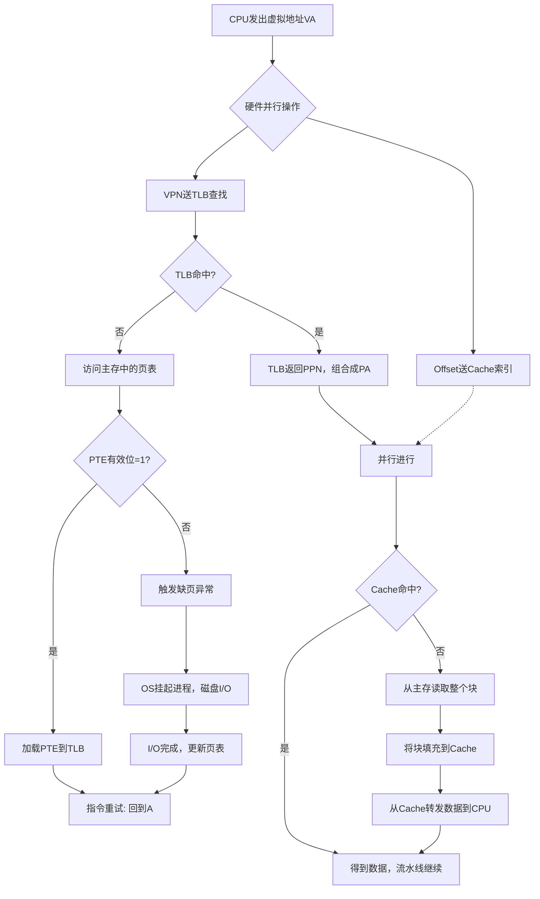

# 第二章 MIPS指令集


## 1. 核心设计准则（硬件基础）

- **指令即数**：每条MIPS指令被编码为一个**32位二进制数**，存储在内存中。CPU取出该数、解码、执行。
- **程序存储概念**：程序以二进制文件形式放在内存里，因此可以发行二进制兼容的软件。
- **RISC设计原则**：
  - 指令长度固定（32位），格式固定（前6位一定是操作码opcode），硬件解码简单，速度快。
  - 指令种类少、寻址方式少。
  - 算术操作的操作数必须来自**寄存器**（Load/Store体系结构），不允许算术指令直接操作内存。
  - 允许指令中包含立即数（常数），减少访存。
  - **字对齐**：即一个32位数据的起始内存地址，必然是4的倍数。（因此在进行空间寻址的时候，写的是连续4个字节内存空间的第一个字节的起始地址，而不是写最后一个字节的地址）

---

## 2. 寄存器堆（硬件结构）

- 物理上有 **32个寄存器**，每个能存放 **32位（1个字，即一个$word$）** 的二进制数据。
- 端口配置：
  - **2个读端口（$scr \ data1（32位）和 src \ data2（32位）$）**：可以同时读出两个不同寄存器的值。
  - **1个写端口（$Write \ Data（32位）$）**：一个时钟周期内只能向一个寄存器写入数据。
- 重要信号定义（答Q1）：
  - **Src1 Data**：从第一个读端口输出的32位数值（来自`rs`字段指定的寄存器）。
  - **Src2 Data**：从第二个读端口输出的32位数值（来自`rt`字段指定的寄存器）。
  - **Write Data**：准备写入某个寄存器的32位数值（来自ALU结果或内存读取数据），配合写使能（RegWrite）和写寄存器编号（dst addr）在时钟上升沿写入。
- **$zero寄存器**：硬件固定为常数0，写入它无效。
- **寄存器约定表格**

| 名称        | 寄存器号 | 用途                     | 调用时是否保存？ |
| :---------- | :------: | :----------------------- | :--------------- |
| `$zero`     | 0        | 常数 0 (hardware)        | 不适用           |
| `$at`       | 1        | 为汇编程序保留           | 不适用           |
| `$v0`-`$v1` | 2-3      | 计算结果和表达式求值     | 否               |
| `$a0`-`$a3` | 4-7      | 参数                     | 是               |
| `$t0`-`$t7` | 8-15     | 临时变量                 | 否               |
| `$s0`-`$s7` | 16-23    | 保留寄存器               | 是               |
| `$t8`-`$t9` | 24-25    | 更多临时变量             | 否               |
| `$gp`       | 28       | 全局指针                 | 是               |
| `$sp`       | 29       | 栈指针                   | 是               |
| `$fp`       | 30       | 帧指针                   | 是               |
| `$ra`       | 31       | 返回地址 (hardware)      | 是               |

---

## 3. 三种指令格式（必须熟记字段定义）

MIPS所有指令长度均为32位（32位2进制数），根据功能分为三种编码格式：

### 3.1 R型（Register，寄存器型）

用于算术、逻辑、移位、比较（如`add`、`sub`、`and`、`or`、`nor`、`sll`、`srl`、`slt`）。


| 字段 | op | rs | rt | rd | shamt | funct |
| :--- | :--- | :--- | :--- | :--- | :--- | :--- |
| 位数 | 6位 | 5位 | 5位 | 5位 | 5位 | 6位 |

- **op**：操作码，R型固定为0。
- **rs**：第一个源操作数寄存器编号。
- **rt**：第二个源操作数寄存器编号。
- **rd**：目的寄存器编号（存放结果）。
- **shamt**：移位量（仅移位指令使用，范围为0~31）。
- **funct**：功能码，区分具体操作（如`0x20`表示`add`，`0x22`表示`sub`，`0x2A`表示`slt`）。

### 3.2 I型（Immediate，立即数/数据传输/分支型）

用于加载/存储（`lw`、`sw`、`lb`、`sb`）、立即数运算（`addi`、`andi`、`ori`、`slti`、`lui`）、条件分支（`beq`、`bne`）。

| 字段 | op | rs | rt | immediate |
| :--- | :--- | :--- | :--- | :--- |
| 位数 | 6位 | 5位 | 5位 | 16位 |

- **rs**：基址寄存器或第一个比较寄存器。
- **rt**：目标寄存器（加载时）或源寄存器（存储时）或第二个比较寄存器（分支时）。
- **immediate**：16位立即数或偏移量。

### 3.3 J型（Jump，跳转型）

用于无条件跳转（`j`、`jal`）。

| 字段 | op | address |
| :--- | :--- | :--- |
| 位数 | 6位 | 26位 |

- **address**：26位目标地址（实际使用时左移2位变成28位，与PC高位拼接）。


### 3.4 三种类型指令的OP和Funct字段的编码（重要）

#### R 型指令（op = `0x00` / `000000`）

| 指令              | funct (十六进制) | funct (二进制) | 说明                           |
| :---------------- | :--------------: | :------------: | :----------------------------- |
| `sll`             |      `0x00`      |   `000000`     | 逻辑左移（移位量在 shamt 字段） |
| `srl`             |      `0x02`      |   `000010`     | 逻辑右移                       |
| `jr`              |      `0x08`      |   `001000`     | 跳转到寄存器地址               |
| `add`             |      `0x20`      |   `100000`     | 加法（有符号，溢出异常）       |
| `sub`             |      `0x22`      |   `100010`     | 减法                           |
| `and`             |      `0x24`      |   `100100`     | 按位与                         |
| `or`              |      `0x25`      |   `100101`     | 按位或                         |
| `nor`             |      `0x27`      |   `100111`     | 按位或非                       |
| `slt`             |      `0x2A`      |   `101010`     | 有符号比较置位（小于则置1）    |
| `sltu`            |      `0x2B`      |   `101011`     | 无符号比较置位                 |

#### I 型指令（看 op 字段）

| 指令              | op (十六进制) | op (二进制)  | 说明                           |
| :---------------- | :-----------: | :----------: | :----------------------------- |
| `beq`             |    `0x04`     |  `000100`    | 相等则分支                     |
| `bne`             |    `0x05`     |  `000101`    | 不相等则分支                   |
| `addi`            |    `0x08`     |  `001000`    | 立即数加法（有符号）           |
| `slti`            |    `0x0A`     |  `001010`    | 立即数比较置位                 |
| `andi`            |    `0x0C`     |  `001100`    | 立即数按位与（零扩展）         |
| `ori`             |    `0x0D`     |  `001101`    | 立即数按位或（零扩展）         |
| `lui`             |    `0x0F`     |  `001111`    | 加载高16位立即数               |
| `lw`              |    `0x23`     |  `100011`    | 加载字（Load Word）            |
| `sw`              |    `0x2B`     |  `101011`    | 存储字（Store Word）           |

#### J 型指令（看 op 字段）

| 指令              | op (十六进制) | op (二进制)  | 说明                           |
| :---------------- | :-----------: | :----------: | :----------------------------- |
| `j`               |    `0x02`     |  `000010`    | 无条件跳转                     |
| `jal`             |    `0x03`     |  `000011`    | 跳转并链接（存入 `$ra`）       |


---

## 4. 算术与逻辑运算指令（分类型标注）

### 4.1 算术运算

- **`add rd, rs, rt`** **[R型]**：`rd = rs + rt`（有符号加法，溢出触发异常）。
- **`sub rd, rs, rt`** **[R型]**：`rd = rs - rt`（有符号减法）。
- **`addi rt, rs, immediate`** **[I型]**：`rt = rs + 符号扩展(immediate)`。常数范围：`-32768 ~ +32767`。

### 4.2 逻辑运算（按位操作）

- **`and rd, rs, rt`** **[R型]**：`rd = rs & rt`（按位与）。
- **`or rd, rs, rt`** **[R型]**：`rd = rs | rt`（按位或）。
- **`nor rd, rs, rt`** **[R型]**：`rd = ~(rs | rt)`（按位或非）。
- **`andi rt, rs, immediate`** **[I型]**：`rt = rs & 零扩展(immediate)`（16位立即数高位补0）。
- **`ori rt, rs, immediate`** **[I型]**：`rt = rs | 零扩展(immediate)`。

### 4.3 移位操作（空位补0）

- **`sll rd, rt, shamt`** **[R型]**：逻辑左移，`rd = rt << shamt`，低位补0。
- **`srl rd, rt, shamt`** **[R型]**：逻辑右移，`rd = rt >> shamt`，高位补0。
- 用途：打包/拆包字节数据，或者乘以/除以2的幂。

### 4.4 大常数加载（超过16位）

由于I型立即数只有16位，加载32位完整常数必须分两步：

1. **`lui rt, immediate`** **[I型]**：将16位立即数加载到`rt`的**高16位**，低16位填0。
2. **`ori rt, rt, immediate`** **[I型]**：将另一个16位立即数通过按位或填入低16位。
   最终`rt` = 高16位常数 + 低16位常数。
例子：
lui $t0, 0x1234      # 执行后：$t0 = 0x12340000，加载高16位（lui）
ori $t0, $t0, 0xABCD # 执行后：$t0 = 0x1234ABCD，填入低16位（ori）

---

## 5. 内存访问指令（I型，地址计算方式）

内存按**字节编址**（每个地址对应1个字节）。MIPS字的起始地址必须是4的倍数（对齐限制）。
MIPS采用**大端 Big-Endian**字节序：字的最高有效字节（最左边）存放在最低地址。

- 注意： **字节编址**指的是：内存控制器规定，​**每一个地址编号（32位）**​（比如 `0x00000000`、`0x00000001`），对应的物理存储空间是**1个字节（8 个 bit）**。

### 5.1 字传输

- **`lw rt, offset(rs)`** **[I型]**：计算地址 = `rs`的值 + 符号扩展(offset)（16位），从该内存地址读取1个字（4字节）放入`rt`。
- **`sw rt, offset(rs)`** **[I型]**：将`rt`的值写入地址 = `rs`的值 + 符号扩展(offset)处的4个字节。

### 5.2 字节传输（重点，答Q2）

- **`lb rt, offset(rs)`** **[I型]**：从内存地址处读取1个字节（8位）放入`rt`的**最低8位**，**高24位执行符号扩展**（将该字节的最高位复制到高24位）。若字节最高位为1，则寄存器变为`0xFFFFFF??`；若为0，则变为`0x000000??`。无符号版本为`lbu`（高位补0）。
- **`sb rt, offset(rs)`** **[I型]**：将`rt`的**最低8位**写入指定的内存地址。**该地址所在32位字内的其他3个字节完全不受影响**，保持原值。

---

## 6. 控制流指令（分支与跳转，重点地址计算）

### 6.1 条件分支（I型）

- **`beq rs, rt, Label`** **[I型]**：若`rs == rt`，则跳转到Label。
- **`bne rs, rt, Label`** **[I型]**：若`rs != rt`，则跳转到Label。
- **分支地址的硬件计算步骤**：
  1. 当前PC（程序计数器）已更新为`PC + 4`（指向下一条指令）。（为了让 CPU 能连续不断地工作，硬件在​取指（IF）阶段​，取出当前指令的同时，​加法器自动计算 ​`PC = PC + 4`​，并把新值写回 PC 寄存器。这个动作是​无条件的、每个周期都会发生的硬件行为​，不受当前指令是什么类型的影响。）
  2. 指令中的16位`immediate`被硬件解读为**相对于下一条指令的指令条数偏移**。
  3. 硬件将`immediate`**左移2位（即乘以4，因为想要跨越一条指令就要跨过4个字节，因此乘4后便得到总共跨越了多少字节）**，将“指令条数”换算为“字节数”。此时得到一个**18位**的字节偏移量（因为左移增加了位数）。
  4. 硬件对这个18位数进行**符号扩展**，补齐为**32位**的字节偏移量。
  5. 最终跳转地址 = 32位的`(PC + 4)` + 32位的符号扩展字节偏移量。结果是一个**32位的绝对字节地址**。（**但是需要注意，18条线的总线不标准且不常用，因此常用：先把32位补齐，再左移两位。先补全再左移和先左移再补全的数学效果是一样的，以上步骤从理解方面是没有问题的！！！**）
- 跳转范围：±$2^{15}$条指令（16位立即数的取值范围是**-32768 ~ +32767**），即±$2^{17}$个字节（**-32768×4 ~ +32767×4**），约±128KB。绝大多数循环和条件跳转都在这个局部范围内。
- 注意：在 CPU 的电路里，​**没有十进制，也没有十六进制**​，只有高电平和低电平（二进制 0 和 1）。所谓的“乘以 4”，在硬件二进制电路里叫​**逻辑左移 2 位（Left Shift by 2）**。这个过程根本不需要做乘法器，直接把二进制数的末尾补上两个 `0` 就行了。十六进制纯粹是给人看的！

### 6.2 比较置位指令（为分支创造条件）

- **`slt rd, rs, rt`** **[R型]**：若`rs < rt`（有符号比较），则`rd = 1`；否则`rd = 0`。
- **`slti rt, rs, immediate`** **[I型]**：若`rs < 符号扩展(immediate)`，则`rt = 1`。
- **`sltu`** **[R型]**与**`sltiu`** **[I型]**：执行**无符号比较**。常用于数组边界检查（可同时检测`x < 0`和`x >= y`，因为负数在无符号视角下是极大的数）。
- 通过组合`slt`（或`slti`）与`beq`/`bne`（配合`$zero`），可构建`blt`、`bgt`、`ble`、`bge`等伪指令。

### 6.3 无条件跳转（J型和R型）

- **`j Label`** **[J型]**：直接跳转。目标地址 = `PC`的高4位与`address`字段左移2位（26位变28位）拼接。可跳转至当前PC所在256MB范围内的任意地址。
- “当前PC所在256MB范围”，**准确含义是“与当前PC拥有相同高4位（二进制）数值的那一整块256MB连续空间”**，而不是“PC正负128MB的浮动窗口”。若PC=0x3C00 0000，那么跳转的空间为0x3000 0000 ~ 0x3FFF FFFF
- **`jr rs`** **[R型]**：跳转到`rs`寄存器中存放的地址（用于函数返回）。

### 6.4 远距离分支处理

若条件分支的目标超过16位偏移量范围，汇编器将条件取反，插入一条`j`指令：
原代码：`beq $s0, $s1, L1`
转换为：`bne $s0, $s1, L2` + `j L1` + `L2: ...`

---

## 7. 过程调用（函数调用/子程序）

### 7.1 核心指令

- **`jal ProcedureAddress`** **[J型]**：跳转并链接。执行两个动作：
  1. 将`PC + 4`（即`jal`下一条指令的地址）存入`$ra`（返回地址寄存器，第31号寄存器）。
  2. 跳转到ProcedureAddress。
- **`jr $ra`** **[R型]**：将控制权返回给调用者，跳转到`$ra`存放的地址。

### 7.2 寄存器使用约定（为了编译器和程序员协作）

- **参数传递**：`$a0` ~ `$a3`（4个参数寄存器），调用者将参数放入这些寄存器。
- **返回值**：`$v0` ~ `$v1`（2个值寄存器），被调用者将结果存入这里。
- **返回地址**：`$ra`。
- **保留寄存器（调用者保存）**：`$s0` ~ `$s7`。调用者（主函数）假定这些寄存器在子函数调用**前后值不变**。子函数若要用它们，必须保存并恢复，因此需要压栈和出栈。
- **临时寄存器（被调用者保存）**：`$t0` ~ `$t9`。子函数可随意使用，无需保存。

### 7.3 栈（$sp）的硬件操作

- `$sp`（栈指针，第29号寄存器）指向栈顶。MIPS栈向**低地址**方向增长（从上向下增长）。
- **压栈（存入）**：
  ```assembly
  addi $sp, $sp, -4   # 栈指针下移4字节
  sw   $t0, 0($sp)    # 将$t0的值存入新的栈顶位置
  ```
- **出栈（取出）**：
  ```assembly
  lw   $t0, 0($sp)    # 从栈顶取出值到$t0
  addi $sp, $sp, 4    # 栈指针上移4字节
  ```

### 7.4 什么时候必须压栈？压入的是什么？

**压入的内容**：执行`sw`指令时，CPU读取**指定寄存器内的32位数值（二进制数据）**，将其复制写入内存。**绝不写入寄存器的编号（如数字4）**，也绝不写入寄存器的地址。

- 注意：

| 概念层级 | 位宽 / 形态 | 存放位置 | 具体例子（以 `$s0` 为例） | 本质作用（一句话总结） |
| :--- | :--- | :--- | :--- | :--- |
| **① 寄存器的编号** | **5 位**（二进制）（范围 0~31） | 存放在 **指令（机器码）** 的 `rs/rt/rd` 字段中 | 二进制 `10000`（代表第 16 号寄存器） | 告诉CPU**要操作哪个**寄存器。 |
| **② 寄存器的物理选择线** | **1 根有效的高电平线**（由 5→32 译码器产生） | 存在于 CPU 内部的 **译码器电路** 中 | 第 16 根物理导线被激活 | 物理上**打开** 16 号寄存器的闸门，让数据能进出。 |
| **③ 寄存器里存储的值** | **32 位**（二进制）（即 1 个字） | 存放在寄存器堆 **（Regfile）** 的锁存器里 | 存的是 `0x00000005`（整数 5） 或 `0x10008000`（地址），取决于要存什么 | 程序运行时真正要计算的**数据**（变量值、指针等）。 |
| **④ 压栈写入内存的值** | **32 位**（二进制）（即 1 个字） | 存放在 **内存（RAM）的栈区** 里 | 复制了上面的 `0x00000005` | 数据的**临时备份**，用于保护现场，等出栈时再恢复。 |

1. **“编号”和“值”永远不会混在一起**：
   
   - **`$s0` 的编号（16）** 永远只存在于 **机器码的 5 位字段** 中。
   - **`$s0` 里的值（如 5）** 永远只存在于 **寄存器堆的 32 位锁存器** 或 **内存（栈）** 中。
   - **两者从物理位置上就是隔绝的**，所以在压栈时，CPU 根本“看”不到那个编号 16，它只搬运锁存器里的 5。
2. **32 位只属于数据，不属于编号**：
   
   - 寄存器的编号只有 **5 位**，寄存器的物理选择线是 **1 根线**，它们都不是 32 位。
   - 只有 **数据（值）** 在 MIPS 中才是 32 位（无论是存在寄存器里，还是存在栈里）。
     

**必须压栈的三种情况**：

1. **保护`$s`寄存器**：子函数开头若打算使用`$s0`~`$s7`，必须先将这些寄存器的原值压栈保存。子函数返回前出栈恢复这些寄存器存放的原值。目的：遵守调用约定，保证调用者看到的值没变。
2. **嵌套调用时保护`$ra`**：若子函数A内部要调用子函数B，执行`jal B`会覆盖`$ra`。A必须在`jal B`之前将当前的`$ra`压栈保存，B返回后出栈恢复，才能正确返回给主调者。
3. **嵌套调用时保护`$a0`~`$a3`**：若A在调用B**之后**还需要使用原有的参数值，但B也会使用`$a0`-`$a3`接收自己的参数，这会冲掉A的参数。因此A必须在`jal B`之前将`$a0`-`$a3`压栈保护，B返回后再出栈恢复。

**注意**：如果只是为了计算中间变量，绝对不会为了“腾出`$a0`”而压栈。MIPS会优先使用未使用的`$t`临时寄存器。压栈访存很慢，非必要不使用。

### 7.5 帧指针（$fp）

当函数内部`$sp`频繁变化（如多次压栈出栈）时，用`$fp`（帧指针，第30号寄存器）固定指向当前函数栈帧的起始地址。局部变量和保存的寄存器可以通过相对于`$fp`的固定偏移量访问。在函数入口，`$fp = $sp`，返回时用`$fp`恢复`$sp`。

---

## 8. MIPS内存布局（虚拟地址空间分布）

从低地址到高地址排列：

| 起始地址 | 区域 | 用途 |
| :--- | :--- | :--- |
| `0x00000000` | 保留区 | 不可访问，用于捕捉空指针等。 |
| `0x00400000` | 正文段（程序代码） | 存放指令的机器码（程序代码）。 |
| `0x10000000` | 静态数据段 | 存放全局变量、常量（`$gp`指向此处附近）。 |
| `0x10008000` | 动态数据段（堆） | 程序运行时用`malloc`动态分配的空间，向高地址增长。 |
| `0x7FFFFFFC` | 栈段 | 存放函数调用栈帧（局部变量、保存的寄存器），向低地址增长（由`$sp`管理）。 |

---

## 9. 总结易混淆点z

1. **指令格式分类**：运算/移位/比较 -> **R型**；访存/立即数/分支 -> **I型**；无条件跳转 -> **J型**。
2. **寄存器堆信号**：`Src1 Data`和`Src2 Data`是**输出**（从寄存器读出）；`Write Data`是**输入**（待写入）。
3. **加载字节（`lb`）**：寄存器高24位 = 所取字节最高位的**符号扩展**。`lbu`则高位补0。
4. **存储字节（`sb`）**：仅改写目标地址所在的1个字节，该32位字中的其余3个字节**保持原值不变**。
5. **分支地址计算**：偏移量先乘以4（左移2位），完成“指令条数→字节数”的单位换算；再符号扩展至32位，与`PC+4`相加，得到32位字节地址。
6. **压栈本质**：永远压入寄存器中的**32位数值**（具体的二进制数据），不是寄存器的编号，也不是寄存器的硬件地址。
7. **保护性压栈的动机**：
   - 压`$s` -> 因为调用者期待它们不变（约定）。
   - 压`$ra` -> 因为`jal`会覆盖它（不存就丢了返回地址）。
   - 压`$a` -> 因为嵌套调用会覆盖当前参数（等内层返回后还要用）。


---

##  MIPS 循环与数组访问（题型整理）


> **核心公式**：
> - 若访问 `D[4*j]` 且 `D` 为 `int` 型（4字节），地址偏移量 = `(4*j) * 4 = 16*j` → 汇编中**左移 4 位**（`sll ... 4`）。
> - 若访问 `D[j]` 且 `D` 为 `int` 型，地址偏移量 = `j * 4` → 汇编中**左移 2 位**（`sll ... 2`）。

---

### 类型一：单层 for 循环

#### 📝 题目
> 将下面的 C 代码翻译为 MIPS 汇编代码。要求使用的指令数目最少。
>
> 假设变量 `a` 存放在寄存器 `$s0` 中，变量 `i` 存放在 `$t0` 中，数组 `D` 的基地址存放在寄存器 `$s2` 中。
>
> ```c
> for(i = 0; i < a; i++) {
>     D[4*i] = i + 10;
> }
> ```

---

####  标准答案（MIPS 汇编）

```mips
    move $t0, $zero      # i = 0
Loop:
    addi $t1, $t0, 10    # $t1 = i + 10 (待写入的数据)
    sll  $t2, $t0, 4     # $t2 = i * 16 (4*i*4 字节偏移)
    add  $t2, $s2, $t2   # $t2 = &D[4*i] (实际内存地址)
    sw   $t1, 0($t2)     # D[4*i] = i + 10
    addi $t0, $t0, 1     # i++
    slt  $t3, $t0, $s0   # $t3 = (i < a)
    bne  $t3, $zero, Loop # 若成立，继续循环
```

**指令计数**：初始化 1 条 + 循环体 7 条（含跳转判断）。  
**关键点**：`sll $t2, $t0, 4` 是关键，它把索引 `i` 直接乘以 16，而不是用两条指令做乘法，这是“最少指令”的体现。

---

### 类型二：双层 for 循环（嵌套循环）

#### 📝 题目
> 将下面的 C 代码翻译为 MIPS 汇编代码。要求使用的指令数目最少。
>
> 假设 `a`、`b`、`i`、`j` 分别存放在寄存器 `$s0`、`$s1`、`$t0`、`$t1` 中，数组 `D` 的基地址存放在寄存器 `$s2` 中。
>
> ```c
> for(i = 0; i < a; i++) {
>     for(j = 0; j < b; j++) {
>         D[4*j] = i + j;
>     }
> }
> ```

---

####  标准答案（MIPS 汇编）

```mips
    move $t0, $zero      # i = 0
OuterTest:
    slt  $t2, $t0, $s0   # $t2 = (i < a)
    beq  $t2, $zero, End # 若 i>=a，退出
    move $t1, $zero      # j = 0 (内层循环初始化)
InnerTest:
    slt  $t2, $t1, $s1   # $t2 = (j < b)
    beq  $t2, $zero, OuterNext # 若 j>=b，跳出内层，准备 i++
    add  $t3, $t0, $t1   # $t3 = i + j (待写入的数据)
    sll  $t4, $t1, 4     # ★核心：$t4 = j * 16 (4*j*4 字节偏移)
    add  $t4, $s2, $t4   # $t4 = &D[4*j] (实际内存地址)
    sw   $t3, 0($t4)     # D[4*j] = i + j
    addi $t1, $t1, 1     # j++
    j    InnerTest       # 继续内层循环判断
OuterNext:
    addi $t0, $t0, 1     # i++
    j    OuterTest       # 继续外层循环判断
End:
```
  
**关键点**：千万不要把索引 `4*j` 和偏移量搞混。因为 C 语言数组下标是 `4*j`（即下标为 4、8、12...），且 `D` 是 `int`（4字节），所以总偏移 = `4*j * 4 = 16*j`，即左移 4 位。如果题目中的 `D` 是 `char` 型（极少见），才左移 2 位。

---

###  两种题型的对比与总结

> [!NOTE] 
> 1. **看循环层数**：外层管行，内层管列。单层for循环用bne且写最后，双层for循环写beq且写前面。
> 2. **算地址偏移**：
>    - 下标是 `n`，元素占 `m` 字节，偏移 = `n * m`。
>    - 在 MIPS 中，优先用 `sll`（左移）实现乘以 2 的幂次。
> 3. **防错提醒**：`sw` 指令的地址**必须 4 字节对齐**（低 2 位为 0）。像 `slt` + `add` 基址这种写法会导致地址非对齐，硬件会报错。

---
# 第三章 计算机的算术运算


## 第一部分：整数的表示

### 1. 无符号整数 (Unsigned Integer)

| 属性             | 说明                                                    |
| :------------- | :---------------------------------------------------- |
| **定义**         | 全部位（8/16/32位）都用来表示绝对值，无正负号。                           |
| **8位范围**       | $0 \sim +255$（即 $2^8 - 1$）                            |
| **32位范围**      | $0 \sim +4,294,967,295$（即 $2^{32} - 1$）               |
| **二进制示例 (8位)** | `00000000`(0) → `00000001`(1) → ... → `11111111`(255) |

**硬件特点**：加法器电路不区分符号位，所有位都参与数值运算。

---

### 2. 原码 (Sign-Magnitude)

| 属性 | 说明 |
| :--- | :--- |
| **定义** | 最高位为符号位：**0 代表正数，1 代表负数**；剩余位表示数值的绝对值。 |
| **8位范围** | $-127 \sim -0 \sim +0 \sim +127$（即 $-(2^7-1) \sim +(2^7-1)$） |
| **缺点** | 1. 存在 **“正零”(`00000000`)** 和 **“负零”(`10000000`)** 两个编码，编程不便。2. 加法器无法直接处理符号位，需要额外逻辑判断正负，硬件复杂。 |

---

### 3. 反码 (Ones' Complement)

| 属性 | 说明 |
| :--- | :--- |
| **定义** | 正数表示与原码相同；负数是将对应正数（最高位为0）的**所有位按位取反**得到。 |
| **8位示例** | 正数 `00000001`(+1) → 负数 `11111110`(-1) |
| **8位范围** | 同样为 $-127 \sim +127$，**依然存在正零 (`00000000`) 和负零 (`11111111`)** |
| **缺点** | 加法时需要对进位进行“循环进位”（端回进位），硬件实现不够直接。 |

---

### 4. 补码 (Two's Complement) —— 现代计算机采用的标准

#### 4.1 核心定义与范围

| 属性 | 说明 |
| :--- | :--- |
| **定义** | 正数：最高位（符号位）为 0，其余位表示数值本身。负数：先将该数对应的正数**按位取反**，再 **+1**。 |
| **8位范围** | $-128 \sim +127$（即 $-2^7 \sim +2^7-1$） |
| **32位范围** | $-2,147,483,648 \sim +2,147,483,647$（即 $-2^{31} \sim +2^{31}-1$） |
| **唯一零编码** | `00000000` 表示 0，**不存在“负零”**。 |

#### 4.2 重要性质：求相反数的方法

> 对一个补码整数取相反数（即正变负、负变正），硬件上执行的操作为：**按位取反，再加 1**。

**数学证明**：
对于任意 n 位数 $x$，有 $x + \overline{x} = 111...111_2 = -1$（因为全1在补码中代表 -1）。
因此 $x + \overline{x} = -1 \Rightarrow \overline{x} + 1 = -x$。

#### 4.3 符号扩展 (Sign Extension)

| 场景 | 说明 |
| :--- | :--- |
| **什么是符号扩展** | 将一个 **位数较少** 的补码数扩展为 **位数较多** 的补码数时，将原数的**符号位（最高位）复制填充到所有新增的高位**上。 |
| **MIPS中的应用** | `addi` 指令中的 **16位立即数** 在参与32位运算前，硬件会自动将其符号扩展为32位。 |
| **示例** | 16位补码 `0xFFE0`（十进制 -32）→ 符号扩展为32位：`0xFFFFFFE0`。 |

#### 4.4 大小端编址 (Endianness)

> 讨论的是：一个**多字节整数**（如32位 int）在内存中**以字节为单位存放时，各字节的顺序**。

| 模式 | 定义 | 示例（存储 32位值 `0x12345678`，起始地址为 0x00） |
| :--- | :--- | :--- |
| **大端 (Big-Endian)** | **高有效字节** 存放在 **低地址**。 | 0x00: `12`，0x01: `34`，0x02: `56`，0x03: `78` |
| **小端 (Little-Endian)** | **低有效字节** 存放在 **低地址**。 | 0x00: `78`，0x01: `56`，0x02: `34`，0x03: `12` |
| **MIPS采用** | 默认采用 **大端** 编址方式（部分MIPS实现可配置）。 | |

**注意**：网络协议（TCP/IP）统一采用大端，因此大端也叫“网络字节序”。

---

## 第二部分：整数的四则运算与 ALU 设计

### 1. 补码加减法与溢出判断

#### 1.1 加法与减法

硬件将减法 `A - B` 统一转化为 **补码加法** 处理：`A - B = A + (-B)`，其中 `-B` 是通过“按位取反+1”得到的。

#### 1.2 溢出 (Overflow)

| 溢出类型 | 触发条件 | 具体情形（两个操作数符号） |
| :--- | :--- | :--- |
| **上溢 (正溢出)** | 结果超出最大正数表示范围。 | **正 + 正 = 负**（符号位本应为0却变成了1） |
| **下溢 (负溢出)** | 结果超出最小负数表示范围。 | **负 + 负 = 正**（符号位本应为1却变成了0） |
| **不可能溢出** | 不会发生溢出。 | **正 + 负** 或 **负 + 正**（两数符号相异） |

**MIPS 对溢出的处理策略**：

- 指令分为 **溢出时触发异常** 和 **溢出时忽略** 两类：
  - `add`、`addi`、`sub`：运算结果发生溢出时，触发**异常（中断）**，由操作系统处理。
  - `addu`、`addiu`、`subu`：无符号运算版本，溢出时**不触发异常**，直接截断结果（高位丢弃）。
    

---

### 2. 1位ALU的实现

#### 2.1 全加器 (Full Adder)

**输入**：`A`（加数1位）、`B`（加数1位）、`CarryIn`（来自低位的进位）。
**输出**：`Sum`（和）、`CarryOut`（向高位的进位）。

| 逻辑方程 | 推导 |
| :--- | :--- |
| `Sum = A ⊕ B ⊕ CarryIn` | 三个输入中1的个数为奇数时和为1，偶数时和为0。 |
| `CarryOut = (A·B) + (CarryIn·(A ⊕ B))` | 至少两个输入为1时产生进位。 |

**即使最低位ALU不需要进位输入，也要使用全加器的原因**：统一硬件结构，便于扩展为支持减法（最低位 `CarryIn` 用于“+1”操作）和多字运算。

#### 2.2 支持 and、or、nor 运算

- **and 和 or**：直接使用与门和或门分别计算，再用 **3路多路选择器** 在 `add`、`and`、`or` 三种结果中根据控制信号选择输出。
- **nor 的实现**：利用**德摩根律** $\overline{A+B} = \overline{A} \cdot \overline{B}$。先将 A 和 B 分别通过非门取反，再将两个反信号输入与门，即可得到或非结果。

#### 2.3 支持减法 (sub)

核心思想：`A - B = A + (-B)`，而 `-B` 在补码中为 `~B + 1`。

在1位ALU中引入 **`Binvert`** 控制信号：

- 当 `Binvert = 1` 时，B 的输入经过非门取反。
- 将 **最低位全加器的 CarryIn 设置为 1**，实现“+1”操作。
- 这样，`A + (~B) + 1 = A - B` 直接由加法器完成。

---

### 3. 32位 ALU：行波进位加法器 (Ripple-Carry Adder)

将32个1位ALU按 **低位进位输出 → 高位进位输入** 串联拼接而成。

#### 3.1 支持 slt (Set on Less Than)

`slt rd, rs, rt` 的功能：若 `rs < rt`，则 `rd = 1`；否则 `rd = 0`。

硬件实现机制：

- 计算 `rs - rt`（即执行减法）。
- 最高位 ALU 的 **符号位（Result[31]）** 即是比较结果：
  - 若差为负数，符号位为1。
  - 若差为非负数，符号位为0。
- 将该符号位从最高位 ALU 的 **Less** 输入传递至 **最低位 ALU 的 Less**，使最低位 ALU 的输出为1或0，而其他31位 ALU 的 Less 信号恒定为0（最高位ALU的 Less 信号为0）。

#### 3.2 支持条件分支 (beq / bne)

对32位 ALU 结果 `Result[31:0]` 进行 **或非** 运算：

- 若所有位均为0，则 `Zero = 1`，表示 `rs == rt`。
- 若任意位为1，则 `Zero = 0`，表示 `rs != rt`。
- `Zero` 信号直接输出供分支判断电路使用。

#### 3.3 ALU 控制信号表

| ALU控制线 `[2:0]` | 功能 | 说明 |
| :--- | :--- | :--- |
| `000` | and | 按位与 |
| `001` | or | 按位或 |
| `010` | add | 加法 |
| `110` | subtract | 减法（Binvert=1, CarryIn=1） |
| `111` | slt | 比较置位 |
| `100` | nor | 或非 |

#### 3.4 性能瓶颈：行波进位延迟

- **关键路径**：进位信号从最低位 ALU 逐级传递到最高位 ALU，需经过32级全加器。
- **门延迟估算**：每个全加器的进位产生需要经过 **与门** 和 **或门** 各一次，共2级门延迟；32位行波进位加法器总延迟为 **64个门延迟**，速度较慢。

---

### 4. 超前进位加法器 (Carry-Lookahead Adder) —— 用空间换时间

#### 4.1 核心思想

通过 **提前计算出每一位的进位信号**，消除进位逐级传递的延迟。将32位分为若干组（通常4位一组），在组内和组间都使用超前进位逻辑并行计算进位。

#### 4.2 门延迟计算（结论）

设加法器位宽为 n 位，找到 **最小的整数 k**，使得 $ 4^k \ge n$（即 n 是 4 的几次方），则：

- 超前进位加法器的门延迟 ≈ $ 2k + 1$。

**实例对比**：

| 加法器位宽 | 行波进位延迟（门级）          | 超前进位延迟（门级）           | 加速比（理论值）              |
| :---- | :------------------ | :------------------- | :-------------------- |
| 16位   | $16 \times 2 = 32$  | $2 \times 2 + 1 = 5$ | $32/5 = 6.4$倍         |
| 32位   | $32 \times 2 = 64$  | $2 \times 3 + 1 = 7$ | $64/7 \approx 9.1$倍   |
| 64位   | $64 \times 2 = 128$ | $2 \times 3 + 1 = 7$ | $128/7 \approx 18.3$倍 |

---

### 5. 乘法运算的硬件实现
#### 5.1 改进前的乘法器硬件结构

- **被乘数寄存器**：64位（初始被乘数放在低32位，高32位补0），每个时钟周期**左移1位**。
- **乘数寄存器**：32位，每个时钟周期**右移1位**（从最低位依次取出乘数的每一位）。
- **积寄存器**：64位，初始为0。
- **控制逻辑**：每轮检查乘数寄存器最低位：若为1，将64位被乘数加到积寄存器；若为0，跳过加法。然后被乘数左移1位，乘数右移1位。

**性能**：需 **32轮迭代**，每轮包括加法、左移、右移，约100个时钟周期才能完成一次32位乘法。

#### 5.2 改进后的乘法器（硬件优化）

**核心优化**：将 **积寄存器的低32位** 与 **乘数寄存器** 合并为一个64位寄存器（称为“积/乘数寄存器”）。

- 初始时，积的高32位为0，低32位存放乘数。
- 每轮迭代：
  1. 检查“积/乘数寄存器”的 **最低位**（即当前乘数位）。
  2. 若是1，将被乘数与 **积寄存器的高32位** 相加（ALU位宽由64位缩减为32位）。
  3. 将整个64位“积/乘数寄存器” **逻辑右移1位**。
- 经过32轮迭代后，高32位为积，低32位被乘数原先的值被移出丢弃。

**优势**：

- ALU从64位缩减到32位，硬件规模减小。
- 每一步可在一个时钟周期内完成，总时钟周期降至约32个。

---

### 6. 除法运算的硬件实现
#### 6.1 改进前的除法器硬件结构

- **余数寄存器**：64位（初始存放被除数，放在低32位）。
- **除数寄存器**：64位（初始除数放在高32位，低32位补0），每轮右移1位。
- **商寄存器**：32位，每轮左移1位。
- **迭代次数**：需 **33轮**（n+1轮，因为初始余数在低32位，需要额外一次对齐）。

#### 6.2 改进后的除法器（硬件优化）

**与改进后的乘法器共享同一套硬件核心**（硬件复用思想）：

- 将 **余数寄存器的低32位** 与 **商寄存器** 合并为一个64位寄存器（称为“余数/商寄存器”）。
- ALU只对高32位进行减法运算。
- 经过 **32轮迭代** 后，高32位存放余数，低32位存放商。

---

### 7. 乘除法的进一步加速技术

| 技术名称 | 核心思想 | 加速效果 |
| :--- | :--- | :--- |
| **并行树乘法器** | 使用31个32位加法器构成树形结构，并行计算所有部分积并快速累加。 | 将乘法延迟从 O(n) 降至 O(log n)。 |
| **SRT除法算法** | 通过查表预测每步生成 **多个商位**（而非每次只生成1位），减少迭代次数。 | 每轮可产生2~4位商，大幅缩短除法时间。 |
| **超前进位加法器** | 在乘法/除法的加法步骤中，用超前进位替代行波进位。 | 加法的门延迟从 O(n) 降至 O(log n)。 |

> 这些技术均遵循 **用空间换时间** 的策略——消耗更多的硬件资源（更多逻辑门、更大面积的芯片）来换取更快的运算速度。

---

### 8. MIPS 乘除法指令（不是很重要）

| 指令 | 类型 | 功能 | 结果存放位置 |
| :--- | :--- | :--- | :--- |
| `mult rs, rt` | R型 | 有符号乘法 | 64位积：高32位 → `HI`，低32位 → `LO` |
| `multu rs, rt` | R型 | 无符号乘法 | 同上 |
| `div rs, rt` | R型 | 有符号除法 | 商 → `LO`，余数 → `HI`（余数符号与被除数相同） |
| `divu rs, rt` | R型 | 无符号除法 | 商 → `LO`，余数 → `HI` |
| `mfhi rd` | R型 | 从 HI 寄存器取值 | `rd = HI` |
| `mflo rd` | R型 | 从 LO 寄存器取值 | `rd = LO` |

**注意**：MIPS 的乘除法指令 **不触发溢出异常**，因此程序员或编译器需要自行判断结果是否溢出（例如除法时检查除数是否为0，乘法结果是否超过32位）。

---

## 第三部分：浮点数的表示与运算

### 1. IEEE 754 浮点数标准

> **核心设计目标**：用固定位数（32或64位）表示范围极大（$\pm 10^{38}$ 或 $\pm 10^{308}$）且精度可接受（约7位或16位十进制有效数字）的实数。

#### 1.1 科学记数法的二进制规格化

任何一个非零二进制实数都可以规格化为：

$$
(-1)^S \times (1.F)_2 \times 2^{E - \text{Bias}}
$$

- **S（符号位）**：0表示正数，1表示负数。
- **F（尾数/小数部分）**：规格化后，小数点左边始终为隐含的 **1**，因此在内存中只存储小数点右侧的 **F** 部分（节省1位精度）。
- **E（阶码）**：存储的是 **真实指数 + 偏移量（Bias）** 后的无符号整数，便于比较大小。

#### 1.2 单精度（32位）与双精度（64位）参数对比

| 参数              | 单精度 (Single)                                   | 双精度 (Double)                                     |
| :-------------- | :--------------------------------------------- | :----------------------------------------------- |
| **总位数**         | 32位                                            | 64位                                              |
| **符号位 S**       | 1位（最高位 bit31）                                  | 1位（最高位 bit63）                                    |
| **阶码 E**        | 8位（bit30 ~ bit23）                              | 11位（bit62 ~ bit52）                               |
| **尾数 F**        | 23位（bit22 ~ bit0）                              | 52位（bit51 ~ bit0）                                |
| **偏移量 (Bias)**  | $127$（即 $2^{7} - 1$）                           | $1023$（即 $2^{10} - 1$）                           |
| **真实指数范围**      | $-126 \sim +127$（E = 1 ~ 254）                  | $-1022 \sim +1023$（E = 1 ~ 2046）                 |
| **精度（有效十进制位数）** | 约 $7.2$ 位（$23 \times \log_{10}2 \approx 6.92$） | 约 $15.9$ 位（$52 \times \log_{10}2 \approx 15.65$） |

#### 1.3 特殊值的编码（单精度为例）

| 指数 E                              | 尾数 F           | 表示的意义                 | 说明                                                                                  |
| :-------------------------------- | :------------- | :-------------------- | :---------------------------------------------------------------------------------- |
| `00000000` (0)                    | `000...0` (全0) | **真值 0**（+0 或 -0）     | 符号位决定正负零，两者在比较时相等。                                                                  |
| `00000000` (0)                    | **非零**         | **非规格化数**             | 用于表示非常接近0的数（$< 2^{-126}$），牺牲精度换取更小值的表示，公式为 $(-1)^S \times (0.F)_2 \times 2^{-126}$。 |
| `11111111` (255)                  | `000...0` (全0) | **±∞（正负无穷）**          | 用于表示上溢结果（如 $1.0 / 0.0$）。                                                            |
| `11111111` (255)                  | **非零**         | **NaN（Not a Number）** | 表示无效操作（如 $0.0 / 0.0$，$\sqrt{-1}$）。                                                  |
| `00000001` ~ `11111110` (1 ~ 254) | 任意             | **规格化浮点数**            | 正常范围内的有效浮点数，公式为 $(-1)^S \times (1.F)_2 \times 2^{E - 127}$。                         |

#### 1.4 单精度绝对值范围

| 边界            | 计算过程                                                                 | 十进制近似值                         |
| :------------ | :------------------------------------------------------------------- | :----------------------------- |
| **最小值（正规格化）** | $1.0_2 \times 2^{1-127} = 2^{-126}$                                  | $\approx 1.18 \times 10^{-38}$ |
| **最大值（正规格化）** | $(1.111...111)_2 \times 2^{254-127} = (2 - 2^{-23}) \times 2^{127}$  | $\approx 3.40 \times 10^{38}$  |
| **最小非规格化正数**  | $0.000...001_2 \times 2^{-126} = 2^{-23} \times 2^{-126} = 2^{-149}$ | $\approx 1.40 \times 10^{-45}$ |

#### 1.5 双精度表示范围

- 最小值（正规格化）：$2^{-1022} \approx 2.23 \times 10^{-308}$
- 最大值（正规格化）：$(2 - 2^{-52}) \times 2^{1023} \approx 1.80 \times 10^{308}$

---

### 2. 十进制与 IEEE 754 浮点数的相互转换（标准步骤）

#### 2.1 十进制数 → IEEE 754 单精度（5步法）

1. **确定符号位 S**：正数为0，负数为1。
2. **十进制整数部分转二进制**：使用“除2取余，倒序排列”。
3. **十进制小数部分转二进制**：使用“乘2取整，正序排列”。
4. **规格化**：将二进制数写成 $\pm 1.F \times 2^{E_{\text{真实}}}$ 的形式，确定真实指数。
5. **计算阶码 E**：$E = E_{\text{真实}} + \text{Bias}$，转为8位无符号二进制。
6. **提取尾数 F**：去掉规格化后小数点左边的隐含 `1.`，保留有效位数（单精度23位，双精度52位），多余位进行舍入（向最接近的偶数舍入）。

#### 2.2 IEEE 754 → 十进制数（反向步骤）

1. **拆分字段**：按位取出 S、E、F。
2. **判断特殊值**：若 E 全0或全1，按特殊值规则解释（非规格化、无穷、NaN）。
3. **计算真实指数**：$E_{\text{真实}} = E - \text{Bias}$。
4. **拼接尾数**：将隐含的 `1.` 与 F 拼接，得到二进制小数 $1.F$。
5. **转换为十进制**：$(-1)^S \times (1.F)_2 \times 2^{E_{\text{真实}}}$，按权展开求和。

---

### 3. 浮点运算的步骤

#### 3.1 浮点加法（4步法：小对大 → 相加 → 规格化 → 舍入）

以 $0.5 + (-0.4375)$ 为例，验证浮点加法器的工作原理。

- $0.5 = 1.000_2 \times 2^{-1}$
- $-0.4375 = -1.110_2 \times 2^{-2}$

| 步骤         | 操作          | 具体过程                                                              |
| :--------- | :---------- | :---------------------------------------------------------------- |
| **Step 1** | **对阶（小对大）** | 将 $-1.110 \times 2^{-2}$ 化为 $-0.111 \times 2^{-1}$（尾数右移1位，指数 +1）。 |
| **Step 2** | **尾数相加**    | $1.000 + (-0.111) = 0.001$（即 $0.001 \times 2^{-1}$）。              |
| **Step 3** | **规格化**     | $0.001 \times 2^{-1} = 1.000 \times 2^{-4}$（尾数左移3位，指数 -3）。        |
| **Step 4** | **舍入**      | 结果 $1.000 \times 2^{-4}$ 已经精确，无需舍入。                               |

**最终结果**：$1.000_2 \times 2^{-4} = 0.0625_{10}$，与 $0.5 - 0.4375 = 0.0625$ 一致。

#### 3.2 浮点乘法（5步法：指数加 → 尾数乘 → 规格化 → 舍入 → 定符号）

以 $0.5 \times (-0.4375)$ 为例：

| 步骤         | 操作         | 具体过程                                        |
| :--------- | :--------- | :------------------------------------------ |
| **Step 1** | **真实指数相加** | $(-1) + (-2) = -3$。                         |
| **Step 2** | **尾数相乘**   | $1.000 \times 1.110 = 1.110000$（结果为双精度中间值）。 |
| **Step 3** | **规格化**    | $1.110000 \times 2^{-3}$ 已经是规格化形式，无需移位。     |
| **Step 4** | **舍入**     | 结果精确，无需舍入。                                  |
| **Step 5** | **确定符号位**  | 被乘数为正，乘数为负，乘积符号为负（S=1）。                     |

**最终结果**：$-1.110_2 \times 2^{-3} = -0.21875_{10}$，与 $0.5 \times (-0.4375) = -0.21875$ 一致。

#### 3.3 浮点运算中的舍入

- **额外保留位**：IEEE 754 标准要求在尾数右侧保留 **3个额外位**：
  - **保护位（Guard, G）**：用于提高中间计算的精度。
  - **舍入位（Round, R）**：用于辅助判断四舍五入。
  - **粘贴位（Sticky, S）**：当右移移出的位中存在1时，S位设为1，用于支持“向最接近的偶数舍入”模式。
- **误差界限**：经过正确舍入的浮点运算，其误差不超过 **0.5 个最低有效位（ulp, unit in the last place）**。

---

### 4. MIPS 浮点指令

#### 4.1 浮点寄存器

- **32个单精度寄存器**：`$f0` ~ `$f31`，每个存放一个 **32位单精度浮点数**。
- **16个双精度寄存器**：以偶数编号配对（如 `$f0`/`$f1` 组合为 `$f0` 存放双精度），**编号必须为偶数**。

#### 4.2 浮点运算指令

| 指令 | 格式 | 功能 | 说明 |
| :--- | :--- | :--- | :--- |
| `add.s` | `add.s fd, fs, ft` | 单精度加法 | `fd = fs + ft` |
| `add.d` | `add.d fd, fs, ft` | 双精度加法 | 寄存器必须为偶数编号 |
| `sub.s` | ... | 单精度减法 | 同加法格式 |
| `mul.s` | ... | 单精度乘法 | 同加法格式 |
| `div.s` | ... | 单精度除法 | 同加法格式 |

> **注意**：浮点运算指令使用 `.s` 或 `.d` 后缀，而非整数指令的 `mult` 和 `div`。

#### 4.3 浮点数据传输

- **`lwc1`**：从内存加载单精度浮点数到 `$f` 寄存器。
- **`swc1`**：将 `$f` 寄存器的值存回内存。
- **`l.d` / `s.d`**：双精度版本的加载/存储。

#### 4.4 浮点比较与分支

| 比较指令 | 格式 | 功能 |
| :--- | :--- | :--- |
| `c.x.s` | `c.lt.s $f2, $f4` | 若 `$f2 < $f4`，将浮点比较条件标志 `cond` 置为 1，否则置 0。 |
| `c.x.d` | `c.eq.d $f2, $f4` | 双精度相等比较。 |

|x 可以是 `eq`（等于）、`neq`（不等于）、`lt`（小于）、`le`（小于等于）、`gt`（大于）、`ge`（大于等于）。

| 分支指令 | 格式 | 功能 |
| :--- | :--- | :--- |
| `bc1t` | `bc1t Label` | 若 `cond == 1`（比较为真），跳转到 Label。 |
| `bc1f` | `bc1f Label` | 若 `cond == 0`（比较为假），跳转到 Label。 |

---
## IEEE 754 浮点数转换例题
---

### 1. 核心参数速查表

| 参数 | 单精度 (32位) | 双精度 (64位) |
| :--- | :--- | :--- |
| **总位数** | 32 | 64 |
| **符号位 (S)** | 1 | 1 |
| **阶码 (E)** | 8 | 11 |
| **尾数 (M)** | 23 | 52 |
| **偏移量 (Bias)** | 127 ($2^{7} - 1$) | 1023 ($2^{10} - 1$) |
| **真实指数范围（规格化）** | $-126 \sim +127$ | $-1022 \sim +1023$ |
| **隐含位** | 小数点左边固定为 `1.` | 小数点左边固定为 `1.` |
| **特殊值：E全0** | 非规格化数（含±0） | 非规格化数（含±0） |
| **特殊值：E全1, M全0** | ±∞ | ±∞ |
| **特殊值：E全1, M非0** | NaN | NaN |

---

### 2. 经典例题解析

#### 例题 1：十进制 → IEEE 754 单精度

**题目**：将十进制数 `-12.75` 转换为 IEEE 754 单精度浮点数表示（32位，十六进制形式）。

**详细步骤**：

1. **确定符号位 S**
   
   - 原数为负数，因此 $S = 1$。
2. **十进制整数部分转二进制**
   
   - $12_{10} \div 2 = 6$ 余 0
   - $6_{10} \div 2 = 3$ 余 0
   - $3_{10} \div 2 = 1$ 余 1
   - $1_{10} \div 2 = 0$ 余 1
   - **倒序排列**：$ 12_{10} = 1100_2$
3. **十进制小数部分转二进制**
   
   - $0.75 \times 2 = 1.5 \Rightarrow$ 取整数位 **1**，余 $0.5$
   - $0.5 \times 2 = 1.0 \Rightarrow$ 取整数位 **1**，余 $0.0$
   - **正序排列**：$0.75_{10} = 0.11_2$
1. **合并并规格化**
   
   - $12.75_{10} = 1100.11_2 = 1.10011_2 \times 2^{3}$
   - 真实指数 $E_{\text{真实}} = 3$
5. **计算阶码 E（8位）**
   
   - $E = E_{\text{真实}} + \text{Bias} = 3 + 127 = 130_{10}$
   - $130_{10} = 128 + 2 = 10000010_2$（8位）
1. **提取尾数 M（23位）**
   
   - 规格化后为 $1.10011_2$，去掉隐含的 `1.`，得到 $10011_2$
   - 补齐23位：$10011\underbrace{000...000}_{18个0} = 10011000000000000000000_2$
1. **最终拼接（S + E + M）**
   
   - S = `1`
   - E = `10000010`
   - M = `10011000000000000000000`
   - 32位二进制：`1 10000010 10011000000000000000000`
   - 分组为十六进制：`1100 0001 0100 1100 0000 0000 0000 0000` = `0xC14C0000`

**答案**：`0xC14C0000`

---

#### 例题 2：IEEE 754 单精度 → 十进制

**题目**：给定单精度浮点数 `0x40F00000`，求其十进制真值。

**详细步骤**：

1. **十六进制转二进制**
   
   - `0x40F00000` = `0100 0000 1111 0000 0000 0000 0000 0000`
2. **按字段拆分**
   
   - S = bit31 = `0`（正数）
   - E = bit30~23 = `10000001` = $129_{10}$
   - M = bit22~0 = `11100000000000000000000`
3. **计算真实指数**
   
   - $E_{\text{真实}} = E - \text{Bias} = 129 - 127 = 2$
4. **恢复隐含位并拼接尾数**
   
   - 隐含位 `1.` + M = `1.11100000000000000000000` = $1.111_2$
1. **计算十进制值**
   
   - $1.111_2 = 1 + 1 \times 2^{-1} + 1 \times 2^{-2} + 1 \times 2^{-3} = 1 + 0.5 + 0.25 + 0.125 = 1.875$
   - 乘以 $2^{2} = 4$，得到 $1.875 \times 4 = 7.5$

**答案**：$+7.5$

---

#### 例题 3：十进制 → IEEE 754 双精度

**题目**：将十进制数 `-0.1` 转换为 IEEE 754 双精度浮点数（64位，十六进制形式），保留精确二进制小数前53位（含隐含位）。

> **注意**：0.1 在二进制中是无限循环小数，故只能近似表示。本题展示舍入前的规格化过程。

**详细步骤**：

1. **确定符号位 S**
   
   - 负数，$S = 1$。
2. **十进制小数转二进制（乘2取整法，取前60位）**
   
   - $0.1 \times 2 = 0.2$ → 取 **0**，余 0.2
   - $0.2 \times 2 = 0.4$ → 取 **0**，余 0.4
   - $0.4 \times 2 = 0.8$ → 取 **0**，余 0.8
   - $0.8 \times 2 = 1.6$ → 取 **1**，余 0.6
   - $0.6 \times 2 = 1.2$ → 取 **1**，余 0.2（循环开始）
   - 循环节为 `0011`，所以 $0.1_{10} = 0.00011001100110011..._2$（无限循环）
1. **规格化（寻找第一个1）**
   
   - $0.000110011..._2 = 1.100110011..._2 \times 2^{-4}$
   - 真实指数 $E_{\text{真实}} = -4$
4. **计算阶码 E（11位）**
   
   - $E = -4 + 1023 = 1019_{10}$
   - $1019_{10} = 1024 - 5 = 01111111011_2$（11位，计算：$512+256+128+64+32+16+8+2+1 = 1019$）
   - **严谨计算**：$1023 + (-4) = 1019$，二进制为 `01111111011`（从高位往低位写，共11位）。
1. **提取尾数 M（52位）**
   
   - 规格化后的尾数部分为 `1001100110011001100110011001100110011001100110011010...`（取前52位，第53位进行舍入）
   - 注意：第53位（即要舍去的第一位）为1，且后续有非零位，故向最接近的偶数舍入，最低有效位加1。
   - 最终52位尾数（舍入后）：`1001100110011001100110011001100110011001100110011010`
6. **最终拼接（1 + 11 + 52 = 64位）**
   
   - S = `1`
   - E = `01111111011`
   - M = `1001100110011001100110011001100110011001100110011010`
   - 十六进制分组：`1011 1111 1011 1001 1001 1001 1001 1001 1001 1001 1001 1001 1001 1001 1001 1010`
   - 对应十六进制：`0xBFB999999999999A`

**答案**：`0xBFB999999999999A`（这是 `-0.1` 在 IEEE 754 双精度中的近似表示）

---

#### 例题 4：IEEE 754 双精度 → 十进制

**题目**：给定双精度浮点数 `0x400921FB54442D18`（这是 $\pi$ 的近似表示），验证其十进制值约为 3.141592653589793。

**详细步骤**：

1. **十六进制转二进制（按位展开）**
   
   - `0x400921FB54442D18` = `0100 0000 0000 1001 0010 0001 1111 1011 0101 0100 0100 0100 0010 1101 0001 1000`
2. **按字段拆分**
   
   - S = bit63 = `0`（正数）
   - E = bit62~52 = `100 0000 0000` = $1024_{10}$
   - M = bit51~0 = `1001 0010 0001 1111 1011 0101 0100 0100 0100 0010 1101 0001 1000`
3. **计算真实指数**
   
   - $E_{\text{真实}} = 1024 - 1023 = 1$
4. **恢复隐含位并拼接尾数**
   
   - `1.` + M = `1.1001001000011111101101010100010001000010110100011000`（二进制）
5. **二进制小数按权展开（取前几位验证）**
   
   - $1.1001001000011111101101..._2 \times 2^{1}$
   - 即 $11.001001000011111101101..._2$（左移一位）
   - 整数部分 $11_2 = 3_{10}$
   - 小数部分：$0.001001000011111101101..._2$，按权展开：
     - $0 \times 2^{-1} = 0$
     - $0 \times 2^{-2} = 0$
     - $1 \times 2^{-3} = 0.125$
     - $0 \times 2^{-4} = 0$
     - $0 \times 2^{-5} = 0$
     - $1 \times 2^{-6} = 0.015625$
     - 累计后续位数，最终趋近于 $0.141592653589793...$
   - 所以 $3 + 0.141592653589793... = 3.141592653589793...$

**答案**：$\approx 3.141592653589793$（即圆周率 $\pi$）

---

### 3. 常见易错点总结

1. **偏移量混淆**：单精度是127，双精度是1023，不能混淆。
2. **尾数隐含位**：规格化浮点数的尾数部分**不存储**小数点左边的 `1.`，计算时务必先恢复。
3. **特殊值判断**：看到 E 全0时，要按非规格化数处理（隐含位为0而非1）；看到 E 全1时，要检查是否为无穷或 NaN。
4. **舍入规则**：当要舍去的位恰好在“中间”（如0.1000...）时，向最接近的偶数舍入（即保证结果最低位为0），这是 IEEE 754 的默认舍入模式，也是考试中最容易忽略的细节。
5. **指数范围两端缺失**：单精度的真实指数 -127（E=0）和 +128（E=255）被保留用于特殊值，因此规格化数的真实指数范围为 $-126 \sim +127$，而非 $-127 \sim +128$。
---

# 第四章 处理器

## 本章核心概念术语表

| 术语（中文） | 术语（英文） | 解释 |
| :--- | :--- | :--- |
| 程序计数器 | Program Counter (PC) | 一个32位寄存器，存放当前正在执行的指令在内存中的地址。每执行完一条指令后，PC自动更新为下一条指令的地址。 |
| 指令寄存器 | Instruction Register (IR) | CPU内部的一个寄存器，用于存放刚从内存取出的当前指令的32位编码。控制器对IR进行解码以生成控制信号。 |
| 寄存器堆 | Register File (RegFile) | CPU内部由32个32位寄存器组成的阵列，用于存放运算数据。配置有2个读端口和1个写端口，支持同时读出两个源操作数并写入一个结果。 |
| 数据通路 | Datapath | 处理器中负责执行数据运算和传输的硬件组合，包括ALU、寄存器堆、存储器、多选器、加法器等组件及其互连。 |
| 控制单元 | Control Unit | 对指令进行解码并生成各类控制信号（如RegWrite、ALUSrc、MemWrite等）的组合逻辑电路。 |
| 多选器 | Multiplexer (MUX) | 一种组合逻辑电路，从多个输入信号中选择一个输出，由选择控制信号决定选通哪个输入。 |
| 单周期处理器 | Single-Cycle Processor | 一种处理器实现方式，每条指令在一个时钟周期内完成取指、译码、执行、访存、写回全部五个阶段。时钟周期由最慢的指令决定。 |
| 流水线 | Pipeline | 一种处理器实现技术，将指令执行过程分为多个阶段，不同指令的不同阶段在同一时钟周期内重叠执行，以提高吞吐率。 |
| 吞吐率 | Throughput | 单位时间内完成的指令条数。流水线技术提高吞吐率但不缩短单条指令的执行时间。 |
| 指令延迟 | Instruction Latency | 一条指令从开始取指到完成写回所花费的总时间，也称响应时间。 |
| 流水线寄存器 | Pipeline Register | 位于流水线相邻阶段之间的寄存器组，用于锁存上一阶段的中间结果和控制信号，供下一阶段使用。包括IF/ID、ID/EX、EX/MEM、MEM/WB四组。 |
| 结构冒险 | Structural Hazard | 多条指令在同一时钟周期内竞争使用同一硬件资源（如同时访问存储器）而导致的流水线停顿。 |
| 数据冒险 | Data Hazard | 一条指令需要使用之前指令尚未计算完成的结果作为源操作数而导致的流水线停顿。 |
| 控制冒险 | Control Hazard | 分支或跳转指令的目标地址在取指阶段尚未确定，导致无法正确取下一条指令而引发的流水线停顿。 |
| 转发/旁路 | Forwarding / Bypassing | 一种解决数据冒险的硬件技术，将计算结果从流水线后级寄存器直接旁路到前级ALU的输入端，无需等待写回寄存器堆。 |
| 阻塞/气泡 | Stall / Bubble | 一种解决冒险的硬件技术，通过在流水线中插入空指令（NOP）来延迟后续指令的执行，等待前序指令完成数据准备。 |
| 清除 | Flush | 一种解决控制冒险的硬件技术，将流水线中已取但不应执行的指令替换为空指令（NOP）。 |
| 分支预测 | Branch Prediction | 一种解决控制冒险的技术，在分支条件实际计算出结果之前，预测分支是否发生，并据此继续取指。预测错误时需要清除已取指令。 |
| 分支目标缓冲器 | Branch Target Buffer (BTB) | 一种缓存结构，以分支指令的地址为索引，缓存该分支指令的目标地址，用于快速获取分支目标。 |
| 分支历史表 | Branch History Table (BHT) | 一种缓存结构，记录最近执行的分支指令的结果（发生或不发生），用于动态分支预测。 |
| 异常 | Exception | 指令执行过程中由内部事件（如算术溢出、未定义指令）引发的同步控制流改变，需要操作系统介入处理。 |
| 中断 | Interrupt | 由外部设备引发的异步控制流改变，与当前执行的指令无关。 |
| EPC寄存器 | Exception Program Counter (EPC) | CP0协处理器中的一个寄存器，用于保存发生异常的那条指令的地址，供异常处理程序返回时使用。 |
| Cause寄存器 | Cause Register | CP0协处理器中的一个寄存器，用于记录异常或中断的原因类型。 |


## 第一部分：单周期处理器实现

### 1. MIPS的简化实现目标

本章实现MIPS指令集的一个子集：

- **存储器访问指令**：`lw`（装载字）、`sw`（存储字）
- **算术逻辑指令**：`add`、`sub`、`and`、`or`、`slt`
- **分支指令**：`beq`、`j`

**通用实现流程**：
1. 程序计数器（PC）指向指令所在的存储单元，并从中取出指令
2. 对指令进行解码（并读寄存器中的内容）
3. 执行指令

**关键观察**：所有指令（除了跳转指令`j`）在读取寄存器后，都使用算术逻辑单元ALU。

### 2. 时钟方法

**状态单元**：即一个存储单元，如寄存器或存储器。

**边沿触发**：即一种时钟机制，所有状态改变仅发生在时钟沿（上升沿或下降沿）。

**典型执行流程**：
读取状态单元的内容 → 通过组合逻辑传送数据 → 将结果写入一个或多个状态单元

**写控制信号**：
- 假设状态单元在每个有效的时钟边沿都进行写入操作，则可忽略写控制信号
- 如果并非每个周期都写入，则需要一个写控制信号（如寄存器堆的`RegWrite`、数据存储器的`MemWrite`）
- 只有当写控制信号有效且时钟边沿到来时，状态单元才改变状态

### 3. 数据通路构建原则

**单周期设计约束**：每个时钟周期执行一条指令（取指、译码、执行）。每条指令执行过程中任何数据通路单元只能被使用一次。

**复制与共享**：
- 如果某个功能单元在一条指令的执行过程中需要被使用多次，则必须复制该单元（例如指令存储器与数据存储器相互独立、配置多个加法器）
- 不同指令之间可以共享功能单元，通过多选器（MUX）和控制信号来选择不同的数据来源

**时钟周期决定**：时钟周期由最长路径（关键路径）的长度决定。

### 4. 各阶段的数据通路操作

#### 4.1 取指阶段（IF）

**操作**：
1. 从指令存储器中取出指令（读操作是组合逻辑，不需要写控制信号）
2. PC自增（PC+4），指向下一条指令（PC每个时钟周期都更新，不需要写控制信号，只需要时钟信号）

#### 4.2 译码阶段（ID）

**操作**：
1. 将取出的指令的操作码（op）和功能码（funct）字段发送给控制单元
2. 从寄存器堆中读取两个源操作数的值
3. 指令中包含了寄存器堆的地址（`rs`和`rt`字段）

#### 4.3 R型指令执行

**指令**：`add`、`sub`、`slt`、`and`、`or`

**操作**：
- 源操作数在`rs`和`rt`字段中
- `op`字段为操作码（R型固定为0）
- `funct`字段指明具体功能
- 结果存回寄存器堆的`rd`字段

**注意**：寄存器堆并非每个周期都进行写操作，因此需要写控制信号`RegWrite`。

#### 4.4 装载和存储指令执行

**`lw`（装载字）** ：
- 将基址寄存器（`rs`）的值与16位有符号扩展的偏移量相加，计算访存地址
- 从数据存储器读取数据
- 将读取的数据写入寄存器堆的`rt`字段

**`sw`（存储字）** ：
- 将基址寄存器（`rs`）的值与16位有符号扩展的偏移量相加，计算访存地址
- 将`rt`寄存器中存放的值写入数据存储器

**关键点**：
- `Read Data 1`读取的是基址
- `Read Data 2`读取的是要存储的数据

#### 4.5 分支指令执行

**`beq`（相等则分支）** ：

**分支地址计算**：
1. 当前PC已更新为`PC + 4`（指向下一条指令）
2. 指令中的16位`immediate`被解读为相对于下一条指令的指令条数偏移
3. 将`immediate`左移2位（乘以4），将"指令条数"换算为"字节数"（因为一个指令32位，占据4个字节，所以乘4就是把指令数换算成了要偏移的字节数），得到18位字节偏移量
4. 对18位数进行符号扩展，补齐为32位字节偏移量
- （**注意**：可以这样理解，但是实际上应该是先将16位的immediate字段给补成32位的，然后再左移两位。这二者在数学运算的结果上来看一样的。）
5. 分支目标地址 = `(PC + 4)` + 符号扩展后的字节偏移量

**分支条件判断**：
- 比较从寄存器堆读取的两个操作数是否相等
- 若相等，则跳转到分支目标地址

**硬件实现方式**：ALU执行减法运算，若结果为0则`Zero`信号为1。

**跳转范围**：±2<sup>15</sup>条指令，约±128KB（即以当前PC为中心，向上和向下各跳128KB）。

#### 4.6 跳转指令执行

**`j`（无条件跳转）** ：

目标地址 = PC的高4位与`address`字段左移2位（26位变28位）拼接。

跳转范围为当前PC所在256MB范围内的任意地址。
  - **注意**：这是一个由地址高 4 位划定的、高 4 位不变且低 28 位全排列、在内存中划定的是一个绝对的 256MB 绝对物理地址块，**不是**以当前 PC 为中心的对称范围（区别于 `b` 类相对跳转指令的 ±128KB）。
  - **陷阱**：高 4 位取自 `PC+4`。若 `j` 指令位于 256MB 块的末尾（地址末 28 位全为 1），`PC+4` 会进位，导致跳转至相邻的下一个 256MB 块。
 - 例子：假设当前 j 指令的地址（PC）是 0x0456_7890。
它的高 4 位是 0（即二进制的 0000）。
那么 j 指令能跳转到的目标地址，高 4 位也必须是 0。
跳转范围被严格限制在：0x0000_0000 到 0x0FFF_FFFF 之间。

### 5. 控制单元设计

#### 5.1 主译码器（Main Decoder）

主译码器接收指令的`op[5:0]`（6位操作码），输出以下控制信号：

| 指令 | op[5:0] | RegWrite | RegDst | ALUSrc | Branch | MemWrite | MemtoReg | ALUOp[1:0] |
| :--- | :--- | :--- | :--- | :--- | :--- | :--- | :--- | :--- |
| R-type | 000000 | 1 | 1 | 0 | 0 | 0 | 0 | 10 |
| lw | 100011 | 1 | 0 | 1 | 0 | 0 | 0 | 00 |
| sw | 101011 | 0 | X | 1 | 0 | 1 | X | 00 |
| beq | 000100 | 0 | X | 0 | 1 | 0 | X | 01 |

**各控制信号含义**：

| 控制信号 | 功能 | 取值含义 |
| :--- | :--- | :--- |
| RegWrite | 寄存器堆写使能 | 1=写入，0=不写入 |
| RegDst | 目标寄存器选择 | 1=rd（R型），0=rt（lw） |
| ALUSrc | ALU第二操作数来源 | 1=立即数，0=寄存器（Read Data 2） |
| Branch | 分支使能 | 1=beq，0=非分支 |
| MemWrite | 数据存储器写使能 | 1=sw，0=不写 |
| MemtoReg | 写回数据来源 | 1=内存读出数据（lw），0=ALU结果（R型） |
| ALUOp[1:0] | ALU操作分类码 | 00=加法（访存），01=减法（分支），10=查funct（R型） |

#### 5.2 ALU译码器（ALU Decoder）

ALU译码器接收主译码器输出的`ALUOp[1:0]`和指令的`funct[5:0]`字段，输出`ALUControl[2:0]`。

**ALUOp编码含义**：

| ALUOp[1:0] | 含义 |
| :--- | :--- |
| 00 | 加法（用于lw/sw地址计算） |
| 01 | 减法（用于beq条件比较） |
| 10 | 查看funct字段（用于R型指令） |
| 11 | 未使用 |

**ALUControl真值表**：

| ALUOp[1:0] | funct | ALUControl[2:0] | 功能 |
| :--- | :--- | :--- | :--- |
| 00 | X | 010（加法） | 加法 |
| X1(即11或01) | X | 110（减法） | 减法 |
| 1X | 100000 (add) | 010（加法） | 加法 |
| 1X | 100010 (sub) | 110（减法） | 减法 |
| 1X | 100100 (and) | 000（按位与） | 按位与 |
| 1X | 100101 (or) | 001（按位或） | 按位或 |
| 1X | 101010 (slt) | 111（比较置位） | 比较置位 |
- 注：由于ALUOp[1:0]中的11未被使用，因此“X1”就可以理解成01，“1X”就为10。

---

#### ALUControl与funct字段的关系说明

在MIPS处理器的控制单元中，`funct`字段和`ALUControl`信号承担不同的职责，两者缺一不可。

**核心原因**：`funct`字段仅存在于R型指令中，对I型指令无效。I型指令（如`lw`、`sw`、`beq`）的低6位属于立即数或偏移量的一部分，并非功能码。因此ALU不能直接读取指令低6位来决定操作，否则在执行I型指令时会将立即数误译。

`ALUControl`信号的作用可以分解为以下三个明确功能：

**1. 根据指令类型决定是否使用`funct`字段**

主译码器根据指令的`op`字段产生`ALUOp[1:0]`信号，该信号指示当前指令的大类：

- 当`ALUOp = 10`时，表示当前指令为R型。ALU译码器启用指令低6位作为`funct`字段，并对照真值表映射为具体的ALU操作。
- 当`ALUOp = 00`时，表示当前指令为访存指令（`lw`/`sw`）。ALU译码器忽略指令低6位，直接固定输出`ALUControl = 010`，强制ALU执行加法操作以计算访存地址。
- 当`ALUOp = 01`时，表示当前指令为分支指令（`beq`）。ALU译码器忽略指令低6位，直接固定输出`ALUControl = 110`，强制ALU执行减法操作以比较两个源操作数是否相等。

**2. 完成编码格式转换，适配ALU硬件接口**

- `funct`字段宽度为6位，包含64种可能的编码。
- ALU硬件模块的控制线宽度为3位，只需要区分有限的几种基础运算（加法、减法、与、或、比较置位等）。
- ALU译码器将不规则的6位`funct`编码（例如`100000`对应add，`100010`对应sub）映射为标准化的3位`ALUControl`编码（例如`010`对应add，`110`对应sub），使ALU硬件能够直接识别。

**3. 提供安全默认操作，防止未定义行为**

在真值表中，当`ALUOp`为`00`或`01`时，`funct`列为无关项（X）。ALU译码器的设计保证对于非R型指令，优先采用由`ALUOp`强制指定的操作，而不是试图解码低6位中可能存在的任意立即数。这个机制确保`lw`、`sw`和`beq`指令在执行时，ALU执行的是预期操作，不会因为立即数低6位的随机值而产生错误结果。

**完整信号传递过程**

1. 指令的前6位（`op[5:0]`）送入主译码器。
2. 主译码器根据`op`字段识别指令类型，输出2位的`ALUOp[1:0]`信号。
3. 指令的低6位（`instruction[5:0]`）和`ALUOp[1:0]`同时送入ALU译码器。
4. ALU译码器根据`ALUOp`的值决定处理方式：
   - `ALUOp = 00`：直接输出`ALUControl = 010`（加法）。
   - `ALUOp = 01`：直接输出`ALUControl = 110`（减法）。
   - `ALUOp = 10`：将指令低6位视为`funct`字段，对照真值表映射为对应的3位控制码。
5. ALU译码器输出最终的`ALUControl[2:0]`信号，送入ALU硬件，由ALU选择具体的运算电路执行操作。

**结论**

`funct`字段是R型指令的固有参数，用于区分该指令在编码层面要做哪种运算。`ALUControl`是经过类型验证和格式转换后，实际发给ALU物理硬件执行操作的最终控制码。缺少`ALUControl`的过滤机制时，I型指令（`lw`、`sw`、`beq`）会因为将偏移量误认为功能码而导致地址计算错误或条件判断错误。


**信号流转关系**：
- `op[5:0]`（指令自带）→ 主译码器 → `ALUOp[1:0]`（分类标签）
- `ALUOp[1:0]` + `funct[5:0]`（指令自带）→ ALU译码器 → `ALUControl[2:0]`（具体操作码）→ ALU硬件

### 6. 单周期处理器的关键路径与性能

**关键路径**：单周期处理器中，时钟周期由执行时间最长的指令决定。

**典型延迟假设**：
- 指令存储器与数据存储器：200ps
- ALU及加法器：200ps
- 寄存器堆访问（读或写）：100ps

**单周期缺点**：
- 时钟周期效率不高，必须由最慢的指令决定
- 某些功能单元必须被复制，因为不能在一个时钟周期内被共享

**单周期优点**：简单且易于理解。


## 第二部分：流水线处理器

### 1. 流水线的基本概念

**定义**：在当前指令完成前开始下一条指令的执行。

**核心效果**：
- **提高吞吐率**：单位时间内完成的指令数量增加
- **指令延迟不变**：单条指令从开始到结束的时间并未减少

**五级流水线阶段**：
1. **IF（取指）** ：从指令存储器读取指令，PC自增（PC+4）
2. **ID（译码）** ：指令译码，从寄存器堆读取源操作数
3. **EX（执行）** ：ALU执行运算（R型）或计算访存地址
4. **MEM（访存）** ：读/写数据存储器
5. **WB（写回）** ：将结果写回寄存器堆

**流水线图示**（以`lw`为例）：

| 时钟周期 | Cycle 1 | Cycle 2 | Cycle 3 | Cycle 4 | Cycle 5 |
| :--- | :--- | :--- | :--- | :--- | :--- |
| lw | IF | ID | EX | MEM | WB |
| sw | | IF | ID | EX | MEM |
| R-type | | | IF | ID | EX |

### 2. 流水线的关键特性

**时钟周期由最慢的阶段决定**：流水线的时钟周期必须等于所有阶段中耗时最长的那个阶段（五个阶段中的一个阶段）的延迟。

**阶段时间不平衡问题**：
- 有些阶段不需要整个时钟周期（如WB阶段，写寄存器操作本身很快）
- 但由于流水线是同步电路，所有阶段共享同一个时钟，快阶段（即五个阶段中的一个阶段）也必须占满一整个时钟周期的"槽位"
- 对于一些指令，某些阶段是浪费的（该指令在该阶段什么工作也没做）

**单周期 vs 流水线对比**：
- 单周期：时钟周期 = 所有阶段耗时之和
- 流水线：时钟周期 = 所有阶段耗时中的最大值

**流水线单条指令延迟增加的原因**：流水线优化的是多指令吞吐率，不是缩短单条指令的执行时长，单条指令反而因寄存器开销和时钟周期要求而变慢。

### 3. 流水线的性能指标

#### 3.1 吞吐率（Throughput Rate, Tp）

单位时间内能完成的作业量。

对于m级线性流水线，各级时长均为Δt，连续处理n条指令时：

**实际吞吐率**：Tp = n / (m·Δt + (n-1)·Δt)

**最大吞吐率**：当n→∞时，Tpmax = 1/Δt

如果流水线各级执行时间不相等，时间最长者成为"瓶颈"。

#### 3.2 加速比（Speedup Ratio, Sp）

非流水线执行时间与流水线执行时间之比。

对于m级线性流水线，各级时长均为Δt，连续处理n条指令时：

**加速比**：Sp = (n·m·Δt) / (m·Δt + (n-1)·Δt)

当n→∞时，Sp → m，即最大加速比等于流水线的段数m。
- 注：对于流水线执行时间T = m·Δt + (n-1)·Δt。即最开始的那条命令走完全部m阶段，剩下的n-1条指令，每条指令只需要Δt的时间。

#### 3.3 效率（Efficiency, E）

一定时段内，流水线所有段处于工作状态的比率。

若一个m级线性流水线各级时长(即拍长)均为Δt，则连续处理n条指令时的效率E为:

E =指令完成时间内占用的时空区 / 指令总时空区 

$$
  = \frac{n \cdot m \Delta t}{m[m \Delta t + (n-1) \Delta t]} = \frac{1}{1 + (m-1)/n}
$$


当n→∞时，E → 1，即流过流水线的指令越多，流水线效率越高。

### 4. MIPS指令集对流水线的支持

MIPS指令集的设计天然有利于流水线实现：

1. **所有MIPS指令长度相同（32位）** ：IF阶段取指，ID阶段译码，无需先判断指令长度
2. **指令格式少，源寄存器位置固定**：ID阶段在确定取指类型的同时就能开始读寄存器堆
3. **存储器操作仅出现在存取指令中**：可利用EX阶段计算存储器地址
4. **每条指令最多只写一个结果**：写回发生在流水线最后的阶段（MEM或WB）
5. **所有操作数必须在存储器中对齐**：一个数据传输指令只需访问一次存储器

### 5. MIPS流水线数据通路

**流水线寄存器**：位于相邻阶段之间，用于隔离各阶段并锁存中间结果。

| 流水线寄存器 | 位置 | 作用 |
| :--- | :--- | :--- |
| IF/ID | IF与ID之间 | 锁存取出的指令和PC+4 |
| ID/EX | ID与EX之间 | 锁存译码结果、控制信号、寄存器值 |
| EX/MEM | EX与MEM之间 | 锁存ALU结果、分支目标地址、控制信号 |
| MEM/WB | MEM与WB之间 | 锁存访存结果、ALU结果、控制信号 |

**图形表示中的"Reg"含义**：
- 第一个"Reg"（IF/ID之后）对应**ID阶段**，代表从寄存器堆**读取**源操作数
- 最后一个"Reg"（MEM/WB之后）对应**WB阶段**，代表向寄存器堆**写入**结果
- 这两个"Reg"在物理上是**同一个寄存器堆实体**，只是在流水线的不同时间被使用
- 因此用图形表示的MIPS流水线可以理解为在不同时间下使用的不同硬件的流程图

### 6. 流水线控制

所有控制信号都可以在ID阶段（译码阶段）决定，并保存在流水线各级之间的状态寄存器中。

**控制信号在各阶段的分配**：

| 阶段 | 控制信号 |
| :--- | :--- |
| IF | 无可选控制信号（PC始终写，指令存储器始终读） |
| ID | 无可选控制信号 |
| EX | RegDst, ALUOp[1:0], ALUSrc, Branch |
| MEM | MemRead, MemWrite |
| WB | RegWrite, MemtoReg |

**控制信号传递方式**：控制信号从ID阶段产生后，随指令一起在流水线寄存器中逐级传递，在对应的阶段被使用，被使用过的控制信号就不再往下传递了。


## 第三部分：流水线冒险及其解决

### 1. 冒险的类型

流水线技术带来的三个主要问题：

1. **结构冒险**：多条指令在同一时钟周期试图使用相同的硬件资源
2. **数据冒险**：一条指令的源操作数由另一条先执行的指令产生，但该指令尚未完成
3. **控制冒险**：在跳转条件未被验证且新的PC目标地址未被计算出来的情况下决定程序的控制流程

### 2. 结构冒险

**定义**：多条指令在同一时钟周期竞争同一硬件资源。

**MIPS的解决方案**：
- IM阶段的寄存器和MEM阶段寄存器使用同一个寄存器有时会导致结构冒险。因此把指令存储器与数据存储器分离，这样之后IF和MEM阶段便不会冲突
- 寄存器堆支持在同一时钟周期内同时进行读（前半周期）和写（后半周期）

### 3. 数据冒险

**定义**：一条指令需要使用尚未计算完成的数据。

**典型场景**：
```
add $1, $2, $3    # 计算$1
sub $4, $1, $5    # 需要使用$1的新值
```

**解决方案**：

#### 3.1 阻塞（Stall）

在流水线中插入气泡（空指令），等待数据就绪。

**缺点**：影响CPI（CPI > 1）。

#### 3.2 转发/旁路（Forwarding/Bypassing）

**核心思想**：在指令完成之前，无论数据在哪个流水线寄存器中，一旦需要的数据项产生，就将其转发至需要该数据项的功能单元。

**ALU转发的硬件实现**：
1. 在ALU的输入端增加多选器（MUX）
2. 增加合适的控制硬件（转发单元）来控制多选器

**转发的本质**：硬件设计允许ALU的输入端越过默认的ID/EX寄存器，从EX/MEM或MEM/WB流水线寄存器（其他流水线上的）中就近截取刚刚出炉的最新计算结果。

**转发的两个来源**：
- **从EX/MEM转发**：截取紧挨着的前一条指令在EX阶段刚算出的结果
- **从MEM/WB转发**：截取更前一条指令从内存读出或算好的结果

**转发控制条件**：

**EX转发单元**（从EX/MEM转发）：
```
if (EX/MEM.RegWrite 
    and (EX/MEM.RegisterRd != 0)
    and (EX/MEM.RegisterRd = ID/EX.RegisterRs)):
    ForwardA = 10  # 将EX/MEM结果转发到ALU左输入

if (EX/MEM.RegWrite 
    and (EX/MEM.RegisterRd != 0)
    and (EX/MEM.RegisterRd = ID/EX.RegisterRt)):
    ForwardB = 10  # 将EX/MEM结果转发到ALU右输入
```

**MEM转发单元**（从MEM/WB转发）：
```
if (MEM/WB.RegWrite 
    and (MEM/WB.RegisterRd != 0)
    and (EX/MEM.RegisterRd != ID/EX.RegisterRs)
    and (MEM/WB.RegisterRd = ID/EX.RegisterRs)):
    ForwardA = 01  # 将MEM/WB结果转发到ALU左输入

if (MEM/WB.RegWrite 
    and (MEM/WB.RegisterRd != 0)
    and (EX/MEM.RegisterRd != ID/EX.RegisterRt)
    and (MEM/WB.RegisterRd = ID/EX.RegisterRt)):
    ForwardB = 01  # 将MEM/WB结果转发到ALU右输入
```

**MEM转发条件中增加`EX/MEM.RegisterRd != ID/EX.RegisterRs`的原因**：当WB阶段指令的结果和MEM阶段指令产生的结果都写入同一个寄存器时，应该转发较新的结果（来自MEM阶段），而不是较旧的结果（来自WB阶段）。

**转发效果**：即使在数据依赖存在的情况下，也能实现CPI=1。

#### 3.3 装载-使用型数据冒险

**定义**：`lw`指令从内存装载的数据，需要被紧接着的下一条指令使用。

**场景**：
```
lw  $1, 4($2)    # 从内存装载$1
sub $4, $1, $5   # 需要使用$1
```

**问题**：**`lw` 的数据在 `MEM` 阶段结束时才出现在 `MEM/WB` 流水线寄存器中。因为下一条指令的 `EX` 阶段紧接着就要开始，数据来不及通过转发送达 ALU，所以必须插入一个周期的阻塞（气泡）。**

**解决方案**：插入一个周期的阻塞（气泡）。

**冒险检测单元条件**：
```
if (ID/EX.MemRead 
    and ((ID/EX.RegisterRt = IF/ID.RegisterRs)
         or (ID/EX.RegisterRt = IF/ID.RegisterRt))):
    stall the pipeline
```

**硬件操作**：
1. 保持PC寄存器和IF/ID流水线寄存器不变（冻结IF和ID阶段的指令）
2. 将ID/EX流水线寄存器的EX、MEM、WB级控制信号全部置为0（插入气泡/NOP）
3. 一个周期后，转发逻辑处理相关性，程序继续从IM取指令开始执行，并且IM取得指令就是上一周被冻结的指令。

**全0控制信号的含义**：
- RegWrite=0：不写寄存器堆
- MemWrite=0：不写内存
- Branch=0：不跳转
- 综合效果：相当于一条空指令（NOP）

### 4. 控制冒险

**定义**：分支或跳转指令的目标地址在取指阶段尚未确定，导致无法确定下一条指令应该取什么。

**分支指令导致控制冒险**：
- `beq`指令在EX阶段（或ID阶段，在ID阶段额外加上比较器和转发结构）才能确定是否跳转
- 但下一条指令在下一个周期就要被取出

#### 4.1 解决方案一：阻塞+清除

**基本方法**：等待分支决策完成，如果取了不该取的指令则清除（Flush）。

**清除操作**：将IF/ID流水线寄存器的指令字段置为0，将预取的指令转变为空指令（NOP）。

#### 4.2 解决方案二：将分支决策提前到ID阶段

**方法**：
1. 在ID阶段增加专用比较器（Comparator），比较两个寄存器的值是否相等
2. 在ID阶段增加加法器计算分支目标地址
3. 分支决策在ID阶段结束时即可确定

**效果**：将分支惩罚从3个周期（决策在MEM）或2个周期（决策在EX）减少到1个周期（决策在ID）。

**代价**：
- ID阶段增加硬件（比较器、加法器、多选器、与门）
- 需要额外的转发逻辑（从EX/MEM转发到ID阶段的比较器）

**ID阶段分支转发的控制条件**：
```
if (IDcontrol.Branch 
    and (EX/MEM.RegisterRd != 0)
    and (EX/MEM.RegisterRd = IF/ID.RegisterRs)):
    ForwardC = 1

if (IDcontrol.Branch 
    and (EX/MEM.RegisterRd != 0)
    and (EX/MEM.RegisterRd = IF/ID.RegisterRt)):
    ForwardD = 1
```

**特殊情况**：如果分支指令的前一条指令（在EX阶段）产生分支的源操作数，则需要在分支指令和该指令之间插入一个阻塞。

#### 4.3 解决方案三：延迟分支（Delay Slot）

**定义**：分支指令后面的那条指令（延迟槽中的指令）无论分支是否发生都会被执行。

**编译器优化**：编译器在分支指令的延迟槽中放入一条不受该分支影响的指令（安全指令）。

**三种调度策略**：
- A. 使用分支前的指令填充延迟槽（最佳，不增加指令数）
- B. 以分支目标指令填充（可能需要复制指令）
- C. 以分支不发生时的下一条指令填充（可能需要复制指令）

**现状**：对于较长的流水线，延迟分支已不够流行，硬件分支预测成为主流。

#### 4.4 解决方案四：静态分支预测

**预测不发生**：
- 总是预测分支不发生，继续顺序取指
- 如果分支实际发生，则清除已取指令（Flush）
- 分支决策在ID阶段时，只需清除IF阶段的1条指令

**预测发生**：
- 预测分支总会被执行
- 若分支目标硬件在ID阶段，预测发生通常导致1个周期的阻塞
- 可用分支目标缓冲器（BTB）缓存分支目标地址来减少阻塞

**适用场景**：
- 预测不发生：对循环体顶部的分支结构效果较好（循环条件在顶部，通常循环体执行多次才退出）
- 预测发生：对循环体底部的分支结构效果较好（每次循环结束都跳回顶部）

#### 4.5 解决方案五：动态分支预测

**分支历史表（BHT）** ：一小块按分支指令的低位地址索引的存储器，记录最近是否发生过分支。

**1位预测器**：
- 只记录上次分支是否发生
- 缺点：循环体结束时会产生两次误预测（循环结束时预测"发生"但实际"不发生"，第一次进入循环时预测"不发生"但实际"发生"）
- 循环10次的准确率约为80%（8次正确，2次错误）

**2位预测器**：
- 使用4状态有限状态机，预测位改变之前需要预测错误2次
- 循环10次的准确率约为90%（9次正确，1次错误，仅在循环退出时错误）
- 状态转换：强预测发生 ⇄ 弱预测发生 ⇄ 弱预测不发生 ⇄ 强预测不发生
- 注意：以下面这个代码为例
```
Loop: 1st loop instr
      2nd loop instr
           .
           .
           .
      last loop instr
      bne $1,$2,Loop
      fall out instr
```
初始状态（假设已饱和）：11（强预测跳转），预测输出为“跳转”。

第 1 ~ 9 次：实际都是“跳转”，预测结果 正确。状态始终保持为 11（强跳转）。
→ 累计 9 次正确。

第 10 次（退出时）：实际是“不跳转”，但当前状态仍是 11，预测输出依然为“跳转”。本次预测 错误。
→ 状态仅从 11 变为 10（弱预测跳转）。

所以该跳转还是跳出与这个预测没有关系。预测不能决定代码是否跳转。是先预测，如果确实跳转了，算你厉害。如果没有预测成功，那就把11退化为10即可。


**分支目标缓冲器（BTB）** ：将分支成功的分支指令的地址和它的分支目标地址都放到一个缓冲区中保存起来，缓冲区以分支指令的地址作为标识。这个缓冲区就是分支目标缓冲器

**动态预测的优势**：随着晶体管数量增加，硬件分支预测变得相对便宜，准确率更高。

### 5. 跳转指令的控制冒险

**问题**：`j`指令在ID阶段才能确定是跳转指令并计算目标地址。

**解决方案**：在ID阶段确定跳转后，清除IF阶段已取的指令（IF.Flush），插入一个周期的阻塞。

**跳转频率**：在SPECint指令混合中仅占约3%，因此影响相对较小。


## 第四部分：异常处理

### 1. 异常与中断

**异常（Exception）** ：由内部事件同步引发的控制流改变。
- 算术溢出（EX阶段）
- 未定义指令（ID阶段）
- 系统服务请求（如缺页异常、TLB异常）
- 硬件错误

**中断（Interrupt）** ：由外部事件异步引发的控制流改变。
- I/O设备请求
- 外部硬件信号

**关键区别**：
- 异常与当前执行的指令相关，必须在流水中精确处理该指令的现场
- 中断可以在指令之间处理，与当前指令无关

### 2. 异常处理的关键寄存器

**EPC（Exception Program Counter）** ：CP0协处理器第14号寄存器。
- 保存发生异常的那条指令的地址
- 异常处理程序返回时使用EPC恢复执行

**Cause寄存器**：CP0协处理器第13号寄存器。
- 记录异常或中断的原因类型
- Bit 31指示异常是否发生在分支延迟槽中

### 3. 流水线中的异常处理

**挑战**：一个时钟周期内可能发生多个异常，需要确定优先级。

**处理原则**：硬件对异常进行排序，先处理最先出现的指令（按程序顺序）。

**处理步骤**：
1. 停止正在执行的非法指令
2. 让前面的指令全部完成（保证程序状态一致）
3. 清除后面的指令（Flush）
4. 将异常原因写入Cause寄存器
5. 将非法指令的地址写入EPC寄存器
6. 跳转到异常处理程序的入口地址（如算术溢出为0x80000180）

**流水线中的异常发生阶段**：

| 异常类型 | 发生阶段 |
| :--- | :--- |
| 算术溢出 | EX |
| 未定义指令 | ID |
| TLB/页错误 | IF, MEM |
| I/O服务请求 | 任意 |
| 硬件错误 | 任意 |

### 4. 异常处理的数据通路控制

**新增控制信号**：
- `CauseWrite`：控制Cause寄存器的写入
- `EPCWrite`：控制EPC寄存器的写入
- PC输入端新增多选器，可硬连接到异常处理程序的入口地址
- Flush信号：清除引发错误的指令及其后续指令

**异常处理流程**：
1. 异常发生 → 设置Cause和EPC
2. 清除流水线中异常指令及其之后的指令
3. PC设置为异常处理程序入口地址
4. 操作系统处理异常
5. 使用`eret`指令从EPC恢复执行


### 5. NOP、stall、flush三者之间的区别

#### 1. 定义
- **NOP（空操作）**  
  **本质**：一条**控制信号全为 0** 的指令（或微操作）。  
  **硬件行为**：进入执行级后，不写回寄存器、不写内存、不改变 PC，所有功能单元空转一个周期。  
  **来源**：它不是用户写的指令，而是流水线控制逻辑在特定时刻**主动注入**到流水线寄存器中的“占位符”。

- **Stall（停顿/插入气泡）**  
  **本质**：一种**控制动作**，用来**暂停某个流水级（或整个前端）的推进**。  
  **硬件行为**：  
  - 冻结当前某一级（如 ID 级）的寄存器，使该级指令重复执行当前周期；  
  - 同时，将**下一级（如 EX 级）的控制信号清 0**，相当于往后续流水级注入一个 **NOP**（气泡）。  
  **触发原因**：通常是**数据冒险**（如 Load-Use）或**结构冒险**（如除法器忙），需要等待结果就绪。

- **Flush（冲刷/清空）**  
  **本质**：一种**控制动作**，用来**丢弃流水线中已经取指但尚未提交的某些指令**。  
  **硬件行为**：将指定流水级（如 IF、ID、EX 级）的寄存器中的**有效位（Valid bit）清零**，或者将它们的指令字替换为 NOP。被丢弃的指令不会改变任何架构状态（寄存器/内存）。  
  **触发原因**：通常是**控制冒险**（如分支预测失败）或**异常/中断**，需要转向正确路径执行。


#### 2. 三者之间的核心关系（动作 vs 结果 vs 触发）

| 概念 | 类别 | 产生的结果 | 触发场景 |
| :--- | :--- | :--- | :--- |
| **Stall** | **动作（插入）** | 向后级注入 **NOP**，同时**保留**当前级指令 | 数据冒险（等待数据） |
| **Flush** | **动作（清除）** | 将前级指令**替换为 NOP**，**丢弃**它们 | 分支预测失败、异常 |
| **NOP** | **结果（填充物）** | 它本身不产生动作，由 Stall 或 Flush 产生 | 由 Stall/Flush 触发产生 |

**关键区别在于**：
- **Stall 是“原地等待，向后插空”**：当前指令不往前走，但为了让后面的流水级不空转，给后续级发一个 NOP。
- **Flush 是“前面的指令不要了，直接清掉”**：把错误路径上的指令抹去，换成 NOP，后续从正确地址重新取指。


#### 3. 它们在实际流水线中的协同工作（以经典五级流水线为例）

**场景一：Load-Use 数据冒险（使用 Stall）**
- 指令 1（Load）在 EX 级计算地址，指令 2 紧跟在 ID 级需要 Load 的结果。
- 控制逻辑判断：无法避免，必须**Stall 一个周期**。
- 动作：**冻结 IF 和 ID 级**（让指令 1 和指令 2 停留在原地）；**将 EX 级控制信号清 0**，即向 EX 级注入一个 **NOP**。
- 结果：后面流水级空转一个周期，指令 2 延后一个周期进入 EX，等待 Load 结果写回。
- **关系**：**Stall 主动生成了一个 NOP**，并冻结了前级。

**场景二：分支预测失败（使用 Flush）**
- 预测跳转，提前取出了分支后的 3 条指令（在 IF、ID、EX 级）。
- 实际计算结果出来，发现预测错误。
- 动作：**Flush IF、ID、EX 三级**（将这三级的有效位清零，即替换为 NOP）；PC 指向正确的分支目标地址，重新取指。
- 结果：错误路径上的 3 条指令在提交前被抹掉，等于从没执行过。
- **关系**：**Flush 将现有指令转换为 NOP**，丢弃它们。


#### 4. 一句话总结三者的本质区别

- **Stall 是“把当前指令按住不动，并在后面插一个 NOP”**（解决数据等待）。
- **Flush 是“把前面的错误指令直接擦掉，变成 NOP”**（解决错误路径）。
- **NOP 既不是动作也不是原因，而是 Stall 和 Flush 这两种控制操作在执行单元中留下的“空白机器码”**。


## 第五部分：多发射流水线简介

**多发射（Multiple Issue）** ：每个时钟周期获取并执行多条指令（超标量技术）。

**挑战**：
- 需要更复杂的硬件来检测和解决冒险
- 异常处理更加复杂（同一周期内多条指令可能产生多个异常）

**异常排序**：硬件对同一周期内的多个异常按程序顺序排序，先处理最先出现的指令。

---

# 第五章：存储器层次结构


## 本章核心概念术语表

| 术语（中文） | 术语（英文） | 解释 |
| :--- | :--- | :--- |
| 存储器层次结构 | Memory Hierarchy | 将不同速度、容量和成本的存储设备按层次组织，利用局部性原理使系统在成本和性能之间取得平衡。 |
| 时间局部性 | Temporal Locality | 如果一个数据项被访问，那么在不久的将来它可能再次被访问。 |
| 空间局部性 | Spatial Locality | 如果某个内存区域的数据项被访问，那么在不久的将来，与它地址相邻的数据项可能再次被访问。 |
| 块/行 | Block / Line | 在Cache和主存之间传递信息的最小单元。 |
| 命中率 | Hit Rate | 在高层存储器（如Cache）中找到目标数据的存储访问比例。 |
| 命中时间 | Hit Time | 访问某存储器层次结构所需要的时间，包括判断当前访问是命中还是缺失所需的时间。 |
| 缺失率 | Miss Rate | 在高层存储器中没有找到目标数据的存储访问比例，等于 1 − 命中率。 |
| 缺失代价 | Miss Penalty | 将相应的块从低层存储器替换到高层存储器所需的时间，包括访问块、将数据逐层传输、将数据插入发生缺失的层和将信息块传送给请求者的时间。 |
| 静态随机存取存储器 | SRAM (Static RAM) | 使用双稳态触发器（6晶体管单元）存储数据，只要不断电数据就保持，速度快但密度低、成本高。 |
| 动态随机存取存储器 | DRAM (Dynamic RAM) | 使用电容（1晶体管+1电容）存储电荷来保存信息，电荷会泄漏，需要定期刷新。 |
| 刷新 | Refresh | DRAM每隔一定时间（如8ms）必须对存储单元进行读-修改-写操作，以恢复电容中衰减的电荷。 |
| 行地址选通 | RAS (Row Access Strobe) | DRAM地址分两次送入，第一次送入的是行地址，触发行译码器。 |
| 列地址选通 | CAS (Column Access Strobe) | DRAM地址分两次送入，第二次送入的是列地址，触发列选择器。 |
| 直接映射 | Direct Mapping | 每个主存块只能映射到Cache中唯一固定的行，映射关系为：Cache行号 = 主存块号 mod Cache总行数。 |
| 全相联映射 | Fully Associative Mapping | 每个主存块可以映射到Cache中的任意一行。 |
| 组相联映射 | Set-Associative Mapping | 将Cache分为若干组，每个主存块只能映射到特定组，但可以在组内任意一行存放。 |
| 标记 | Tag | 存放在Cache行中的地址高位部分，用于验证该行存放的数据是否属于当前请求的主存地址。 |
| 索引 | Index | 主存地址中的中间位，用于定位Cache中的行（直接映射）或组（组相联映射）。 |
| 块内偏移 | Block Offset | 主存地址中的低位，用于在Cache块内定位具体的字节或字。 |
| 写直达 | Write-Through | 写命中时，同时将数据写入Cache和主存。 |
| 写回 | Write-Back | 写命中时，只将数据写入Cache，标记该行为脏（Dirty），只有当该行被替换时才写回主存。 |
| 脏位 | Dirty Bit | 在写回策略中，用于标记Cache行中的数据是否已被修改（与主存不一致）。 |
| 写缓冲 | Write Buffer | 保存等待写入主存的数据的缓冲队列，用于解耦CPU写操作和慢速主存写入。 |
| 写分配 | Write Allocate | 写缺失时，先将缺失块从主存读入Cache，再执行写入操作。 |
| 非写分配 | No-Write Allocate | 写缺失时，不将块读入Cache，直接将数据写入主存（通过写缓冲）。 |
| 强制缺失 | Compulsory Miss | 第一次访问某个块时，该块从未在Cache中出现过而导致的缺失。 |
| 容量缺失 | Capacity Miss | 由于Cache容量不足以容纳程序执行所需的所有块而导致的缺失。 |
| 冲突缺失 | Conflict Miss | 多个主存块映射到同一个Cache位置，互相竞争而导致的缺失。 |
| 平均存储器访问时间 | AMAT (Average Memory Access Time) | 综合考虑命中和缺失的平均访存时间，AMAT = 命中时间 + 缺失率 × 缺失代价。 |
| 虚拟内存 | Virtual Memory | 操作系统将磁盘（外存）的一部分作为主存的扩展，通过页表实现虚拟地址到物理地址的转换。 |
| 转译后备缓冲器 | TLB (Translation Lookaside Buffer) | 也称为快表，是CPU中的一个Cache，用于缓存最近使用的虚拟地址到物理地址的转换。 |
| 监听协议 | Snooping Protocol | 在多核处理器中，每个Cache控制器通过监听总线来维护Cache一致性的硬件协议。 |
| MESI协议 | MESI Protocol | 一种常用的Cache一致性协议，包含四种状态：Modified（已修改）、Exclusive（独占）、Shared（共享）、Invalid（无效）。 |


## 第一部分：存储器层次结构概述

### 1. 存储器设计的基本矛盾

存储器设计面临三个相互制约的目标：**速度、容量、成本**。

- **速度快的存储器**：容量小、成本高（如寄存器、SRAM Cache）
- **容量大的存储器**：速度慢、成本低（如DRAM主存、磁盘）

**核心问题**：如何让用户感觉拥有一个"又大、又快、又便宜"的存储器？

**答案**：利用**局部性原理**构建**存储器层次结构**，使绝大多数存储器访问发生在最快的那一层。

### 2. 局部性原理

局部性原理是存储器层次结构能够工作的根本原因。

**时间局部性（Temporal Locality）** ：
- 如果一个数据项被访问，那么在不久的将来它可能再次被访问
- 实现方式：将最近访问的数据项保留在离处理器更近的层次中

**空间局部性（Spatial Locality）** ：
- 如果某个内存区域的数据项被访问，那么在不久的将来，与它地址相邻的数据项可能再次被访问
- 实现方式：将包含连续地址的内存块整体移到离处理器更近的层次中

### 3. 典型的存储器层次结构

从离CPU最近到最远，各层次的特征如下：

| 层次 | 技术 | 速度（相对CPU周期） | 容量 | 成本 | 管理方式 |
| :--- | :--- | :--- | :--- | :--- | :--- |
| 寄存器 | 触发器 | < 1周期 | 数百字节 | 最高 | 编译器 |
| L1 Cache | SRAM | 1-2周期 | 数十KB | 高 | 硬件 |
| L2 Cache | SRAM | 10-20周期 | 数百KB~数MB | 中高 | 硬件 |
| 主存 | DRAM | 50-100周期 | 数GB | 中 | 硬件+OS |
| 辅助存储器 | 磁盘/SSD | 数百万周期 | 数TB | 最低 | 操作系统/程序员 |

数据在相邻层次之间以**块（Block）** 为单位传递。

### 4. 各层次的管理方式

| 层次间传输 | 管理者 | 说明 |
| :--- | :--- | :--- |
| 寄存器 ↔ Cache | 编译器（程序员） | 编译器决定哪些变量放寄存器 |
| Cache ↔ 主存 | 缓存控制器硬件 | 硬件自动完成，对软件透明 |
| 主存 ↔ 硬盘 | 操作系统（虚拟内存）+ 程序员（文件） | 虚拟内存由OS管理，文件由程序员通过系统调用操作 |


## 第二部分：存储器技术——SRAM与DRAM

### 1. SRAM（静态随机存取存储器）

**存储原理**：使用**双稳态触发器**（6个晶体管构成）保存信息。

**核心特性**：
- **静态**：只要不断电，内容永久保持，不需要刷新
- **速度快**：典型访问时间 0.5 ~ 2.5 ns
- **密度低**：6个晶体管/单元，集成度低
- **功耗高**、价格贵
- **用途**：作为Cache（L1、L2 Cache）

### 2. DRAM（动态随机存取存储器）

**存储原理**：使用**电容**存储电荷来保存信息（1个晶体管 + 1个电容）。

**核心特性**：
- **动态**：电容会漏电，需要**定期刷新**
- **速度慢**：典型访问时间 50 ~ 70 ns
- **密度高**：1个晶体管/单元，集成度高
- **功耗低**、价格便宜
- **用途**：作为主存（Main Memory）

### 3. DRAM的刷新机制

**为什么需要刷新？**

DRAM使用电容存储电荷，电荷代表数据（有电荷=1，无电荷=0）。电容存在漏电流，电荷会逐渐流失。如果不处理，大约在几毫秒内电荷就会流失到无法辨别的程度，数据丢失。

**刷新操作的本质**：

刷新不是"擦除重写"，而是 **"读出后再原样写回"** ：
- 读出该存储单元当前的电荷状态（判断是0还是1）
- 如果是1，补充足量电荷（恢复到满电荷状态）
- 如果是0，不充电（保持空状态）

**刷新的参数**：
- 刷新周期：约 **8 ms**（每隔8ms必须完成一次全片刷新）
- 刷新开销：消耗 DRAM 活动周期的 **1% ~ 2%**
- 刷新以**行**为单位进行，一次刷新一整行

**刷新期间**：DRAM无法响应CPU的访问请求（处于"停滞"状态）。

### 4. DRAM的地址复用：RAS和CAS

为了减少芯片引脚数量，DRAM将地址分为两次送入：

1. **RAS（Row Access Strobe，行地址选通）** ：先送入行地址，触发行译码器，选中一整行
2. **CAS（Column Access Strobe，列地址选通）** ：后送入列地址，触发列选择器，从已选中的行中选出具体列

这种设计使地址引脚数量减半（例如32位地址只需16根引脚），但访问时间增加（需要两次地址传输）。


## 第三部分：Cache的基本原理

### 1. Cache需要解决的两个问题

Cache硬件需要回答两个核心问题：

- **Q1：怎么知道一个数据项是否在Cache中？**
- **Q2：如果在，又怎么找到它？**

### 2. 直接映射（Direct Mapping）

**定义**：每个主存块只能映射到Cache中唯一固定的行。

**映射公式**：
```
Cache行号 = （主存块号） mod （Cache总行数）
```


**主存地址的拆分**：

在直接映射中，CPU发出的且经过一定处理得到的物理上的主存地址被硬件拆分为三个字段：

| 字段 | 位置 | 用途 |
| :--- | :--- | :--- |
| **Tag（标记）** | 高位 | 存放在Cache行中，用于验证该行是否存放了请求的数据 |
| **Index（索引）** | 中间位 | 用于定位Cache中的具体行（即取模运算的结果） |
| **Block Offset（块内偏移）** | 低位 | 在Cache块内定位具体的字节或字 |

**硬件查找流程**：

1. CPU发出主存地址
2. 硬件提取地址的 **Index** 部分，直接访问Cache中对应的行
3. 硬件提取地址的 **Tag** 部分，与Cache该行中存储的Tag进行比较
4. 若Tag相同且Valid位有效 → **命中（Hit）** ，从该行的Data中取出数据
5. 若Tag不同或Valid位无效 → **缺失（Miss）** ，从主存中读取数据并装入Cache

**直接映射的硬件时序特点**：

在直接映射Cache中，Index直接选中唯一的物理行，硬件在**同一个时钟周期内并行做两件事**：
- 从该行读出Data（数据已出现在数据总线上）
- 从该行读出Tag并与地址Tag进行比较

数据在总线上准备就绪的时间与Tag比较完成的时间**是并行重叠的**。当Hit/Miss信号最终稳定时，数据早已稳定在总线上。

**优缺点**：
- 优点：硬件简单、成本低、查找速度快
- 缺点：冲突率高——多个主存块可能映射到同一行，频繁替换降低命中率

### 3. 全相联映射（Fully Associative Mapping）

**定义**：每个主存块可以映射到Cache中的任意一行。

**主存地址的拆分**：
- 只有 **Tag** 和 **Block Offset** 两个字段（没有Index字段）

**硬件查找流程**：
1. 将地址的Tag与Cache中**所有行**的Tag进行**并行比较**
2. 若某行的Tag匹配且Valid有效 → 命中
3. 若所有行都不匹配 → 缺失

**优缺点**：
- 优点：几乎没有冲突缺失，命中率高
- 缺点：需要N个比较器并行工作，硬件复杂、成本高、速度慢

### 4. 组相联映射（Set-Associative Mapping）

**定义**：介于直接映射和全相联之间——将Cache分为若干组，每个主存块只能映射到特定组，但可以在组内任意行存放。

**映射公式**：
```
组号 = （主存块号） mod （Cache总组数）
```

**主存地址的拆分**：

| 字段 | 用途 |
| :--- | :--- |
| **Tag（标记）** | 高位，用于验证 |
| **Index（组索引）** | 中间位，用于定位具体的组 |
| **Block Offset（块内偏移）** | 低位 |

**硬件查找流程**：
1. 提取地址的 **Index**，定位到对应的组
2. 将该组内**所有路（Ways）** 的Tag与地址Tag进行**并行比较**
3. 若某路的Tag匹配且Valid有效 → 命中，从该路取出数据
4. 若组内所有路都不匹配 → 缺失

**举例**：2路组相联Cache

- 每组包含2行（2个Way）
- Index定位到组后，硬件并行比较该组内2个Tag
- 地址0和地址4若Index相同（映射到同一组），可分别存放在Way 0和Way 1，互不冲突

**组相联的硬件成本**（N路组相联）：
- **N个比较器**：需要N套独立的比较器逻辑，增加芯片面积和延迟
- **N:1多路选择器（MUX）延迟**：N个路各有一份数据，在Tag比较完成前无法确定选哪一路，数据必须经过MUX才能输出

**组相联的时序特点**：

与直接映射不同，组相联Cache中**数据最终就绪的时刻晚于Hit/Miss判定信号生成的时刻**。原因是：
- 硬件需先并行比较组内所有路的Tag
- 比较结果生成"命中路选择信号（Way Select Signal）"
- 该信号控制N:1 MUX选择具体哪一路的数据输出
- 因此数据输出必须等待Tag比较完成

**为什么不能"先假设命中再恢复"？**

在组相联Cache中，Tag比较完成之前MUX没有有效输出，CPU的ALU接收不到任何确定数据。若强行默认选择某一路（如Way 0）投机执行，当实际命中其他路时，必须进行流水线深度冲刷，恢复代价远大于MUX自身的延迟。因此硬件设计选择**等待策略**——必须等Tag比较完成后再输出数据。

### 5. 三种映射方式的对比

| 特性 | 直接映射 | 全相联映射 | 组相联映射 |
| :--- | :--- | :--- | :--- |
| 映射位置 | 固定唯一行 | 任意行 | 固定组内任意行 |
| Index字段 | 有 | 无 | 有 |
| Tag比较次数 | 1次 | N次（所有行） | N次（组内所有路） |
| 硬件复杂度 | 最低 | 最高 | 中等 |
| 冲突缺失率 | 最高 | 最低（0） | 中等 |
| 查找速度 | 最快 | 最慢 | 中等 |
| 实际应用 | 早期/简单系统 | 很少单独使用 | **最常用** |

### 6. Cache各字段大小计算

**Cache总位数 = 行数 × 每行位数**

每行包含：
- **有效位（Valid）** ：1位
- **标记位（Tag）** ：(地址位数 − Index位数 − Offset位数) 位
- **数据位**：块大小（字节数 × 8，单位为bit）

**示例**：直接映射Cache，16KB数据，块大小=4个字（16字节），32位地址

- 块内偏移位数 = log₂(16) = 4位
- Cache行数 = 16KB / 16B = 1024行
- Index位数 = log₂(1024) = 10位
- Tag位数 = 32 − 10 − 4 = 18位
- 总位数 = 1024 × (1 + 18 + 16×8) = 1024 × 147 = 150,528位 ≈ 18.4KB


## 第四部分：Cache的命中与缺失处理

### 1. 读命中（Read Hit）

**定义**：CPU执行读指令（如`lw`），请求的数据在Cache中。

**操作**：
- Cache直接将Data发送给CPU的寄存器
- 没有任何后续问题（读操作不改变数据）
- 这是Cache工作的理想状态（"this is what we want!"）

### 2. 写命中（Write Hit）

**定义**：CPU执行写指令（如`sw`），要写入的地址在Cache中。

**核心问题**：写操作会**改变数据**。Cache中的数据被更新了，但主存中还是旧数据——产生**数据不一致**。

**解决方案有两种**：

**策略一：写直达（Write-Through）**
- CPU在更新Cache的同时，**同时**把新数据写到主存
- 优点：Cache和主存始终一致
- 缺点：每次写操作都要访问慢速主存
- 优化：使用**写缓冲（Write Buffer）** ——CPU将待写入主存的数据放入缓冲队列后继续执行，由硬件后台慢慢写入

**策略二：写回（Write-Back）**
- CPU只把新数据更新到Cache，主存暂不更新
- 引入**脏位（Dirty Bit）** ：标记该行是否被修改过
- 只有当该行**被替换时**，才检查Dirty Bit：
  - Dirty=1：将该行数据写回主存
  - Dirty=0：直接丢弃（主存数据仍是最新的）

### 3. 读缺失（Read Miss）

**定义**：CPU执行读指令，请求的数据不在Cache中。

**处理流程**（单字块）：
1. **停顿流水线（Stall Pipeline）**
2. 从下一级存储层次（主存）读取整个数据块
3. 将数据块装入Cache
4. 将请求的字传送给CPU
5. 恢复流水线执行

### 4. 写缺失（Write Miss）

**定义**：CPU执行写指令，要写入的地址不在Cache中。

**处理方式有三种**：

**标准方式**（停顿+取数+写入）：
1. 停顿流水线
2. 从主存读取数据块装入Cache（若采用写回策略且要替换的行是脏的，需先写回主存）
3. 将CPU要写的值写入Cache
4. 恢复流水线

**方式一：写分配（Write Allocate）**
- 不检测是否命中，直接在Cache中分配一行
- 从主存将数据块取过来
- 再将新值写入
- 核心逻辑：既然要写这块数据，干脆放进Cache，下次大概率还要用

**方式二：非写分配（No-Write Allocate）**
- 根本不管Cache
- 直接将数据扔进写缓冲，由硬件后台写到主存
- **必须将Cache中对应的旧块标记为无效（Invalidate）** ——因为主存已更新，Cache旧数据已过时
- 若写缓冲未满，CPU完全不需要停顿

### 5. 多字块的特殊处理

当Cache块包含多个字时，读缺失的优化策略：

**提前重启（Early Restart）** ：
- 不需要等整个块全部到达
- 一旦CPU需要的那个字返回，CPU立即恢复执行
- 剩余字在后台继续填充

**请求字优先（Requested Word First）** ：
- 重新组织存储器传输顺序
- 将CPU需要的字**放在最前面**传输
- 配合"提前重启"最大化性能

**非阻塞Cache（Nonblocking Cache）** ：
- 允许Cache在处理当前缺失时，CPU继续访问Cache中的其他数据
- 若后续访问命中，则无需停顿

**写缺失使用写分配时的注意事项**：
- 必须先**从主存获取整个块**，再将字写入
- 原因：若不先获取整块，直接写入会导致Cache行中混合了"新Tag + 新字 + 旧字"——数据错乱（Garbled）

### 6. Cache缺失的三种来源

| 缺失类型 | 定义 | 解决方法 |
| :--- | :--- | :--- |
| **强制缺失（Compulsory Miss）** | 块第一次被访问，从未在Cache中出现过 | 增大块大小 |
| **容量缺失（Capacity Miss）** | Cache容量不足以容纳程序所需的所有块 | 增大Cache容量 |
| **冲突缺失（Conflict Miss）** | 多个块映射到同一Cache位置互相竞争 | 增大关联度（组相联）或增大Cache |


## 第五部分：Cache性能评估

### 1. CPU时间公式

Cache命中的开销包含在CPU正常执行周期内，因此只需额外加上因Cache缺失导致的停顿周期：

```
CPU时间 = (CPU执行时钟周期数 + 内存停顿周期数) × 时钟周期
```

其中：
- `CPU执行时钟周期数 = IC × CPI_ideal`
- `内存停顿周期数`由Cache缺失引起

### 2. 内存停顿周期的精确计算

读操作和写操作的缺失率和代价可能不同，必须分开计算：

**读操作停顿周期**：
```
读停顿 = (读次数/程序) × 读缺失率 × 读缺失代价
```

**写操作停顿周期**：
```
写停顿 = (写次数/程序) × 写缺失率 × 写缺失代价 + 写缓冲区阻塞
```

**写直达策略下的简化公式**：
```
存储器停顿周期 = (存储器访问次数/程序) × 缺失率 × 缺失代价
```

### 3. 缺失代价（Miss Penalty）的精确含义

**缺失代价**定义为：从CPU发出访问请求、发现Cache缺失，到最终将所需数据块从主存加载到Cache中、并将请求的字传送给CPU，这**整个过程**消耗的时钟周期数。

它包含三个组成部分：
1. **发送地址时间**：将地址放到存储器总线上的时间
2. **存储器访问时间**：DRAM完成行激活（RAS）和列读取（CAS）的时间
3. **数据传送时间**：将数据从DRAM通过总线传回Cache的时间

**关键特性**：缺失代价的**绝对时间**由DRAM物理特性决定（相对固定），但其**时钟周期数**随处理器主频变化。处理器频率加倍时，缺失代价的时钟周期数也翻倍。

### 4. 处理器性能提升对Cache代价的放大效应

**核心规律**：只提高处理器速度（提高时钟频率或降低CPI），不改进存储系统，会使Cache缺失的相对代价增大。

- 主存系统的访问速度（绝对时间）无法与处理器周期时间同步提高
- 处理器周期越短，缺失代价的**时钟周期数**越大
- `CPI_ideal`越低，停顿周期在总CPI中的**占比**越显著

**定量示例**：

给定参数：
- `CPI_ideal` = 2
- 缺失代价 = 100个时钟周期
- 指令Cache缺失率 = 2%
- 数据Cache缺失率 = 4%
- Load/Store指令频率 = 36%

计算：
```
指令停顿 = 2% × 100 = 2.0
数据停顿 = 36% × 4% × 100 = 1.44
总停顿 = 3.44
CPI_stall = 2 + 3.44 = 5.44
```

实际CPI（5.44）是理想CPI（2）的两倍以上——存储延迟严重拖垮了性能。

### 5. 平均存储器访问时间（AMAT）

AMAT综合考虑了命中和缺失的平均访存时间：

```
AMAT = 命中时间 + 缺失率 × 缺失代价
```

**示例**：
- 处理器时钟周期 = 1ns
- Cache访问时间 = 1个时钟周期
- 缺失代价 = 50个时钟周期
- 缺失率 = 0.02次缺失/指令

```
AMAT = 1 + 0.02 × 50 = 2 (ns)
```


## 第六部分：支持Cache的存储系统与带宽计算

### 1. 基本时序参数

以下计算基于以下假设：
- 发送地址需要 **1** 个存储器总线时钟周期
- 获取DRAM块中第1个字需要 **15** 个周期（行周期时间，RAS）
- 访问第2、3、4个字各需要 **5** 个周期（列访问时间，CAS）
- 传送1个数据字需要 **1** 个存储器总线时钟周期

**Memory-Bus to Cache带宽**：每个存储器总线时钟周期内从存储器获取并转移到Cache/CPU的字节数。

### 2. 情况一：块大小=1个字，总线宽度=1个字

| 操作 | 周期数 |
| :--- | :--- |
| 发送地址 | 1 |
| 读DRAM | 15 |
| 返回数据 | 1 |
| **缺失代价总计** | **17** |

带宽 = 4字节 / 17周期 = **0.235** 字节/周期

### 3. 情况二：块大小=4个字，总线宽度=1个字，4个字在不同DRAM行

每个字都在不同行，每次都需要完整的行周期（15周期），无法利用列访问加速。

| 操作 | 周期数 |
| :--- | :--- |
| 发送第1个地址 | 1 |
| 读DRAM（4个字 × 15） | 60 |
| 返回最后一个数据字 | 1 |
| **缺失代价总计** | **62** |

带宽 = 16字节 / 62周期 = **0.258** 字节/周期

相比情况一几乎没有提升——行切换开销抵消了块大的优势。

### 4. 情况三：块大小=4个字，总线宽度=1个字，4个字在同一DRAM行

利用DRAM的突发模式/页模式：激活一行后，通过改变列地址连续取出后续数据。

| 操作 | 周期数 |
| :--- | :--- |
| 发送第1个地址 | 1 |
| 读DRAM（15 + 3×5） | 30 |
| 返回最后一个数据字 | 1 |
| **缺失代价总计** | **32** |

带宽 = 16字节 / 32周期 = **0.5** 字节/周期

**关键结论**：将块内多字放在同一DRAM行，带宽相比情况二接近翻倍。

### 5. 情况四：交错存储器（Interleaved Memory），块大小=4个字，总线宽度=1个字

将DRAM分成4个独立的存储体（Bank），所有Bank**并行**进行行访问。

| 操作 | 周期数 |
| :--- | :--- |
| 发送第1个地址 | 1 |
| 读DRAM（4个Bank并行，15周期） | 15 |
| 返回4个字（4 × 1，串行传输） | 4 |
| **缺失代价总计** | **20** |

带宽 = 16字节 / 20周期 = **0.8** 字节/周期

**这是所有配置中带宽最高的**——存储体并行访问完全隐藏了DRAM的行延迟，瓶颈仅剩总线宽度。

### 6. DRAM存储系统设计总结

1. **Cache特性匹配**：Cache访问以"块"为单位，内存系统必须针对多字访问优化
2. **利用DRAM特性**：充分利用DRAM的行/列结构（页模式/突发模式），使Cache块大小与DRAM行长度匹配，避免跨行访问
3. **关注总线带宽**：存储器-总线的带宽必须匹配DRAM的访问速度。使用交错存储器时，**总线往往是瓶颈**（并行读得快，但串行传得慢）

**核心结论**：增大块大小本身不能直接提升带宽；只有确保块内多字位于同一DRAM行（利用列访问加速）或采用存储体交错（并行化行访问），再配合足够的总线宽度，才能有效降低缺失代价、提升带宽。


## 第七部分：多级Cache

### 1. 多级Cache的设计动机

随着芯片上晶体管数量的增加，可以在CPU芯片上集成多级Cache：
- **L1 Cache（一级Cache）** ：容量小、速度快、命中时间短
- **L2 Cache（二级Cache）** ：容量大、速度较慢、缺失率低
- 部分系统还有 **L3 Cache**

### 2. 一级Cache与二级Cache的设计差异

| 设计目标 | 一级Cache（L1） | 二级Cache（L2） |
| :--- | :--- | :--- |
| 首要目标 | **减少命中时间** | **改善缺失率** |
| 容量 | 小 | 大 |
| 关联度 | 较低（直接映射或2路） | 较高（4路或8路） |
| 缺失率 | 较高 | 较低 |

由于有了L2 Cache，L1 Cache的缺失代价显著降低——L1缺失后访问的是L2（快），而不是主存（慢）。因此L1可以设计得更小、更快。

### 3. 多级Cache的CPI计算

**关键概念区分**：
- **局部缺失率**：该级Cache的缺失次数 / 到达该级Cache的访问次数
- **全局缺失率**：该级Cache的缺失次数 / CPU发出的访存总次数

对于两级Cache：
```
全局缺失率_L2 = 缺失率_L1 × 缺失率_L2
```

**CPI计算公式**：
```
CPI_stall = CPI_ideal + L1缺失带来的停顿 + L2缺失带来的停顿
```

**定量示例**：
- `CPI_ideal` = 2
- L1指令缺失率 = 2%，L1数据缺失率 = 4%
- L2缺失率（全局）= 0.5%
- L1缺失代价（访问L2）= 25个周期
- L2缺失代价（访问主存）= 100个周期
- Load/Store频率 = 36%

```
L1指令停顿 = 2% × 25 = 0.5
L1数据停顿 = 36% × 4% × 25 = 0.36
L2指令停顿 = 0.5% × 100 = 0.5
L2数据停顿 = 36% × 0.5% × 100 = 0.18
总停顿 = 1.54
CPI_stall = 2 + 1.54 = 3.54
```

相比没有L2 Cache时的5.44，性能显著提升。


## 第八部分：Cache一致性（多核处理器）

### 1. 问题的来源

多核处理器中，多个核心可能共享同一个物理地址空间，每个核心都有自己的Cache。当多个核心缓存了同一数据的副本时，一个核心修改数据会导致其他核心的Cache副本过时——产生**Cache一致性问题**。

### 2. 一致性协议：监听协议（Snooping Protocol）

**核心机制**：所有Cache控制器通过共享总线（或其他广播媒介）**监听**总线上的传输。当某个核心要写数据时，通过总线广播，其他Cache控制器检查自己是否持有该数据的副本。

### 3. 两种写处理方式

**写更新（Write-Update / Write-Broadcast）** ：
- 执行写操作的处理器通过总线**广播新数据**
- 所有持有该数据副本的Cache**更新**自己的副本
- 优点：新值在Cache中立即可见，延迟低
- 缺点：每次写操作都要占用总线，总线流量大

**写无效（Write-Invalidate）** ：
- 执行写操作的处理器在总线上发布**无效信号**
- 其他Cache监听到后，将持有的副本标记为**无效（Invalid）**
- 允许多个读者，但只有一个写者
- 优点：只在第一次写时占用总线，总线流量低
- 缺点：其他核心再次读取时需要重新从主存获取

### 4. MESI协议

MESI是一种常用的写无效Cache一致性协议，包含四种状态：

| 状态 | 含义 | 说明 |
| :--- | :--- | :--- |
| **M（Modified，已修改）** | 该行已被修改，与主存不一致；只有本Cache有此副本 | 写命中时不需要发无效信号 |
| **E（Exclusive，独占）** | 该行与主存一致；只有本Cache有此副本 | 写命中可直接转为M |
| **S（Shared，共享）** | 该行与主存一致；可能有多个Cache有此副本 | 写操作前需发无效信号 |
| **I（Invalid，无效）** | 该行无效 | 相当于不存在 |

### 5. 假共享（False Sharing）

**定义**：当两个不相关的共享变量被放在同一个Cache块中时，即使每个处理器访问的是不同的变量，整个块仍会在处理器之间来回交换。

**影响**：写无效协议下，假共享会增加Cache缺失率。

**解决方案**：编译器可以将高度相关的数据分配到同一Cache块，减少假共享。


这是根据你提供的PPT内容、笔记模板以及我们历史对话中你曾不理解的知识点，生成的第五章《存储器层次结构》第二部分的学习笔记。我重点纠正了“虚拟页≠页表”这一核心概念，并详细解释了“从主存取数据必须先填Cache”的硬件原因，同时将修正后的TLB工作流程图收录进了正文。

---

# 第五章：存储器层次结构（第二部分：虚拟存储器与TLB）


## 本章核心概念术语表

| 术语（中文） | 术语（英文） | 解释 |
| :--- | :--- | :--- |
| 虚拟存储器 | Virtual Memory | 一种存储器管理技术，将硬盘（辅助存储器）作为物理内存（主存）的后备存储，使程序可以运行在比物理内存更大的虚拟地址空间中。 |
| 虚拟地址 | Virtual Address (VA) | 程序编译时生成的地址，属于程序自己的独立地址空间。CPU执行指令时发出的地址是虚拟地址，不能直接用于访问物理内存。 |
| 物理地址 | Physical Address (PA) | 主存（DRAM）中的实际存储单元地址。虚拟地址必须经过地址转换变为物理地址后，才能访问主存。 |
| 虚拟页 | Virtual Page (VP) | 程序虚拟地址空间被划分成的固定大小的连续块（典型大小4KB）。虚拟页是程序的数据和指令的实际载体，是“要存放的内容”。 |
| 物理页框 | Physical Page Frame (PPF) | 主存（DRAM）被划分成的与虚拟页大小相同的连续物理存储区域。虚拟页被加载到主存时，存放于物理页框中。 |
| 页表 | Page Table (PT) | 存放在主存中的数据结构，用于记录每个虚拟页到物理页框的映射关系，以及该页是否已在主存中。页表是“记录映射关系的账本”，不是数据本身。 |
| 页表项 | Page Table Entry (PTE) | 页表中的一行记录，包含物理页框号、有效位（Valid）、脏位（Dirty）、引用位（Reference）等信息。 |
| 有效位 | Valid Bit | 页表项中的一个标志位。1表示该虚拟页当前已在主存中（物理页框有效）；0表示该页不在主存中（可能在硬盘上，或尚未分配）。 |
| 脏位 | Dirty Bit | 页表项或Cache行中的一个标志位。1表示该页/块的数据已被修改，与硬盘/主存不一致，替换前需要写回。 |
| 缺页异常 | Page Fault | 当CPU访问的虚拟页不在主存中时触发的同步异常。操作系统会挂起当前进程，从硬盘读取该页到主存，更新页表，然后恢复进程执行。 |
| 快表 | Translation Lookaside Buffer (TLB) | 位于CPU内部的一个小型、高速的专用Cache，用于缓存最近使用的虚拟页号到物理页框号的映射关系（即页表项的副本），避免每次地址转换都要访问主存中的页表。 |
| TLB命中 | TLB Hit | CPU要转换的虚拟页号在TLB中找到了对应的映射条目，可以在几个时钟周期内直接得到物理页框号。 |
| TLB缺失 | TLB Miss | CPU要转换的虚拟页号不在TLB中。此时需要访问主存中的页表来获取PTE，并加载到TLB中（若页不在主存则触发缺页异常）。 |
| 地址转换 | Address Translation | 将虚拟地址转换为物理地址的过程。由MMU（内存管理单元）配合TLB和页表共同完成。 |
| 指令重试 | Instruction Restart | 当TLB缺失或缺页异常处理完成后，CPU不会从流水线中间继续执行，而是将PC回退到触发异常的指令，重新从取指阶段开始执行该指令。这是保证精确异常处理的关键机制。 |


## 第一部分：虚拟存储器概述

### 1. 虚拟存储器的本质定义

虚拟存储器将硬盘（辅助存储器）作为物理内存（主存）的“后备仓库”。程序运行时不需全部装入内存，而是只把当前要用的部分（若干页）放在内存里，其余暂时留在硬盘。

在这个层次关系中：
- 主存（DRAM）充当硬盘的“Cache”，存放当前活跃的页面
- 硬盘（磁盘）是比主存更低一级的存储层次

### 2. 虚拟存储器解决的三个实际问题

| 问题 | 虚拟存储器的解决方法 |
| :--- | :--- |
| **安全共享** | 每个程序拥有独立的虚拟地址空间，通过页表和地址转换机制，确保程序A无法访问程序B的物理内存，实现安全隔离。 |
| **运行超大规模程序** | 程序可以编译成远大于物理内存容量的规模，因为同一时刻只有程序的一小部分（工作集）真正驻留内存，其余在硬盘上。 |
| **简化程序加载（重定位）** | 程序编译时使用从0开始的虚拟地址，加载到物理内存时可以被放在任意空闲的物理页框位置，地址转换硬件自动完成偏移映射，无需程序员手动修改地址。 |

### 3. 虚拟存储器的工作前提——局部性原理

与Cache一样，虚拟存储器能够工作的根本原因是**局部性原理**：
- **时间局部性**：程序在短时间内可能反复访问同一组指令或数据
- **空间局部性**：程序倾向于访问与当前地址相邻的存储区域

正因为程序在任何时刻只访问整个地址空间中的一小部分（工作集），操作系统才只需要将这一小部分保留在主存中，其余留在硬盘。

### 4. 虚拟地址空间与物理地址空间

- **虚拟地址空间**：每个程序编译时拥有自己独立的地址空间，从虚拟地址0开始。不同程序的同一虚拟地址（如0x00400000）映射到不同的物理地址。
- **物理地址空间**：主存（DRAM）的实际存储单元地址范围。

**核心规则**：CPU发出的每一个访存请求（取指或取数据）使用的都是虚拟地址（VA）。该虚拟地址必须在程序运行时实时转换为物理地址（PA），才能访问主存。

### 5. 页（Page）的定义

程序的虚拟地址空间和物理主存都被划分为**固定大小**的连续块，这些块称为**页**（Page）。

- **虚拟页（Virtual Page）** ：程序虚拟地址空间被划分成的固定大小的连续块。虚拟页是程序的数据和指令的实际载体——当你编译一个程序时，你的代码、变量、常量等数据就存放在这些虚拟页中。虚拟页是“要存放的内容”。
- **物理页框（Physical Page Frame）** ：主存被划分成的与虚拟页大小相同的连续物理存储区域。虚拟页被加载到主存时，存放于某个物理页框中。
- **典型页大小**：4KB（2¹²字节），也可以是2MB或1GB（大页）。

**关键概念区分（易混淆点）** ：

**虚拟页（VP）** 是程序中的数据和指令本身。虚拟页是“要存放的内容”

**页表（PT）** 是一个数据结构，记录虚拟页到物理页框的映射关系。页表是“记录映射关系的账本”。

具体例子：假设有一个程序，它的虚拟页0存放着`main`函数的机器码（指令）。操作系统在页表中为虚拟页0创建一条记录，该记录写明：虚拟页0当前存放在物理页框5中。然后CPU执行`main`函数时，发出虚拟地址0x00400000。硬件查页表发现该地址属于虚拟页0，对应物理页框5，于是将虚拟地址转换为物理地址。CPU最终访问的是物理页框5中的指令（`main`函数的机器码）。本例中，虚拟页0是真正的`main`函数指令；页表中的那一条记录是“虚拟页0 → 物理页框5”的映射账目。


## 第二部分：页表（Page Table）

### 1. 页表的本质

页表是存放在**主存（DRAM）** 中的一个数据结构，由操作系统为每个程序维护。页表的本质是**记录虚拟页到物理页框映射关系的线性表**。

**页表的物理存储**：页表本身也是数据，存放在主存中。这意味着页表本身也占用物理内存空间。

### 2. 页表项（PTE, Page Table Entry）的结构

页表的每一行称为一个页表项（Page Table Entry, PTE），记录一个虚拟页的映射信息。一个典型的PTE至少包含：

| 字段 | 位宽（典型） | 作用 |
| :--- | :--- | :--- |
| **物理页框号（PPN）** | 20~24位 | 该虚拟页当前所在的物理页框编号。若该页不在主存中，该字段无意义。 |
| **有效位（Valid）** | 1位 | 1表示该页在主存中（有效映射）；0表示该页不在主存中（在硬盘上或尚未分配）。 |
| **脏位（Dirty）** | 1位 | 1表示该页在主存中的内容已被修改，替换时需要写回硬盘；0表示未修改，可直接丢弃。 |
| **引用位（Reference）** | 1位 | 用于近似LRU页面置换算法。硬件在每次访问该页时将此位置1，操作系统定期清零并检查哪些页被访问过。 |
| **读写执行权限位** | 3位 | 控制该页的访问权限（可读/可写/可执行），用于内存保护。 |

### 3. 地址转换的基本流程（无TLB时）

1. CPU发出虚拟地址（VA），包含两个部分：
   - **虚拟页号（VPN）** ：高20位（32位地址，页大小4KB时）
   - **页内偏移（Offset）** ：低12位（在页内定位具体的字节）
2. 硬件用VPN作为索引，去主存中的页表找到对应的PTE。
3. 检查PTE的**有效位**：
   - 若为1：取出物理页框号（PPN），与偏移量拼接，得到物理地址（PA）。
   - 若为0：触发**缺页异常（Page Fault）** ，转入操作系统处理。

**无TLB时的性能问题**：页表存放在主存中。一条普通的取指或访存指令，若不用TLB，必须额外先访问一次主存（读页表获取PTE），再访问一次主存（读指令或数据）。这就是PPT 7中说的“程序每次访存至少需要两次”的开销——第一次用于地址转换，第二次才真正访问数据。

### 4. 缺页异常（Page Fault）的处理流程

当PTE的有效位为0时，触发缺页异常。这是一个**同步的精确异常**，意味着异常与当前正在执行的指令直接相关，流水线必须精确地保存该指令的现场。

缺页异常处理流程：
1. CPU触发缺页异常，硬件将引发异常的虚拟页号保存到`BadVAddr`寄存器，将当前PC保存到EPC寄存器。
2. CPU切换到操作系统内核代码，**挂起当前进程**（阻塞状态），该进程不再占用CPU。
3. CPU立即调度执行其他就绪的进程（利用I/O等待时间）。
4. 操作系统发起磁盘I/O命令，将缺失的页面从硬盘读入主存中的空闲物理页框。
5. I/O完成后，硬盘控制器发出中断通知操作系统。
6. 操作系统更新页表（将该页的有效位置为1，填写物理页框号）。
7. 操作系统将该进程重新放入就绪队列，等待调度。
8. 当该进程再次获得CPU时间片时，**重新执行那条触发缺页的指令**。
9. 此时该页已在主存中，页表查询命中，流水线正常继续。


## 第三部分：TLB（快表）

### 1. TLB的本质

TLB（Translation Lookaside Buffer，快表）是位于**CPU内部**的一个小型、高速的专用Cache。

- **TLB缓存的内容**：页表中**最近使用过的PTE（地址映射条目）** 。
- **TLB的输入**：虚拟页号（VPN）。
- **TLB的输出**：物理页框号（PPN）。

**核心作用**：避免每次地址转换都要访问主存中的页表，将地址转换的延迟从“访问主存”降低到“访问CPU内部Cache”。

### 2. TLB与Cache的类比

| Cache（PPT 6） | TLB |
| :--- | :--- |
| 缓存主存中的**数据块** | 缓存页表中的**地址映射条目（PTE）** |
| 用物理地址的Index字段索引 | 用虚拟页号（VPN）索引 |
| 缺失时从主存取数据块 | 缺失时从主存中的页表取PTE |
| 有直接映射、组相联、全相联 | 同样有直接映射、组相联、全相联 |
| 容量相对较大 | 容量很小（通常不超过512项） |
| 访问时间相对较长 | 访问时间比Cache更短（因为容量小） |

### 3. TLB的查找过程

1. CPU发出虚拟地址（VA）。
2. 硬件**并行执行**两个操作：
   - 将VPN送往TLB进行查找。
   - 将页内偏移（Offset）直接送往Cache作为低位索引（因为偏移量在虚实转换中不变）。
3. 根据TLB查找结果分支：
   - **TLB命中**：TLB在几个时钟周期内直接返回PPN，与偏移量拼接得到PA。然后用PA去访问Cache（或主存）。**不需要访问主存中的页表**，节省了一次访存。
   - **TLB缺失**：TLB中没有这个VPN的映射，需要进一步处理。

### 4. TLB缺失的处理

TLB缺失分为两种情况，必须通过检查页表来区分：

**情况一：TLB缺失，但页在主存中（转换缺失）**
- TLB中没有该VPN的条目，但页表中的PTE有效位为1（该页已在主存中）。
- 硬件或软件去主存中的页表读取对应的PTE，将其加载到TLB中（替换掉一个旧条目）。
- 然后**重新执行该指令**（指令重试）。
- 耗时约12个时钟周期（PPT 7数据）。

**情况二：TLB缺失，且页不在主存中（真正的缺页）**
- TLB中没有该VPN的条目，且页表中的PTE有效位为0（该页在硬盘上）。
- 触发真正的缺页异常，按前述缺页处理流程处理（挂起进程、磁盘I/O、更新页表、恢复执行）。
- 耗时约1,000,000个时钟周期（百万级，因为磁盘I/O极慢）。

**关键结论**：TLB缺失比缺页异常要频繁得多（PPT 7原文）。大多数TLB缺失只是“转换缺失”，只需从页表加载PTE到TLB即可，不需要磁盘I/O。

### 5. TLB中可能发生的事件组合
| 情况 | TLB状态 | 页表状态 | Cache状态 | 结果 |
| :--- | :--- | :--- | :--- | :--- |
| 1 | 命中 | （无需检查） | 命中 | 理想情况：TLB有映射，Cache有数据，直接取数 |
| 2 | 命中 | （无需检查） | 缺失 | TLB有映射，但数据不在Cache，需从主存取块 |
| 3 | 缺失 | 页表有效（页在主存） | 缺失/命中均可 | TLB没映射，但页表中该页存在，需从页表加载PTE到TLB |
| 4 | 缺失 | 页表有效（页在主存） | 缺失 | 同情况3，且数据也不在Cache，加载完TLB后还需访存 |
| 5 | 缺失 | 页表无效（缺页） | 无关 | 真正的缺页异常，需从硬盘读页 |
| 6 | 缺失 | 页表无效（缺页） | 命中 | **不可能**——Cache中的数据一定来自主存，页不在主存则Cache中不可能有该数据 |
| 7 | 缺失 | 页表无效（缺页） | 缺失 | **不可能**——理由同上 |

### 6. 指令机制（关键概念）

实际的硬件行为是：
1. TLB缺失发生 → 流水线被阻塞（Stall）。
2. 硬件/软件从页表加载PTE到TLB（或操作系统完成缺页处理）。
3. 流水线中触发缺失的那条指令被**冲刷（Flush）** ，PC回退到该指令的地址。
4. CPU**重新从取指阶段（IF）开始执行该指令**。
5. 此时TLB中已有该VPN的映射（或该页已在主存中），TLB查找必然命中。

这种设计的硬件原因：保证精确异常处理。流水线中，当TLB缺失发生时，该指令并没有真正“完成”。硬件不允许这条指令带着刚填好的数据继续向下流动，而是冲刷流水线，让指令重新从取指阶段开始。这确保了在恢复执行时，所有流水线阶段的状态都是干净且正确的。

### 7. 完整TLB工作流程

以下流程图整合了TLB查找、页表遍历、缺页异常和指令重试机制：

```
                         ┌──────────────────────────────────────┐
                         │         硬件并行操作                 │
                         │  CPU发出VA，同时兵分两路：           │
                         │  1. 高位(VPN) → 查TLB               │
                         │  2. 低位(Offset) → 直接送Cache索引  │
                         └──────────────────────────────────────┘
                                        ↓
                              ┌─────────────────┐
                              │   TLB Lookup    │ (匹配虚拟页号 VPN)
                              └─────────────────┘
                                        ↓
                             ┌─────────────────────┐
                             │   TLB 是否命中？    │
                             └─────────────────────┘
                          /                     \
                       (是)                       (否 - TLB Miss)
                         ↓                          ↓
                 ┌─────────────┐          ┌──────────────────┐
                 │  得到 PA    │          │  页表遍历         │
                 │ (物理地址)  │          │ (Page Walk)      │
                 └─────────────┘          └──────────────────┘
                         ↓                          ↓
                 ┌─────────────┐          ┌──────────────────┐
                 │ 访问 Cache  │          │ PTE 有效位是否为1?│
                 └─────────────┘          └──────────────────┘
                  /         \                /             \
               (命中)       (缺失)       (是，页在主存)    (否，缺页)
                 ↓           ↓                ↓              ↓
            ┌─────────┐ ┌─────────┐   ┌─────────────┐ ┌─────────────┐
            │得到数据 │ │从主存   │   │更新TLB      │ │触发缺页异常 │
            │继续执行 │ │读入Cache│   │(填充PTE)    │ │(Page Fault) │
            └─────────┘ └─────────┘   └─────────────┘ └─────────────┘
                                              ↓              ↓
                                          ┌─────────────────────────────┐
                                          │         ★ 关键 ★          │
                                          │  指令必须重新执行 (Restart)  │
                                          │  禁止直接流向Cache!          │
                                          └─────────────────────────────┘
                                              ↓              ↓
                                          ┌─────────────────────────────┐
                                          │  回到起点：CPU 重新发出 VA  │
                                          │  (此时TLB已含映射 / 磁盘已  │
                                          │   加载数据到主存)           │
                                          └─────────────────────────────┘
                                                   ↓
                                           (再次进入 TLB Lookup，此时必然命中)
```

### 8. TLB缺失的处理（MIPS实现）

当TLB缺失发生时，MIPS硬件将被引用的页号保存在`BadVAddr`寄存器中，然后产生异常。控制权被转移到地址`0x80000000`处的TLB缺失处理程序。

```assembly
TLBmiss:
    mfc0  $k1, Context   # 将页表项地址复制到$k1
    lw    $k1, 0($k1)    # 将PTE加载到$k1
    mtc0  $k1, EntryLo   # 将PTE放入EntryLo控制寄存器
    tlbwr                # 将EntryLo的内容写入TLB（由Random寄存器选择表项）
    eret                 # 从异常返回（触发指令重试）
```

`tlbwr`指令将控制寄存器`EntryLo`中的内容复制到由控制寄存器`Random`所选择的TLB表项中。`eret`指令从异常返回，导致触发TLB缺失的那条指令重新执行。


## 第四部分：为什么不用虚拟寻址Cache？

### 1. 直接虚拟寻址的诱惑

如果直接用虚拟地址访问Cache（即`VA → Cache`，而不是`VA → TLB → PA → Cache`），流程会变成：
1. CPU发出虚拟地址VA。
2. 直接用VA中的Index和Tag去访问Cache。
3. 若Cache命中，直接得到数据，**完全绕过了TLB查找**，节省了1~2个时钟周期。

这种方法被称为虚拟寻址Cache（VIPT或VIVT），仅在Cache缺失时才需要地址转换（去查TLB和页表）。

### 2. 虚拟寻址Cache的根本问题：别名（Alias）

**别名**的定义：两个不同的虚拟地址（VA1和VA2），通过页表映射后，指向了同一个物理地址（PA）。

别名在现代操作系统中极其常见：
- **共享库（动态链接库）** ：程序A和程序B都调用`printf`函数。操作系统为了节省内存，只把`printf`的代码在物理内存中存一份（PA = 0x1000）。但在程序A中它的虚拟地址是0x4000，在程序B中它的虚拟地址是0x8000。两个不同的虚拟地址指向同一个物理地址。

### 3. 别名导致的数据不一致问题

当虚拟Cache遇到别名时，会发生以下灾难：

1. **程序A第一次访问**：用VA=0x4000去写Cache，硬件把数据存进了Cache的第X行，打上标记Tag=0x4000。
2. **程序B第一次访问**：用VA=0x8000去读同样的物理内存数据。硬件发现Cache的第Y行是空的，于是又从物理内存（PA=0x1000）把这份相同的数据再复制一份，存进了Cache的第Y行，打上标记Tag=0x8000。
3. **后果**：Cache里有了两份完全相同物理地址（PA=0x1000）的数据副本（一份在第X行，一份在第Y行）。
4. **程序A执行写操作**：修改了Cache第X行的数据（新值=5），物理内存PA=0x1000里的旧值（0）被标记为脏或等待写回。
5. **程序B执行读操作**：去Cache第Y行找数据，找到的依然是旧值（0）。

**结果**：程序B读到了过期的脏数据。同一个物理地址，在Cache里出现了两个不一样的值——Cache数据不一致。

PPT 7原文：“必须更新所有具有相同物理地址的Cache条目，否则内存会变得不一致。”问题在于：硬件无法高效地找到所有别名。Cache是按虚拟地址索引和标记的，硬件不知道还有哪些其他的虚拟地址指向了同一个物理地址。除非把整个Cache彻底扫描一遍或全部清空，但这样会导致性能暴跌。

### 4. 为什么物理寻址Cache是标准答案？

现代CPU（包括MIPS）绝大多数使用**物理寻址Cache（Physically Indexed/Tagged）** ：
- 流程变为：`VA → TLB → PA → Cache`。
- 多了一道TLB查找工序，命中时间略有增加。
- **但好处是决定性的**：物理地址是唯一的。无论程序A用VA=0x4000还是程序B用VA=0x8000，转换后的物理地址都是PA=0x1000。Cache里永远只存这一份数据，彻底消灭了别名问题，保证了绝对的数据一致性。

**权衡结论**：用微小的性能牺牲（多一个TLB查找周期），换取系统正确性的“安全”设计。这也呼应了虚拟存储器要提供“有效而**安全**地共享存储器”的原则。


## 第五部分：虚拟存储器的软硬件边界

### 1. 硬件负责的部分

| 硬件组件/功能 | 说明 |
| :--- | :--- |
| **TLB（快表）** | 用于记录最近用过的地址变换的高速缓存。TLB访问时间是Cache命中时间的一部分（必须先查TLB再查Cache），可能在流水线中增加一个专门阶段用于TLB访问。 |
| **页表存储** | 页表存放在主存中，由硬件访问（在TLB缺失时）。 |
| **故障检测** | 硬件检测TLB缺失和缺页异常，并在同一时钟周期末尾判定，下一周期开始异常处理。 |
| **Dirty位和Reference位的更新** | 硬件自动维护页表中的脏位和引用位，供操作系统页面置换算法使用。 |

### 2. 软件（操作系统）负责的部分

| 软件功能 | 说明 |
| :--- | :--- |
| **缺页异常处理** | 缺页导致的中断由操作系统处理。OS挂起进程、发起磁盘I/O、更新页表、恢复进程。 |
| **页面置换决策** | 当物理内存已满时，OS根据引用位等信息，决定替换哪一页（通常使用LRU近似算法）。 |
| **页表的建立与维护** | OS为每个程序创建页表，并在程序运行时动态更新页表内容。 |
| **TLB缺失处理（部分体系结构）** | MIPS中TLB缺失由软件处理（通过TLB缺失处理程序）。x86中TLB缺失由硬件处理。 |

### 3. 缺页异常是精确异常

PPT 7强调：缺页导致的异常是**精确异常（Precise Exception）** 。这意味着：
- 异常与当前正在执行的指令直接相关。
- 流水线必须保存该指令的完整现场（EPC寄存器保存指令地址）。
- 异常处理完成后，该指令**重新执行**，而不是从流水线中间恢复。


## 第六部分：虚拟存储器与Cache的对比

PPT 7末尾用“存储器层次结构的4个问题”统一总结了Cache、TLB和虚拟存储器的设计框架：

| 问题 | Cache（PPT 6） | 虚拟存储器 |
| :--- | :--- | :--- |
| **Q1: 块可以放到何处？** | 直接映射（固定行）、组相联（固定组）、全相联（任意行） | 虚拟页可以放在主存的任意空闲物理页框（本质上是全相联，由操作系统动态分配） |
| **Q2: 如何找到一个块？** | 用地址中的Index定位行/组，比较Tag | 通过页表（或TLB）查找，获取物理页框号 |
| **Q3: 缺失时替换哪一块？** | 硬件直接决定（LRU、随机或FIFO），几个时钟周期内完成 | 缺页时由操作系统决定（通常用LRU近似，硬件只更新引用位，OS查表做决策），数百万个时钟周期后完成 |
| **Q4: 写操作如何处理？** | 写直达（同时写Cache和主存）或写回（只写Cache，加Dirty位） | 虚拟存储器几乎总是采用**写回（Write-Back）** 策略（因为磁盘I/O极慢，不可能每次写都同步到硬盘），并配合脏位（Dirty bit） |

**关键结论**：Cache是纯硬件管理（快），虚拟存储器是硬件+操作系统软硬件协同管理（慢）。这就是PPT 7中“软硬件边界”的实质含义。


## 第七部分：完整的访存流程（从VA到数据）

以下流程图展示了从CPU发出虚拟地址到最终获得数据的完整路径，整合了TLB、页表、Cache和主存的全部交互：



**关键路径说明**：
1. 最佳路径：TLB命中 → Cache命中 → 一个或两个时钟周期得到数据。
2. TLB缺失但页在主存：页表遍历 → 填充TLB → 指令重试 → 最佳路径。
3. 缺页异常：磁盘I/O（百万级时钟周期）→ 更新页表 → 指令重试 → 最佳路径。
4. Cache缺失：从主存读取数据块（几十个时钟周期）→ 填充Cache → 转发数据。

**TLB与Cache的访问顺序**：
- TLB访问和Cache索引可以**部分并行**：VPN送TLB查找的同时，Offset直接送Cache做低位索引。
- 但Cache的高位Tag比较必须等到TLB返回PPN后才能进行（除非使用虚拟寻址Cache，但别名问题使其不可行）。
- 因此PPT 7说“TLB访问时间是Cache命中时间的一部分”——TLB查找被包含在整个Cache命中的总时间里。


## 第八部分：常见易混淆点总结

1. **虚拟页 ≠ 页表**：虚拟页是程序的数据/指令内容；页表是记录映射关系的数据结构。页表是“账本”，虚拟页是“货物”。

2. **TLB缺失 ≠ 缺页异常**：TLB缺失只是TLB中没有该映射，该页可能仍在主存中（只是TLB没缓存），只需从页表加载PTE即可。缺页异常是页表显示该页根本不在主存中，需要从硬盘读取。

3. **TLB缺失后指令不直接流向Cache**：TLB填充或缺页处理后，指令必须重新执行（Restart），而不是从流水线中间继续。这是精确异常处理机制决定的。

4. **Cache缺失时必须先填块再转发数据**：不允许直接绕过Cache从主存取数据返回CPU。因为硬件设计上所有发给CPU的数据必须从Cache的数据输出端口送出，而且不填块会导致同一地址反复缺失。

5. **物理寻址Cache是标准，虚拟寻址Cache有别名问题**：虚拟寻址Cache虽然能省去TLB查找时间，但会导致同一物理地址在Cache中有多个副本的数据不一致问题，因此现代CPU几乎都使用物理寻址Cache。

